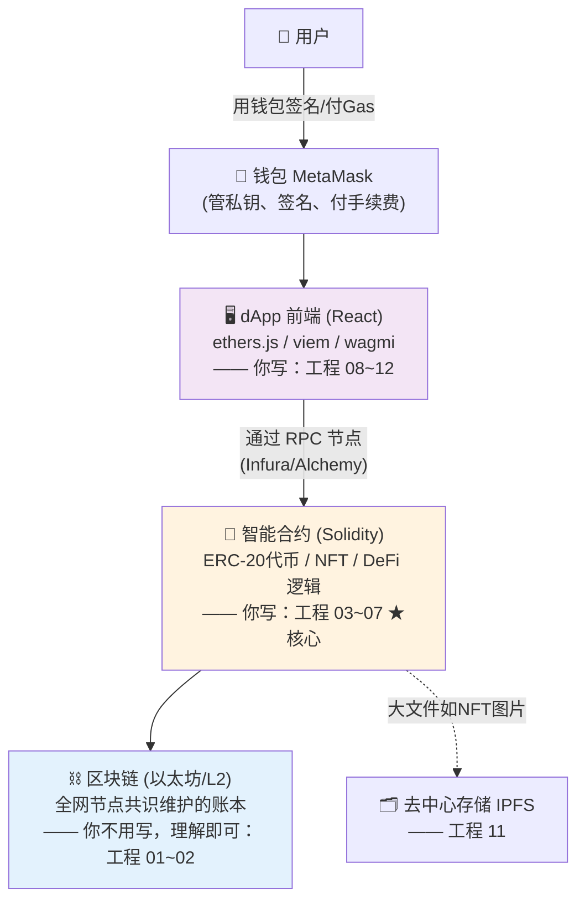

# 00 · Web3 开发到底开发什么（从这里开始）

> 新手第一站。别急着学"什么是区块链"——先花 10 分钟搞懂**"Web3 开发者每天到底在写什么代码、做出来的东西长什么样"**，建立全局观，后面每一步就都有地方可挂。

## 📖 知识讲解

### 一句话：Web3 开发 ≈ 写"部署在区块链上、改不了、用一次付一次钱"的后端 + 能连钱包的前端

如果你写过或了解过传统网站/App（Web2），用下面这张对照表就秒懂 Web3 开发是啥：

| 你熟悉的 Web2 | Web3 开发 |
| --- | --- |
| 写后端程序，部署到**你自己的服务器** | 写**智能合约（Solidity）**，部署到**区块链**（一大堆陌生人的电脑） |
| 数据存 **MySQL / Redis**（你随时能改能删） | 数据存**链上**（全世界都能看、**你也改不了删不掉**） |
| 用户**注册账号密码** | 用户用**钱包**（一把私钥）就是账号，**不用注册** |
| 前端（网页）调**你写的 API** | 前端（叫 **dApp**）**直接调链上的合约**，还要连用户的钱包 |
| 服务器免费跑，你付服务器租金 | **每次写数据都要付一点"手续费"（叫 Gas）**，读数据免费 |

> 把这张表记住，你就懂了 80%。**Web3 开发 = 把后端搬到区块链上（叫智能合约）+ 让网页能连钱包去调它（叫 dApp）。**

### Web3 开发者具体做三件事

```
① 写智能合约  ← 最核心！相当于"后端"，用 Solidity 语言写
     部署到以太坊，处理链上逻辑：转账、发行代币、铸造 NFT、DeFi 借贷…
     特点：部署后基本改不了、数据全公开、写操作要付 Gas → 所以安全极重要

② 写 dApp 前端 ← 让用户能用，就是"前端活"
     普通网页(React) + 一个库(ethers/viem) + 连钱包(MetaMask)
     用户点"购买" → 钱包弹窗让他确认并付 Gas → 交易上链、合约执行

③ 懂链上"业务" ← 知道自己在做什么
     DeFi(去中心化金融)、NFT(数字资产)、DAO(去中心化组织)… 
     这些是"区块链上的生意"，做之前得懂它们的玩法
```

### 你（新手/转行）该重点学什么？

- **最核心：Solidity 智能合约**（本合集工程 03~07）。Solidity 语法很像"JavaScript + 类型"，有点编程基础几天能上手。
- **其次：dApp 前端**（工程 08~12）。就是前端活，用 JS 库把网页和链、钱包连起来。
- **打底：区块链原理**（工程 01~02）。不用自己造轮子，但要懂"钱包地址哪来的、Gas 为什么要付、交易怎么上链"。

> 难点其实不是语法，是**"链上思维"**：代码上链后改不了（要写对）、每一步都花钱（要省 Gas）、数据全公开（别存密码）、被黑就是真金白银没了（安全第一）。

## 🔄 原理图 / 技术栈全景

一个 Web3 应用从用户到区块链，各层是这样的（看清自己以后写哪一层）：



> ★ 橙色的**智能合约**是你要花最多精力学的（后端核心）；紫色的**前端**是前端活；蓝色的**区块链**你不用自己写，理解原理就行。

## ▶️ 怎么用这个合集学（新手路线）

本合集 12 个工程就是按上面这条线排的，新手照这个顺序走：

1. **先看懂链**（工程 01→02）：哈希、区块、账户、交易、Gas、EVM。**纯概念 + 小 demo，不碰钱不碰真链**。
2. **再写合约**（工程 03→04→05→06→07）：用 Solidity 写合约、懂安全、用 OpenZeppelin 发币/发 NFT、用 Hardhat 部署。**Solidity 全程用网页版 Remix，免安装**。
3. **最后做 dApp**（工程 08→09→10→11→12）：让网页连上链和钱包，最终做一个**完整的 NFT 铸造 dApp**。

> 想最快跑通一个东西？**01（懂概念）→ 03-01（第一个合约）→ 07（Hardhat 部署）→ 06（发个自己的代币）→ 12（做成 dApp）**。

## ⚠️ 新手必知（安全 & 心态）

- ⚠️ **只用测试网、只用测试币**：练手在 Sepolia 测试网（[工程 02](../../02-ethereum/)），测试币免费领，**绝不碰主网真钱**。
- ⚠️ **私钥/助记词 = 你的一切**：谁拿到谁就能拿走你所有资产，丢了没人能找回。**绝不要把私钥写进代码或传到 GitHub**。
- ⚠️ **链上没有隐私**：所有数据和合约代码都公开可查，**别在链上存密码、隐私、明文敏感信息**。
- ⚠️ **合约改不了**：上链前一定在测试网充分测试；发币/NFT/权限别自己从零写，用审计过的 **OpenZeppelin**（[工程 05](../../05-openzeppelin/)）。
- ✅ **心态**：语法几天能会，"链上思维"（省 Gas、防攻击、不可篡改）才是要慢慢练的。别怕，跟着工程一个个 demo 跑就行。

## 🔗 官方文档

- Ethereum 官方开发者文档（最权威入门）：<https://ethereum.org/zh/developers/docs/>
- "什么是 Web3"：<https://ethereum.org/zh/web3/>
- Solidity 官方文档：<https://docs.soliditylang.org/>
- 下一站 → [01 · 区块链是什么](../01-what-is-blockchain/)
