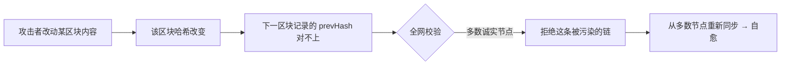

# 01 · 区块链是什么（What is a Blockchain）

> 一句话：区块链是一个由全网多方共同维护、按时间顺序把数据打包成「区块」并用密码学首尾相连的**去中心化、防篡改的共享账本**。

## 📖 知识讲解

### 从「一本账」说起

想象一家银行只有**一本账本**，放在总部保险柜里。它的问题是：

- **中心化信任**：你必须相信银行不会偷改余额、不会宕机、不会作恶。
- **单点故障**：账本被烧毁 / 被黑，记录就没了。

区块链换了一种思路：**让成千上万台互不信任的电脑（节点）各存一份完全相同的账本**，并用规则保证大家永远保持一致。于是「要不要相信某一家机构」变成了「相信数学和多数人」。

### 三个关键词

| 关键词 | 含义 | 带来什么 |
| --- | --- | --- |
| **去中心化 (Decentralized)** | 没有唯一的中央服务器，账本在全网多个节点上复制 | 抗宕机、抗审查、无需信任单一机构 |
| **分布式账本 (Distributed Ledger)** | 每个节点保存一份相同的、只能追加的记录 | 人人可查、公开透明 |
| **不可篡改 (Immutable)** | 数据一旦写入并被多数确认，改动会被立即发现 | 记录可信、可审计 |

### 为什么改不了？（本质是「哈希链」）

每条记录（区块）里都存了**上一条记录的哈希指纹**。哈希的特点是：**内容改一个字，指纹全变**（见模块 02）。所以：

1. 你想偷偷改第 5 条记录 → 第 5 条的哈希变了。
2. 第 6 条里存着「旧的第 5 条哈希」，对不上了 → 链断裂，立刻被发现。
3. 想圆谎，你得把第 5 条之后的**所有**区块全部重算，还要说服全网多数节点接受你这条假链 —— 在 PoW/PoS 下（模块 05）这在经济上几乎不可能。

> 官方定义（ethereum.org）：区块链是「一个在网络中被许多计算机更新和共享的公共数据库」，数据被组织成一个个区块，每个区块用密码学方式链接到它的前一个区块，形成不可篡改的链条。

### 区块链 vs 传统数据库

| 维度 | 传统数据库 | 区块链 |
| --- | --- | --- |
| 控制权 | 单一管理员 | 全网共同维护 |
| 写入 | 可增删改 | 只能追加（append-only） |
| 信任模型 | 信任运营方 | 信任密码学 + 共识 |
| 性能 | 高 | 相对低（换取去信任） |

## 🔄 原理图

去中心化账本的整体结构：多个节点各存一份相同的链，链内区块用 prevHash 首尾相连。

```mermaid
flowchart TB
    subgraph 全网节点（每个都存一份相同账本）
      direction LR
      NA[节点 A]
      NB[节点 B]
      NC[节点 C]
    end
    NA <-->|广播 & 同步| NB
    NB <-->|广播 & 同步| NC
    NA <-->|广播 & 同步| NC

    subgraph 每个节点内部的哈希链
      G[创世块<br/>prevHash=000...] --> B1[区块 #1<br/>prevHash=H0]
      B1 --> B2[区块 #2<br/>prevHash=H1]
      B2 --> B3[区块 #3<br/>prevHash=H2]
    end
```

篡改检测的流程：



## 💻 代码说明

`index.html` 是一个**纯前端、无需联网/钱包**的交互 demo：

- 用浏览器内置的 `crypto.subtle.digest("SHA-256", ...)` 计算哈希，无第三方库。
- 模拟节点 A / B / C 各存一份账本，每条记录 `hash = SHA256(本条内容 + 上一条哈希)`。
- 点「篡改 节点C 第 1 条」→ 该节点会立刻标红报「检测到篡改」，而 A、B 依然一致。
- 点「重新同步」→ 用多数诚实节点（A、B）覆盖被污染的 C，演示区块链的**自愈**能力。

核心校验逻辑（README 摘录，完整见文件）：

```js
// 逐条重算哈希：本条哈希要算得对，且本条声明的 prevHash 必须等于上一条的真实哈希
for (let i = 1; i < chain.length; i++) {
  const prevRealHash = await sha256(chain[i-1].data + chain[i-1].prevHash);
  const expected     = await sha256(chain[i].data + chain[i].prevHash);
  if (chain[i].hash !== expected || chain[i].prevHash !== prevRealHash) return i; // 发现篡改
}
```

## ▶️ 运行方式

**直接用浏览器打开** `index.html` 即可（双击，或在文件上右键 → 用浏览器打开）。

- 无需安装任何依赖、无需 Node、无需联网、无需钱包。
- 建议用 Chrome / Edge / Safari 最新版（`crypto.subtle` 需要 `https://` 或 `file://`/`localhost` 安全上下文，本地文件均满足）。

## ⚠️ 常见坑 / 安全提示

- **别把「去中心化」当成「绝对安全」**：区块链保证的是「账本不可被偷改、无需信任单一机构」，但**智能合约代码本身可能有 bug**（见工程 04 安全）。
- **不可篡改 ≠ 不可回滚**：极端情况下全网可通过硬分叉「回滚」（如以太坊 The DAO 事件），这是社会共识而非技术漏洞。
- 本 demo 只为建立直觉，**真实区块链的安全来自共识机制的经济成本**（模块 05），而非仅仅哈希链。
- 教学演示，**不涉及任何真实资产、私钥或主网**。

## 🔗 官方文档

- 以太坊官方 · 区块链介绍：https://ethereum.org/zh/developers/docs/intro-to-blockchain/
- 以太坊官方 · 以太坊介绍：https://ethereum.org/zh/developers/docs/intro-to-ethereum/
- 比特币白皮书（中文）：https://bitcoin.org/files/bitcoin-paper/bitcoin_zh_cn.pdf
