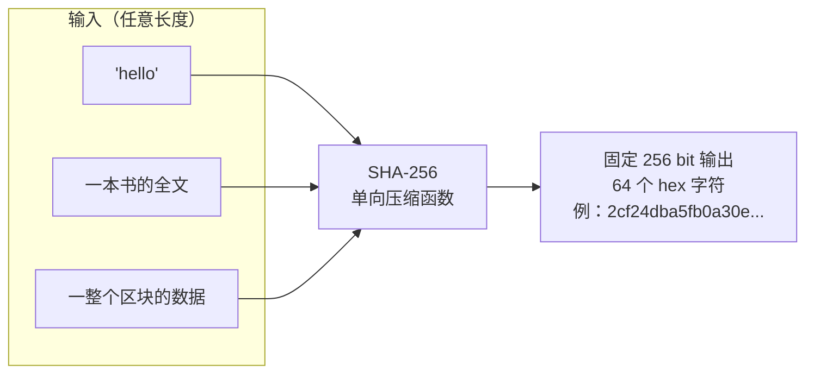
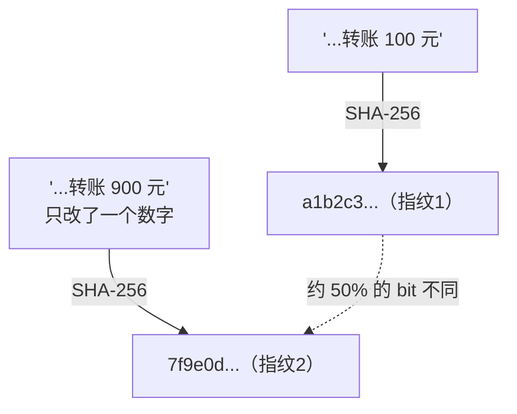

# 02 · 哈希函数（Hash Functions / SHA-256）

> 一句话：密码学哈希函数把**任意长度**的数据压缩成**固定长度**的「数字指纹」，输入改一个字节，指纹面目全非 —— 它是整个区块链的密码学基石。

## 📖 知识讲解

### 什么是密码学哈希

哈希函数 `H(x)` 接受任意数据，输出一个固定长度的值（SHA-256 输出 256 bit = 32 字节 = 64 个十六进制字符）。区块链（比特币、以太坊）大量使用 SHA-256、Keccak-256 等。

一个**密码学**哈希函数必须满足：

| 性质 | 含义 | 为什么区块链需要它 |
| --- | --- | --- |
| **确定性 (Deterministic)** | 同样输入永远得到同样输出 | 全网节点独立计算能得到一致结果 |
| **快速计算** | 任意数据都能很快算出哈希 | 验证成本低 |
| **雪崩效应 (Avalanche)** | 输入改 1 bit，输出约一半 bit 翻转 | 任何篡改都藏不住 |
| **单向性 (Preimage resistance)** | 由哈希无法反推原文 | 保护隐私、支撑挖矿难题 |
| **抗碰撞 (Collision resistance)** | 极难找到两个不同输入有相同哈希 | 指纹唯一，无法伪造 |

### 它在区块链里无处不在

- **区块链接**（模块 03）：区块存上一区块的哈希，形成链。
- **默克尔树**（模块 04）：交易两两哈希汇聚成默克尔根。
- **工作量证明**（模块 05）：挖矿就是不断改 nonce 求一个「足够小」的哈希。
- **地址生成**（模块 08）：公钥经哈希得到钱包地址。
- **交易 ID**：交易内容的哈希就是它的唯一编号。

### 直觉：哈希 = 防伪指纹

给你一份 100 页合同，你不用逐字比对，只要比对双方各自算出的哈希是否一致，就能确认「一字未改」。区块链正是用这一点，让全网无需信任也能校验数据完整性。

## 🔄 原理图



雪崩效应示意（改一个字 → 指纹全变）：



## 💻 代码说明

本模块提供两个 demo：

- **`demo.js`（Node）**：用内置 `crypto.createHash("sha256")` 演示确定性、定长输出、雪崩效应（量化到具体多少 bit 不同）、单向性。
- **`index.html`（浏览器）**：用内置 `crypto.subtle.digest("SHA-256", ...)` 做交互 —— 你在两个框里输入几乎相同的文字，页面逐位标红两个哈希的差异。

核心就一行：

```js
// Node
crypto.createHash("sha256").update(input).digest("hex");
// 浏览器
await crypto.subtle.digest("SHA-256", new TextEncoder().encode(input));
```

## ▶️ 运行方式

Node 版：

```bash
cd 01-blockchain-basics/02-hash-functions
node demo.js
```

浏览器版：双击打开 `index.html`（无需联网、无需依赖）。

## ⚠️ 常见坑 / 安全提示

- **哈希不是加密**：加密可以解密还原，哈希是**单向**的、不可逆，别把「哈希一下」当成「加密保存」。
- **哈希不等于签名**：哈希只保证「没被改」，不能证明「是谁写的」。想证明身份要用数字签名（模块 07）。
- **给密码做哈希要加盐 + 慢哈希**（bcrypt/scrypt/Argon2），直接 `SHA256(密码)` 易被彩虹表破解 —— 这是 Web 安全常识，区块链场景同样注意。
- **MD5 / SHA-1 已不安全**（可被构造碰撞），教学与生产都请用 SHA-256 / Keccak-256 及以上。

## 🔗 官方文档

- 以太坊官方 · 密码学哈希（Intro to blockchain 中「哈希」小节）：https://ethereum.org/zh/developers/docs/intro-to-blockchain/
- Node.js `crypto` 文档：https://nodejs.org/api/crypto.html
- Web Crypto `SubtleCrypto.digest`：https://developer.mozilla.org/zh-CN/docs/Web/API/SubtleCrypto/digest
- NIST SHA-256 标准 (FIPS 180-4)：https://nvlpubs.nist.gov/nistpubs/FIPS/NIST.FIPS.180-4.pdf
