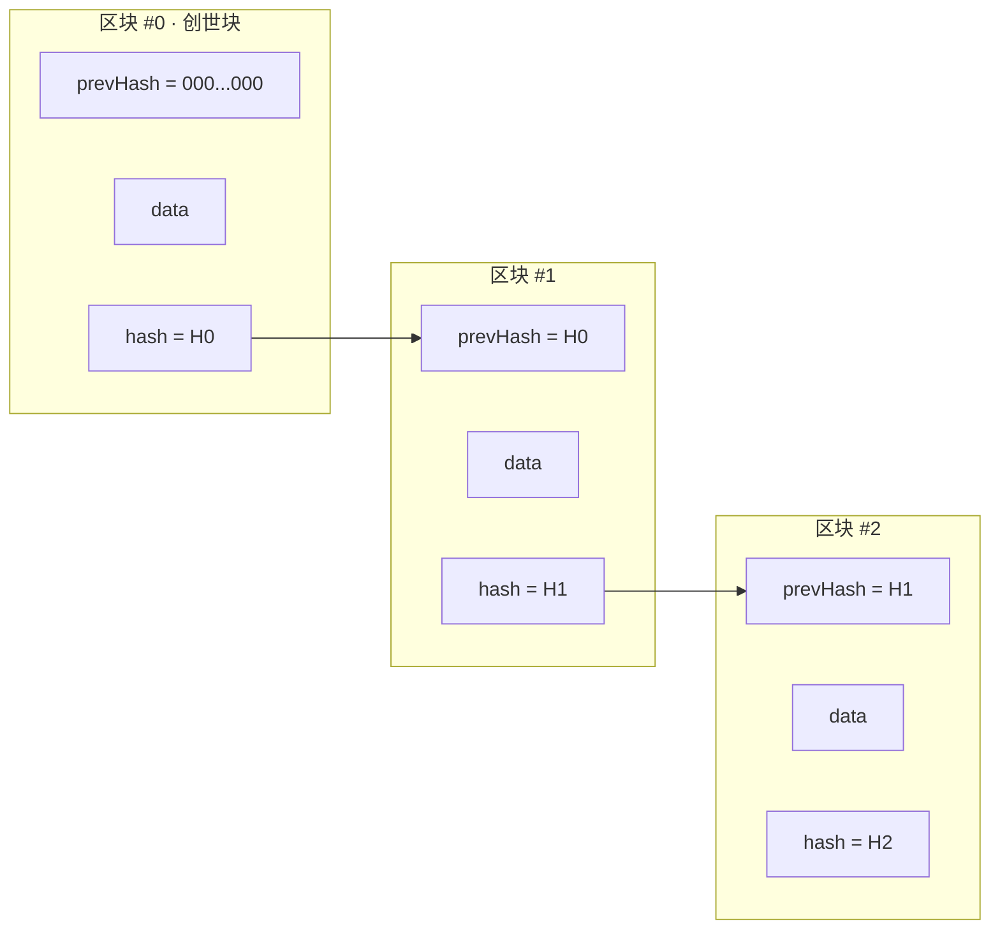

# 03 · 区块结构与链式链接（Blocks and the Chain）

> 一句话：把交易打包进「区块」，每个区块里存上一个区块的哈希，一环扣一环，就形成了改一处便断全链的「区块链」。

## 📖 知识讲解

### 一个区块里有什么

不同链字段略有差异，但核心结构一致。一个区块通常分为**区块头（Block Header）**和**区块体（交易列表）**：

| 字段 | 含义 |
| --- | --- |
| `index` / 高度 (height) | 这是链上第几个区块 |
| `timestamp` | 出块时间 |
| `prevHash`（父哈希） | **上一个区块的哈希** —— 链式结构的关键 |
| `merkleRoot` | 本区块所有交易的默克尔根（模块 04），代表整批交易的指纹 |
| `nonce` | 挖矿用的随机数（模块 05） |
| `hash` | 对以上区块头字段求哈希，作为本区块的唯一指纹 |
| 交易列表 | 本区块打包的若干交易（demo 里简化成一条文本） |

### 「链」是怎么连起来的

关键就一句：**每个区块都保存了上一个区块的哈希（prevHash）**。

```
创世块(hash=H0)  ←  区块1(prevHash=H0, hash=H1)  ←  区块2(prevHash=H1, hash=H2)  ← ...
```

- 第一个区块叫**创世块（Genesis Block）**，它没有前驱，`prevHash` 约定为全 0。
- 因为哈希有雪崩效应（模块 02），只要改动任何一个区块的任何字段，它的 `hash` 就会变，于是下一个区块里存的 `prevHash` 立刻对不上 —— **链断裂，全网可见**。

### 为什么这让篡改「几乎不可能」

假设攻击者想改区块 #1 的一笔转账：

1. 改 #1 → #1 的 hash 变了。
2. 得连锁重算 #2、#3……直到链尾（否则 prevHash 处处对不上）。
3. 而在真实链里，每个区块的 hash 还必须满足**共识难题**（PoW 要求哈希小于某目标，PoS 要求合法出块权，见模块 05）。重算等于要重新「挖」出后面所有区块，还要比诚实全网更快 —— 经济上不可行。

这就是「不可篡改」的技术根源：**哈希链把区块锁在一起，共识机制给篡改标上天价成本**。

## 🔄 原理图

区块结构 & 链式链接：



篡改后的连锁失效：

```mermaid
flowchart TB
    X[改动区块 #1 的 data] --> H1[#1 的 hash 变化]
    H1 --> C{#2.prevHash == #1.hash ?}
    C -->|不相等| BR[链在 #2 处断裂 → 校验失败]
    H1 -.攻击者补算 #1.hash.-> N[但 #2.prevHash 仍是旧值]
    N --> C
    BR --> COST[要圆谎需重算其后所有区块<br/>并战胜全网共识 → 天价成本]
```

## 💻 代码说明

`demo.js`（Node，内置 `crypto`，无第三方依赖）手写一条迷你链：

- `class Block`：定义区块字段，`computeHash()` 对 `index+timestamp+data+prevHash+nonce` 求 SHA-256。
- `class Blockchain`：`addBlock()` 时把新块的 `prevHash` 指向当前链尾的 `hash`；`isValid()` 逐块校验「自身哈希对不对」与「prevHash 是否接得上」。
- 演示三步：正常链校验通过 → 篡改 #1 → 链断裂；即使攻击者补算 #1 哈希，#2 仍对不上，证明必须连锁重算。

## ▶️ 运行方式

```bash
cd 01-blockchain-basics/03-blocks-and-chain
node demo.js
```

预期：第 1 段校验 `{ ok: true }`；篡改后变为 `{ ok: false, reason: ... }`。

## ⚠️ 常见坑 / 安全提示

- **真实区块头哈希的是「区块头」而非整包交易**：交易通过默克尔根（模块 04）间接被哈希覆盖，这样轻节点无需下载全部交易也能验证。
- **prevHash 指向的是父区块**：分叉时可能有多个区块指向同一个父，最终由共识（最长链 / 最重链）选出主链。
- demo 用写死的 timestamp 只为结果可复现；真实链的 timestamp 会参与哈希，且受协议规则约束。
- 教学演示，不涉及真实资产 / 私钥 / 主网。

## 🔗 官方文档

- 以太坊官方 · 区块：https://ethereum.org/zh/developers/docs/blocks/
- 以太坊官方 · 区块链介绍：https://ethereum.org/zh/developers/docs/intro-to-blockchain/
- 比特币白皮书 · 第 3-4 节（时间戳服务器 & 工作量证明）：https://bitcoin.org/files/bitcoin-paper/bitcoin_zh_cn.pdf
