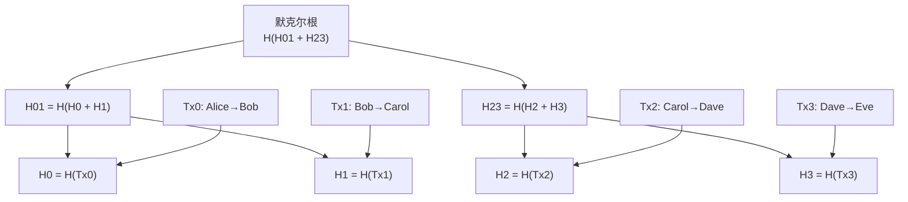
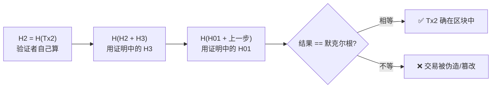

# 04 · 默克尔树与默克尔根（Merkle Tree & Merkle Root）

> 一句话：把一批交易两两哈希、逐层汇聚成一个「默克尔根」，就能用 32 字节代表成千上万笔交易，并让任何人用一条极短的证明验证「某笔交易是否在其中」。

## 📖 知识讲解

### 问题：一个区块可能有几千笔交易

如果要验证「我的这笔交易是否被打包进了区块」，最笨的办法是下载区块里全部交易逐一比对。手机钱包做不到（存不下、耗流量）。默克尔树（由 Ralph Merkle 提出）优雅地解决了这个问题。

### 怎么构建（自底向上）

1. **叶子层**：对每笔交易求哈希，得到一排叶子节点。
2. **两两配对**：相邻两个哈希拼接后再哈希，得到父节点：`父 = H(左 + 右)`。若某层节点数为奇数，最后一个与自己配对。
3. **重复**：一层层往上汇聚，直到只剩一个节点 —— 它就是**默克尔根（Merkle Root）**。
4. 区块头里只存这个根，就「承诺」了全部交易；改任何一笔交易，根都会变（雪崩效应逐层放大）。

### 默克尔证明（Merkle Proof）—— 省资源验证

要证明「Carol→Dave 这笔交易在区块里」，不需要全部交易，只需要**沿途每一层的兄弟节点哈希**（一条从叶子到根的路径）。

- 交易数为 N 时，证明只包含约 **log₂(N)** 个哈希。1024 笔交易也只需 10 个哈希！
- 验证者拿「交易 + 证明路径」从叶子逐层往上算，若最终算出的根 == 区块头里的默克尔根，则交易确实存在，且未被篡改。

这就是**轻节点 / SPV（Simplified Payment Verification，简单支付验证）**的基础：手机钱包不存全链，只存区块头，靠默克尔证明验证与自己相关的交易。

### 以太坊的进阶版

以太坊用的是 **Merkle Patricia Trie（默克尔帕特里夏字典树）**，不仅承诺交易，还承诺**账户状态**（余额、合约存储等），区块头里有 `transactionsRoot`、`stateRoot`、`receiptsRoot` 三棵树的根。原理同源：用一个根哈希承诺海量数据 + 短证明验证。

## 🔄 原理图

默克尔树结构（4 笔交易为例）：



验证 Tx2 的默克尔证明（只需 H3、H01 两个兄弟哈希）：



## 💻 代码说明

`demo.js`（Node，内置 `crypto`）：

- `buildTree(leaves)`：自底向上构建，返回每一层哈希，顶层即默克尔根。
- `getProof(layers, index)`：为第 index 笔交易生成证明（沿途兄弟哈希 + 左右位置）。
- `verifyProof(tx, proof, root)`：从叶子按证明逐层重算，比对默克尔根。
- 演示：构建树 → 为第 3 笔交易生成证明并验证通过 → 用同一证明验证一笔伪造交易，结果失败。

## ▶️ 运行方式

```bash
cd 01-blockchain-basics/04-merkle-tree
node demo.js
```

预期：真实交易验证输出 `true`，伪造交易输出 `false`。

## ⚠️ 常见坑 / 安全提示

- **奇数节点的配对方式各链不同**：比特币是「与自己配对」，某些实现会向上提升。规则不一致会算出不同的根，跨系统时务必对齐。
- **比特币历史上的 CVE-2012-2459**：奇数叶子复制自己曾被用于制造两棵不同交易集却相同根的树，需在验证时限制。教学 demo 已简化，生产实现需按各链规范处理。
- **证明只证明「存在与完整」**，不证明交易「有效」（是否双花、签名对不对由全节点校验）。
- 教学演示，不涉及真实资产 / 私钥 / 主网。

## 🔗 官方文档

- 以太坊官方 · 默克尔帕特里夏树：https://ethereum.org/zh/developers/docs/data-structures-and-encoding/patricia-merkle-trie/
- 以太坊官方 · 交易：https://ethereum.org/zh/developers/docs/transactions/
- 比特币白皮书 · 第 7-8 节（回收硬盘空间 & 简化支付验证 SPV）：https://bitcoin.org/files/bitcoin-paper/bitcoin_zh_cn.pdf
