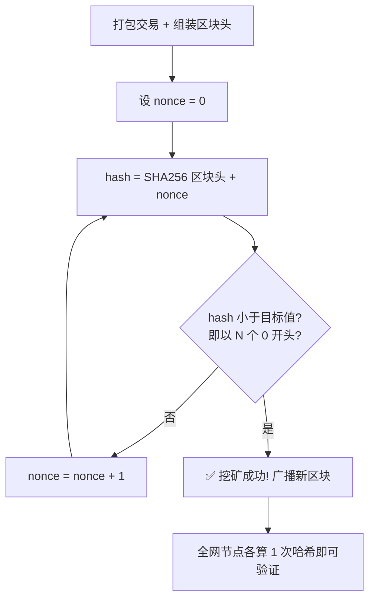
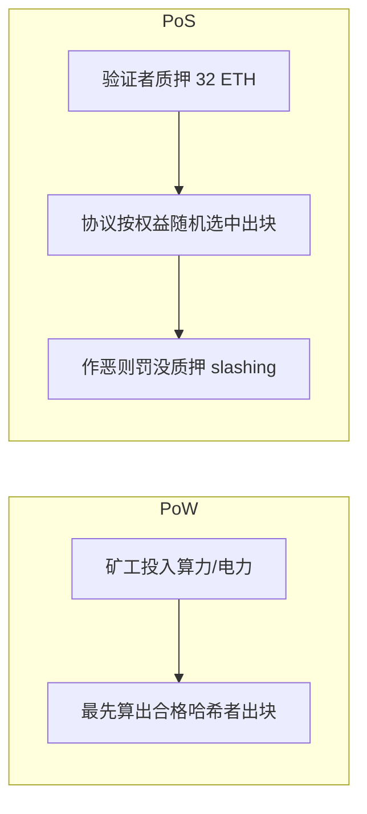

# 05 · 共识机制（Consensus：PoW vs PoS）

> 一句话：共识机制是「让互不信任的全网节点，就下一个区块达成一致」的规则；工作量证明（PoW）拼算力，权益证明（PoS）拼质押，它们给「篡改历史」标上了天价成本。

## 📖 知识讲解

### 为什么需要共识

区块链没有中心服务器，那么「谁有权写下一个区块？大家怎么保证抄的是同一本账？」这就是**共识问题**（本质是分布式系统的拜占庭将军问题）。共识机制要同时做到：

- **防女巫攻击**：不能靠多注册账号就获得更多话语权（否则一人可伪造万人）。
- **公平出块**：随机、可验证地选出下一个记账人。
- **作恶昂贵**：想改历史/双花，代价远超收益。

### 工作量证明（PoW，Proof of Work）

- **规则**：矿工不断调整区块头里的 `nonce`，计算区块哈希，直到哈希小于某个目标值（直观表现为「以若干个 0 开头」）。第一个找到的矿工获得出块权和奖励。
- **难度调整**：全网自动调节目标值，让出块速度稳定（比特币约 10 分钟/块）。要求前缀多一位 0，平均工作量约 ×16。
- **安全来源**：找哈希极难（暴力尝试），验证极易（算一次即可）。要篡改第 K 个区块，必须重挖第 K 块及其后所有块，还要超越诚实全网的算力增长 —— 即需 **>50% 全网算力（51% 攻击）**，成本天文数字。
- **代价**：耗电巨大。

### 权益证明（PoS，Proof of Stake）

- **规则**：验证者（validator）质押（stake）一定数量的币作为「保证金」，协议按质押量加权随机选出出块者。以太坊需质押 **32 ETH** 成为验证者。
- **作恶惩罚**：出块者若作恶（双签、造假），质押会被**罚没（slashing）**。作恶 = 烧自己的钱，因此不划算。
- **优点**：能耗极低。以太坊 2022 年 9 月「合并（The Merge）」从 PoW 切到 PoS，能耗下降约 **99.95%**。

### 对比表

| 维度 | PoW 工作量证明 | PoS 权益证明 |
| --- | --- | --- |
| 出块资格 | 算力（谁先算出合格哈希） | 质押的币（按权益随机选中） |
| 稀缺资源 | 电力 / 矿机 | 锁定的资本 |
| 作恶成本 | 掌握 >50% 算力 | 被罚没质押（slashing） |
| 能耗 | 极高 | 极低 |
| 代表 | 比特币 | 以太坊（2022 起）、多数新链 |

> demo 聚焦最直观的 PoW 挖矿；PoS 因涉及验证者集合、随机选择、罚没等协议细节，此处以讲解 + 图示呈现。

## 🔄 原理图

PoW 挖矿流程：



PoW 与 PoS 出块权对比：



## 💻 代码说明

`demo.js`（Node，内置 `crypto`）：

- `mine(blockData, difficulty)`：循环递增 `nonce`，直到 `SHA256(blockData + nonce)` 以 `difficulty` 个 0 开头，返回 nonce、尝试次数、耗时。
- 从难度 1 跑到 5，直观展示尝试次数随难度**指数增长**（每 +1 约 ×16）。
- 演示「挖矿慢、验证快」的非对称性，并以文字对比 PoW / PoS。

## ▶️ 运行方式

```bash
cd 01-blockchain-basics/05-consensus
node demo.js
```

预期：难度越高，`共尝试` 次数与耗时越大；难度 5 可能需要几十万到上百万次尝试（几百毫秒到数秒，视机器而定）。

## ⚠️ 常见坑 / 安全提示

- **别把「难度前缀 0 的个数」当成线性**：每多一位 hex 前缀，工作量约 ×16，是指数关系。
- **PoW 的安全 = 经济成本**：小币种算力低，更易被 51% 攻击；安全性与全网算力/市值正相关。
- **PoS 不是「有钱就能改账」**：质押越多、作恶被罚没越多；且需要控制大量验证者并甘冒罚没，经济上同样不划算。
- 本 demo 是极简教学模型，真实难度目标是一个 256 位大整数比较，且区块头字段更复杂。
- 不涉及真实资产 / 私钥 / 主网。

## 🔗 官方文档

- 以太坊官方 · 共识机制：https://ethereum.org/zh/developers/docs/consensus-mechanisms/
- 以太坊官方 · 权益证明（PoS）：https://ethereum.org/zh/developers/docs/consensus-mechanisms/pos/
- 以太坊官方 · 工作量证明（PoW）：https://ethereum.org/zh/developers/docs/consensus-mechanisms/pow/
- 以太坊官方 · 合并 The Merge：https://ethereum.org/zh/roadmap/merge/
- 比特币白皮书 · 第 4 节（工作量证明）：https://bitcoin.org/files/bitcoin-paper/bitcoin_zh_cn.pdf
