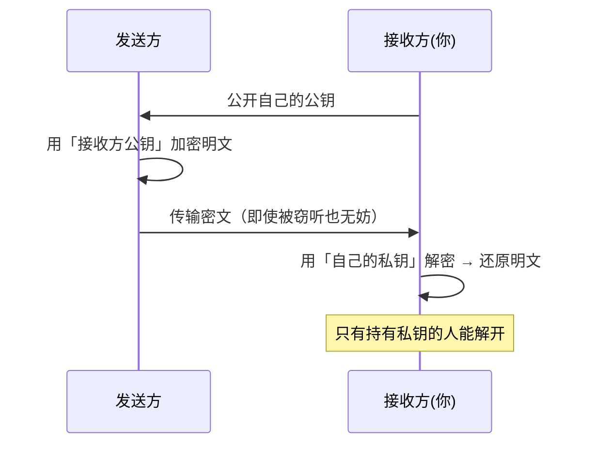
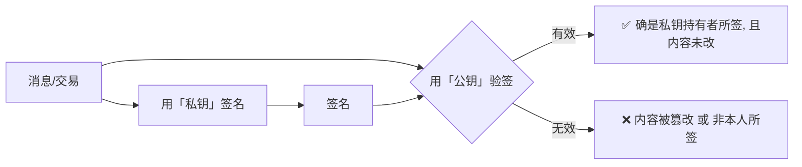

# 06 · 非对称加密与公私钥（Public-Key Cryptography）

> 一句话：非对称密码学给每个人一对钥匙 —— **公钥可公开、私钥须保密**；公钥加密的只有私钥能解，私钥签名的任何人可用公钥验证。区块链的「所有权」正建立在此之上。

## 📖 知识讲解

### 对称 vs 非对称

- **对称加密**：加密解密用**同一把**钥匙。快，但双方得先安全地共享这把钥匙 —— 「怎么把钥匙安全递给对方」本身就是难题。
- **非对称加密（公钥密码学）**：每人一对数学上关联的钥匙：
  - **公钥（public key）**：可以公开贴到网上，给任何人。
  - **私钥（private key）**：只有自己知道，绝不泄露。
  - 关键性质：**从私钥能轻松算出公钥，但从公钥几乎无法反推私钥**（基于大整数分解 / 椭圆曲线离散对数等数学难题）。

### 两大用途

| 用途 | 谁用什么钥匙 | 解决什么 |
| --- | --- | --- |
| **加密通信** | 对方用你的**公钥**加密，你用**私钥**解密 | 不安全信道上安全传密 |
| **数字签名** | 你用**私钥**签名，别人用你的**公钥**验签 | 证明「是你本人 + 内容没被改」 |

区块链主要用的是**数字签名**（模块 07）：你用私钥对交易签名，全网用你的公钥/地址验证这笔交易确实是你授权的。**没有你的私钥，谁也动不了你的币。**

### 区块链用的具体算法：secp256k1

比特币和以太坊用**椭圆曲线密码学（ECC）**，曲线为 **secp256k1**，签名算法为 **ECDSA**。相比 RSA：

- 私钥只有 32 字节（256 bit），密钥短、签名快。
- 支持从签名+消息**反推出公钥**（`ecrecover`），因此交易里不必附带公钥，省空间（模块 07/09 会用到）。

> 本模块 demo 为便于直接演示「加密/解密」用了 RSA（Node 内置、无需第三方库）。但「私钥签、公钥验」的核心思想与 secp256k1 **完全一致**；真正的以太坊签名放在模块 07 用 ethers 演示。

### 从私钥到「你的身份」

```
私钥 (保密, 32字节随机数)  ──单向──▶  公钥  ──哈希──▶  钱包地址(公开)
```

这条单向链是模块 08「钱包/地址」的核心，这里先建立「私钥 = 掌控权」的认知。

## 🔄 原理图

公钥加密 / 私钥解密：



私钥签名 / 公钥验签：



## 💻 代码说明

`demo.js`（Node，内置 `crypto`，无第三方依赖）：

- `crypto.generateKeyPairSync("rsa", ...)`：生成一对公私钥。
- `publicEncrypt` / `privateDecrypt`：演示「公钥加密 → 私钥解密」。
- `sign` / `verify`：演示「私钥签名 → 公钥验签」，并展示篡改文档后验签立即失败。
- 结尾说明区块链现实中用的是 secp256k1 + ECDSA。

## ▶️ 运行方式

```bash
cd 01-blockchain-basics/06-public-key-cryptography
node demo.js
```

预期：解密还原出原文；正常验签 `true`，篡改后 `false`。

## ⚠️ 常见坑 / 安全提示

- **私钥 = 你的一切**：谁拿到私钥就能花你的币、冒充你签名。**绝不把私钥/助记词贴到聊天、截图、云盘、GitHub。** 本仓库任何示例都用占位符或临时随机生成，不含真实私钥。
- **公钥可以公开，但地址更常用**：链上通常公开的是地址（公钥的哈希），进一步降低暴露。
- **别自己发明密码学**：算法、曲线、随机数生成都用成熟库（Node crypto、ethers、noble 等）。弱随机数会导致私钥被算出。
- RSA 与 secp256k1 用途侧重不同：区块链几乎只用 ECC 做**签名**，很少用公钥直接加密大数据。
- 教学演示，不涉及真实资产 / 主网。

## 🔗 官方文档

- 以太坊官方 · 账户（公私钥与地址的关系）：https://ethereum.org/zh/developers/docs/accounts/
- Node.js `crypto` 文档：https://nodejs.org/api/crypto.html
- secp256k1 / ECDSA 背景（Bitcoin Wiki）：https://en.bitcoin.it/wiki/Secp256k1
