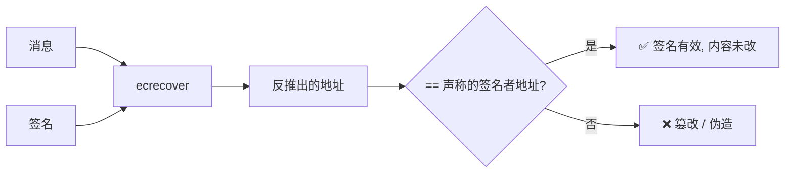

# 07 · 数字签名与验签（Digital Signatures）

> 一句话：数字签名让你用**私钥**在一段消息/交易上「盖章」，任何人无需你的私钥，仅凭消息与签名就能**反推出签名者地址**、确认「确是你签的、且内容一字未改」。这就是区块链交易授权的核心。

## 📖 知识讲解

### 签名解决三件事

| 目标 | 含义 |
| --- | --- |
| **身份认证 (Authentication)** | 证明消息确实由某私钥持有者发出 |
| **完整性 (Integrity)** | 消息若被改动，验签立即失败 |
| **不可否认 (Non-repudiation)** | 签过就赖不掉，因为只有你有私钥 |

### 以太坊怎么签（ECDSA + secp256k1）

1. 先对消息求哈希（以太坊消息签名遵循 **EIP-191**：加 `\x19Ethereum Signed Message:\n` 前缀再 Keccak-256，避免签名被拿去当交易重放）。
2. 用**私钥**对哈希做 **ECDSA** 签名，得到 `(r, s, v)` 三个值拼成的签名。
3. 验签用 **ecrecover**：由「消息哈希 + 签名」直接**反推出签名者的公钥/地址**。这正是以太坊的巧妙之处 —— 交易里不必附带公钥，用签名就能算出「是谁」。

### 签名 vs 加密（别混）

- **加密**：为了保密（别人看不懂内容）。
- **签名**：为了鉴权（内容公开，但证明是谁写的、没被改）。区块链交易是**公开**的，用的是签名而非加密。

### 它在交易里怎么用

你发一笔转账，钱包用你的私钥对交易内容签名 → 广播 → 全网节点用 ecrecover 得出发送者地址，核对地址余额是否够、nonce 是否对（模块 09）→ 通过才打包。**没有你的私钥签名，没人能替你花钱。**

## 🔄 原理图

签名与验签时序：

```mermaid
sequenceDiagram
    participant A as Alice(私钥持有者)
    participant N as 全网/任何验证者
    A->>A: 1. 对消息求哈希 (EIP-191 前缀 + Keccak-256)
    A->>A: 2. 用「私钥」做 ECDSA 签名 → (r,s,v)
    A->>N: 3. 广播「消息 + 签名」(不含私钥/公钥)
    N->>N: 4. ecrecover(消息, 签名) → 反推出签名者地址
    N->>N: 5. 该地址 == 预期发送方? 且消息哈希吻合?
    Note over N: 一致 → ✅ 有效; 消息被改 → 反推地址变化 → ❌
```

验签判定流程：



## 💻 代码说明

`index.html`（浏览器 + ethers v6 CDN）：

- `ethers.Wallet.createRandom()`：在浏览器本地随机生成一个**测试钱包**（私钥仅存内存，刷新即失）。
- `wallet.signMessage(msg)`：按 EIP-191 用私钥签名，得到签名串。
- `ethers.verifyMessage(msg, sig)`：仅凭消息与签名**反推签名者地址**（ecrecover 封装）；与钱包地址一致即验签通过。
- 交互体验：签名后改动消息一个字再验签，反推地址立即对不上 —— 直观感受「完整性」。

关键三行：

```js
const wallet = ethers.Wallet.createRandom();        // 生成测试钱包
const sig = await wallet.signMessage(msg);          // 私钥签名
const signer = ethers.verifyMessage(msg, sig);      // 由消息+签名反推地址（验签）
```

## ▶️ 运行方式

**双击打开 `index.html`**。页面会通过 CDN 加载 ethers v6（首次需联网下载这一个 JS 文件），随后全部在本地完成，不连接任何区块链、不需要 MetaMask、不涉及真实资产。

> 如果所在环境无法访问 CDN：可将 `ethers.umd.min.js` 下载到本模块目录，把 `<script src>` 改成本地路径即可离线运行。

## ⚠️ 常见坑 / 安全提示

- **钓鱼签名是真实威胁**：恶意 dApp 可能诱导你签一段「看似无害」的消息，实则是授权转账/挂单。**签名前务必看清内容**，尤其 `permit`、`SetApprovalForAll`、OpenSea 挂单等。
- **签名可被重放**：同一条签名可能在多处被重复使用。生产签名应包含 `nonce`、`chainId`、`deadline`、`domain`（见 EIP-712 结构化签名）。
- **本 demo 的私钥是即时随机生成的测试钱包**，仅用于演示；真实私钥/助记词绝不可粘贴进任何网页或代码。
- EIP-191 的前缀正是为了让「个人消息签名」无法被伪装成一笔真实交易，避免重放。
- 教学演示，不涉及主网 / 真实资产。

## 🔗 官方文档

- 以太坊官方 · 账户与签名：https://ethereum.org/zh/developers/docs/accounts/
- 以太坊官方 · 交易（签名字段 v,r,s）：https://ethereum.org/zh/developers/docs/transactions/
- ethers v6 文档（Wallet / verifyMessage）：https://docs.ethers.org/v6/
- EIP-191（签名数据标准）：https://eips.ethereum.org/EIPS/eip-191
- EIP-712（结构化数据签名）：https://eips.ethereum.org/EIPS/eip-712
