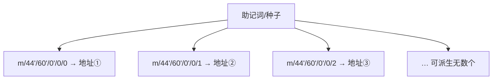

# 08 · 钱包、密钥与地址（Wallets, Keys & Addresses）

> 一句话：钱包不「装币」，它管理**私钥**；从一串助记词可单向派生出私钥→公钥→地址，地址是你的收款账号，私钥/助记词是你的一切。

## 📖 知识讲解

### 一条单向派生链

```
助记词(12/24词, BIP39)
   │  按 BIP32/BIP44 派生
   ▼
私钥 (32 字节随机数)        ← 保密！掌握它 = 拥有资产
   │  椭圆曲线 secp256k1 乘法（单向）
   ▼
公钥 (椭圆曲线上的点)
   │  Keccak-256 哈希，取后 20 字节
   ▼
地址 (0x + 40 hex)          ← 公开，收款用
```

每一步都是**单向**的：由私钥能算出公钥和地址，但由地址/公钥**无法反推私钥**。这就是为什么公开地址收款是安全的。

### 助记词（BIP39）：给人看的私钥

32 字节的私钥是一长串十六进制，人类没法抄写。BIP39 把随机熵编码成 **12 或 24 个常用英文单词**（助记词 / 种子短语 mnemonic），便于备份。助记词经过（可选密码 +）PBKDF2 生成种子，再派生出私钥。

- **助记词 = 主私钥**：拿到助记词就能恢复整套钱包里的所有账户。
- 所以助记词的保密级别 = 私钥，甚至更高。

### HD 钱包（BIP32 / BIP44）：一词生多址

**分层确定性钱包（Hierarchical Deterministic）**：从一个种子按「路径」派生出一棵密钥树。以太坊常用路径：

```
m / 44' / 60' / 0' / 0 / x
     │     │    │   │   └─ 第 x 个地址 (0,1,2,...)
     │     │    │   └───── 外部链
     │     │    └───────── 账户 0
     │     └────────────── 币种 60 = 以太坊
     └──────────────────── BIP44 规范
```

这就是 MetaMask 里「账户 1 / 账户 2 / …」的来源：**同一份助记词，派生出无数个地址**，备份一次即可。

### 地址是怎么从公钥来的（以太坊）

1. 取未压缩公钥（去掉前缀 `04`）的 64 字节。
2. 做 **Keccak-256** 哈希。
3. 取结果的**后 20 字节**，加 `0x` 前缀 = 以太坊地址。
4. （EIP-55）用大小写混合做校验和，防手滑打错地址。

### 钱包的种类

| 类型 | 私钥存哪 | 特点 |
| --- | --- | --- |
| 热钱包（MetaMask 等） | 联网设备 | 方便，风险较高 |
| 冷钱包（Ledger 等硬件） | 离线设备 | 私钥不触网，最安全 |
| 托管钱包（交易所） | 平台替你保管 | 你没有私钥，「Not your keys, not your coins」 |

## 🔄 原理图

派生链：


一词生多址（HD 钱包树）：



## 💻 代码说明

`index.html`（浏览器 + ethers v6 CDN）：

- `ethers.Wallet.createRandom()`：生成带 BIP39 助记词的随机测试钱包。
- 依次展示 `mnemonic.phrase`（助记词）、`privateKey`、`signingKey.publicKey`（公钥）、`address`（地址），可视化整条派生链。
- `ethers.HDNodeWallet.fromPhrase(phrase, "", "m/44'/60'/0'/0/x")`：用同一助记词按 BIP44 路径派生出多个地址，演示「一词生多址」。

## ▶️ 运行方式

**双击打开 `index.html`**（首次需联网从 CDN 加载 ethers 这一个文件），随后本地运行，不上链、不需真实钱包。

## ⚠️ 常见坑 / 安全提示（本模块最重要）

- **助记词/私钥 = 你的全部资产**。任何人拿到即可转走你的币，且区块链交易**不可撤销**。
- **绝不**把助记词/私钥：截图、存相册、发微信、上传网盘、粘进网页表单、提交到 GitHub。**没有任何客服/官方会向你索要助记词** —— 索要的一律是骗子。
- **官方 App 只从官网/应用商店下载**；小心假钱包、假 MetaMask。
- **本 demo 显示的助记词是即时随机生成、仅供演示**，请勿用它保管任何真实资产。
- 冷钱包/硬件钱包让私钥永不触网，大额资产首选。
- 「Not your keys, not your coins」：把币放交易所，等于把私钥交给平台，平台跑路/被黑你就没了。

## 🔗 官方文档

- 以太坊官方 · 账户（地址与密钥）：https://ethereum.org/zh/developers/docs/accounts/
- 以太坊官方 · 以太坊钱包：https://ethereum.org/zh/wallets/
- BIP39（助记词）：https://github.com/bitcoin/bips/blob/master/bip-0039.mediawiki
- BIP32（HD 钱包）：https://github.com/bitcoin/bips/blob/master/bip-0032.mediawiki
- BIP44（多币种路径）：https://github.com/bitcoin/bips/blob/master/bip-0044.mediawiki
- EIP-55（地址校验和）：https://eips.ethereum.org/EIPS/eip-55
