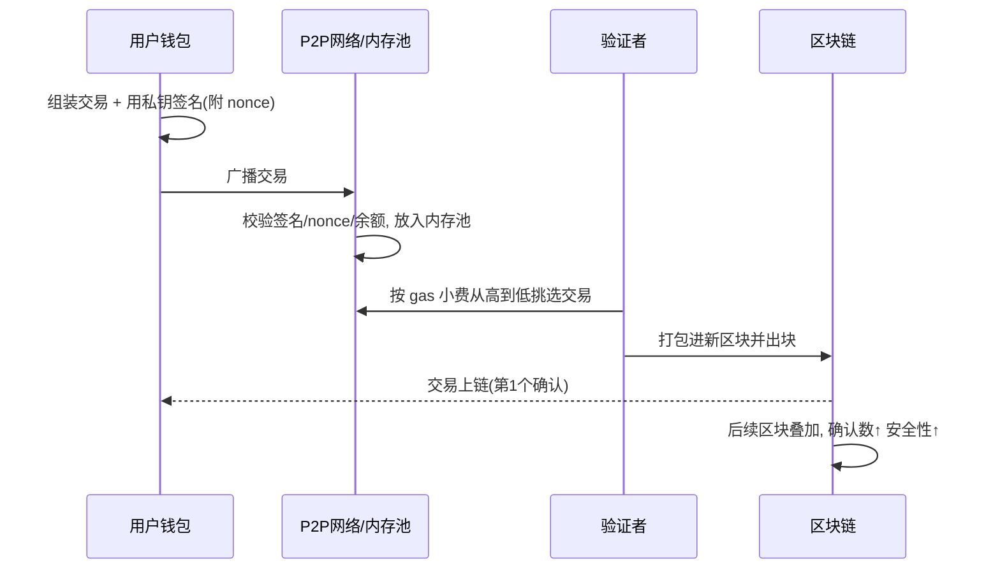
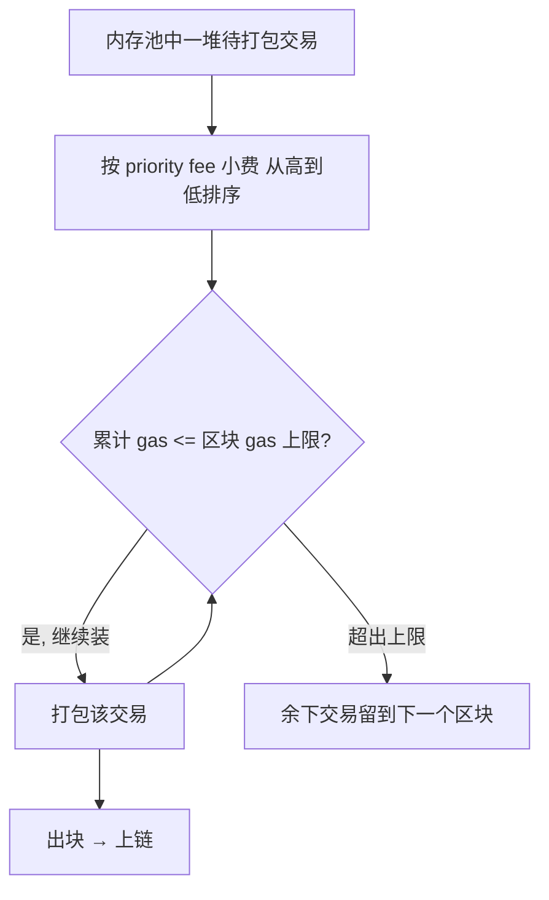

# 09 · 交易结构、nonce 与打包（Transactions）

> 一句话：交易是「改变区块链状态」的唯一入口；每笔交易带 nonce 保证顺序与防重放，签名后进入内存池，由验证者按 gas 出价择优打包进区块。

## 📖 知识讲解

### 交易是状态机的输入

以太坊本质是一台全球共享的状态机（EVM），**只有交易能改变它的状态**（转账、部署合约、调用合约）。交易必须由发送方私钥签名，全网才认。

### 一笔（EIP-1559）以太坊交易的字段

| 字段 | 含义 |
| --- | --- |
| `from` | 发送方地址（实际不写在交易里，由签名 ecrecover 反推） |
| `to` | 接收方地址；为空则表示「创建合约」 |
| `nonce` | 该发送方已发交易的计数（从 0 起），保证顺序、防重放 |
| `value` | 转账的 ETH 数量 |
| `gasLimit` | 本交易最多消耗多少 gas（普通转账固定 21000） |
| `maxFeePerGas` | 每单位 gas 愿付的最高价（EIP-1559） |
| `maxPriorityFeePerGas` | 给验证者的「小费」，越高越优先被打包 |
| `data` | 附加数据；转账为空，调用合约则是编码后的函数与参数 |
| `chainId` | 链标识（1=主网、11155111=Sepolia），防跨链重放 |
| `signature (v,r,s)` | 私钥对以上内容的签名，用于鉴权 |

> 交易哈希（txHash）是整笔交易的哈希，作为它的唯一编号，用于在区块浏览器里查询。

### nonce：账户级的自增计数器

每个账户维护自己的 nonce，交易必须 `0,1,2,3...` **依次**被打包：

- **防重放**：nonce=5 的交易上链后，任何 nonce=5 的副本都会被拒绝（已用过），别人无法把你的交易复制一份再花一次钱。
- **保证顺序**：nonce=6 必须等 nonce=5 先上链，否则悬在内存池等待（「卡住」的常见原因）。
- **加速 / 取消**：用**相同 nonce + 更高 gas 价**重发，可替换掉尚未上链的旧交易（钱包里的「加速/取消」就是这么做的）。

### Gas 与费用（一句话）

执行交易要消耗算力，用 **gas** 计量，费用 = 实际消耗 gas × gas 价格。EIP-1559 把费用拆成会被**销毁的 base fee** + 给验证者的 **priority fee（小费）**。网络越拥堵，base fee 越高。

### 交易的生命周期

```
钱包签名 → 广播到 P2P 网络 → 进入各节点的内存池(mempool, 待打包区)
        → 验证者按 gas 出价择优打包进区块 → 上链(1 个确认)
        → 后续区块不断叠加(确认数增加, 越难被回滚 = 越安全)
```

「拥堵时提高 gas 费能更快确认」正是因为验证者优先挑小费高的交易。

## 🔄 原理图

交易生命周期时序：



内存池打包决策：



## 💻 代码说明

`demo.js`（Node，内置 `crypto`，不联网、不签真交易）：

- **交易结构**：打印一笔 EIP-1559 交易的完整字段并附带一个模拟 txHash。
- **nonce 演示**：把乱序到达的 `nonce=7,5,6` 按 nonce 排序，说明必须顺序执行、防重放。
- **打包演示**：内存池里若干交易带不同小费，按小费从高到低装入受 `BLOCK_GAS_LIMIT` 限制的区块，展示「高小费先上链、低小费等下一块」。

## ▶️ 运行方式

```bash
cd 01-blockchain-basics/09-transactions
node demo.js
```

预期：看到交易结构、按 nonce 排序结果、以及按小费择优打包的结果。

## ⚠️ 常见坑 / 安全提示

- **交易不可撤销**：一旦上链无法「退款」，转错地址/金额基本无解。转账前反复核对地址（尤其防「地址投毒」骗局）。
- **nonce 卡住**：一笔低 gas 交易长期不上链会「堵住」后续所有交易，需用相同 nonce + 更高 gas 加速或取消。
- **抢跑 / MEV**：内存池是公开的，机器人可能看到你的交易抢先交易（front-running）。大额兑换注意滑点保护与私有交易通道。
- **测试优先**：任何转账/合约交互先在 **Sepolia 测试网** 用水龙头测试币演练，绝不拿主网真实资产试手。
- 本 demo 是结构与规则演示，不生成真实签名、不广播任何交易。

## 🔗 官方文档

- 以太坊官方 · 交易：https://ethereum.org/zh/developers/docs/transactions/
- 以太坊官方 · Gas 与手续费：https://ethereum.org/zh/developers/docs/gas/
- EIP-1559（费用市场改革）：https://eips.ethereum.org/EIPS/eip-1559
- EIP-155（chainId 防重放）：https://eips.ethereum.org/EIPS/eip-155
