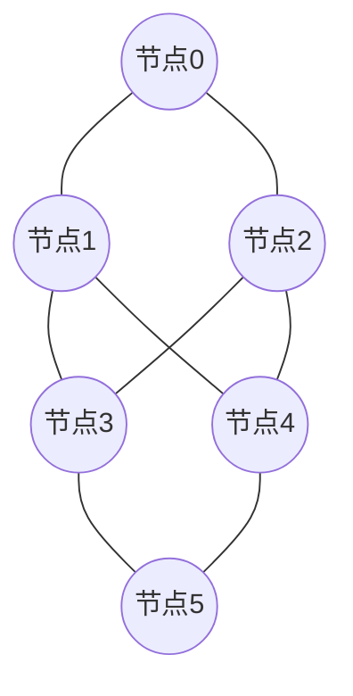

# 10 · 节点与 P2P 网络（Nodes & Peer-to-Peer Network）

> 一句话：区块链没有中心服务器，它是一张由成千上万个「节点」组成的点对点（P2P）网络，交易和区块靠节点间「收到即转发」的八卦式传播扩散到全网。

## 📖 知识讲解

### 什么是节点

**节点（node）** 是运行区块链客户端软件、参与网络的一台电脑。它保存（部分或全部）账本、校验交易与区块、并把消息转发给邻居。正是「许多独立节点各存一份并互相校验」，让区块链去中心化、无需信任单一机构。

### 节点的类型

| 类型 | 存什么 | 能做什么 | 适合谁 |
| --- | --- | --- | --- |
| **全节点 (Full node)** | 近期完整状态 + 校验所有区块/交易 | 独立验证一切、不信任他人 | 追求去信任的用户/服务 |
| **轻节点 (Light node)** | 只存区块头 | 靠默克尔证明（模块 04）验证与自己相关的交易 | 手机/资源受限设备 |
| **归档节点 (Archive node)** | 全部历史状态 | 查询任意历史时刻的状态 | 区块浏览器、数据分析 |
| **验证者节点 (Validator)** | 全节点 + 质押 32 ETH | 出块、参与 PoS 共识（模块 05） | 参与共识赚取奖励者 |

> 「验证者」负责出块，「全节点」负责校验。全节点越多，网络越抗审查、越难作恶 —— 因为任何非法区块都会被诚实全节点拒绝。

### P2P 网络与八卦传播（Gossip）

- **点对点（P2P）**：没有中央服务器，每个节点只维护与少数「邻居（peers）」的连接。节点可随时加入/退出，网络自动愈合，**无单点故障**。
- **八卦传播（gossip / flooding）**：某节点产生一条新交易或新区块 → 转发给所有邻居 → 邻居再转发给它们的邻居……一跳一跳，几秒内传遍全网。
- **收到即校验**：诚实节点先验证消息（交易签名对不对、区块哈希/共识合不合法），**校验不通过就不再转发**，于是伪造/非法消息传不远。
- **冗余可靠**：一条消息经多条路径抵达，个别节点掉线或作恶不影响整体，鲁棒性极强。

### 节点如何找到彼此

新节点通过**引导节点（bootnode）** 或 DNS 种子接入，再通过节点发现协议（如以太坊的 devp2p / discovery）结识更多邻居，逐渐融入网络拓扑。

## 🔄 原理图

P2P 网络拓扑（无中心，节点互联）：



八卦传播（新交易从节点 0 逐跳扩散）：

```mermaid
sequenceDiagram
    participant N0 as 节点0(源)
    participant N1 as 邻居
    participant N2 as 邻居的邻居
    participant N3 as 更远的节点
    N0->>N1: 广播新交易/区块
    N1->>N1: 校验(签名/哈希/共识)
    N1->>N2: 校验通过 → 转发给自己的邻居
    N2->>N2: 校验
    N2->>N3: 继续转发
    Note over N0,N3: 一跳一跳, 几秒内传遍全网; 非法消息在校验处被丢弃, 传不远
```

## 💻 代码说明

`demo.js`（Node，纯 JS，无第三方依赖，不联网）：

- `buildNetwork(n)`：构造一个 n 节点的随机连通 P2P 网络，每个节点只认识几个邻居。
- `gossip(nodes, source)`：从源节点开始，按「收到就转发给未收到的邻居」逐跳（round）广播，打印每一跳新触达的节点数，直到覆盖全网。
- 输出体现：仅靠局部的邻居转发，一条消息就能在对数级跳数内传遍全网。

## ▶️ 运行方式

```bash
cd 01-blockchain-basics/10-nodes-p2p-network
node demo.js
```

预期：看到消息从节点 0 一跳一跳扩散，最终「触达 20/20 个节点」（网络随机生成，具体跳数每次略有不同）。

## ⚠️ 常见坑 / 安全提示

- **RPC 节点的信任问题**：多数 dApp 通过第三方 RPC（如 Infura/Alchemy）读链，等于信任对方给的数据。追求去信任可自建全节点或做交叉校验。
- **别暴露节点管理端口**：自建节点时，切勿把 JSON-RPC 的管理接口暴露到公网、更不要开启 `personal`/解锁账户，否则私钥/资金有被盗风险。
- **日蚀攻击（Eclipse attack）**：攻击者用大量恶意节点包围你的节点，喂你假视图。保持足够多样的 peer 连接可降低风险。
- **轻节点的安全依赖诚实多数**：它不亲自验证全部数据，需要网络中存在诚实全节点提供正确的证明。
- 本 demo 是网络传播的抽象模型，不实现真实 devp2p 协议、不联网。

## 🔗 官方文档

- 以太坊官方 · 节点与客户端：https://ethereum.org/zh/developers/docs/nodes-and-clients/
- 以太坊官方 · 运行一个节点：https://ethereum.org/zh/run-a-node/
- 以太坊官方 · 网络层（networking）：https://ethereum.org/zh/developers/docs/networking-layer/
- 比特币白皮书 · 第 5 节（网络）：https://bitcoin.org/files/bitcoin-paper/bitcoin_zh_cn.pdf
