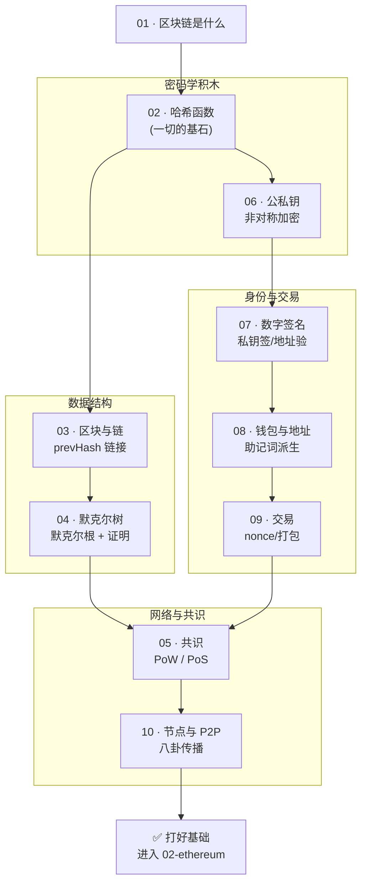

# 01 · 区块链基础原理（Blockchain Basics）

> Web3 学习合集的第一站。用**纯 JavaScript、免链、免钱包、免安装**的可运行 demo，把区块链最核心的密码学与共识原理一次讲透。看完这一工程，你会真正理解「区块链为什么改不了、去中心化怎么实现、交易怎么上链」。

## 🧭 这个工程讲什么

区块链不是「魔法」，它由几块可拆解的密码学积木搭成：**哈希 → 区块链接 → 默克尔树 → 共识 → 公私钥 → 签名 → 钱包/地址 → 交易 → 网络**。本工程按官方推荐的由易到难顺序，每个知识点一个模块，每个模块配一个亲手能跑的 demo + 图解。

- **语言**：全中文讲解，代码含详细中文注释。
- **技术栈**：Node.js 内置 `crypto`、浏览器 `SubtleCrypto`、ethers v6（仅 CDN，本地演示）。
- **安全底线**：只演示原理，**不连主网、不用真实钱包、不含任何真实私钥/助记词**。

## 📚 模块索引

| # | 模块 | 一句话 | Demo 形式 | 运行 |
| --- | --- | --- | --- | --- |
| 00 | [what-is-web3-dev](./00-what-is-web3-dev/) | 👉 **新手先看**：Web3 开发到底开发什么、技术栈全景、学习路线 | 纯讲解 | 阅读 |
| 01 | [what-is-blockchain](./01-what-is-blockchain/) | 去中心化、防篡改的共享账本是什么 | `index.html` | 浏览器打开 |
| 02 | [hash-functions](./02-hash-functions/) | SHA-256 哈希，改一字节指纹全变 | `demo.js` + `index.html` | `node` / 浏览器 |
| 03 | [blocks-and-chain](./03-blocks-and-chain/) | 区块结构 & prevHash 链式链接（手写迷你链） | `demo.js` | `node demo.js` |
| 04 | [merkle-tree](./04-merkle-tree/) | 默克尔树/默克尔根，构建 + 证明验证 | `demo.js` | `node demo.js` |
| 05 | [consensus](./05-consensus/) | 共识 PoW vs PoS，PoW 挖矿难度 demo | `demo.js` | `node demo.js` |
| 06 | [public-key-cryptography](./06-public-key-cryptography/) | 非对称加密 / 公私钥 | `demo.js` | `node demo.js` |
| 07 | [digital-signatures](./07-digital-signatures/) | 数字签名与验签（ethers 签名/ecrecover） | `index.html` | 浏览器打开 |
| 08 | [wallets-keys-addresses](./08-wallets-keys-addresses/) | 助记词→私钥→公钥→地址（BIP39/44） | `index.html` | 浏览器打开 |
| 09 | [transactions](./09-transactions/) | 交易结构 / nonce / 如何被打包 | `demo.js` | `node demo.js` |
| 10 | [nodes-p2p-network](./10-nodes-p2p-network/) | 节点/全节点轻节点/P2P 八卦传播 | `demo.js` | `node demo.js` |

## 🗺️ 学习路线图



**建议顺序**：01 建立整体直觉 → 02 哈希（基石）→ 03/04 数据结构 → 05 共识 → 06/07/08 身份与密钥 → 09 交易 → 10 网络。若急着看「钱是怎么被授权花出去的」，可先跳 06→07→08→09 这条线。

## ▶️ 运行说明

**前置**：只需要下面两者之一，无需任何 `npm install`。

- **Node.js**（跑 `.js` demo，建议 v18+；本项目用 v24 验证）
- **现代浏览器**（跑 `index.html`，Chrome/Edge/Safari 最新版）

**跑 Node demo**（模块 02/03/04/05/06/09/10）：

```bash
cd 01-blockchain-basics/03-blocks-and-chain
node demo.js
```

**跑浏览器 demo**（模块 01/02/07/08）：直接双击对应目录下的 `index.html` 即可。

> 模块 07、08 会通过 CDN 加载 ethers v6（就一个 JS 文件），首次需联网；之后全在本地运行，**不连接任何区块链、不需要 MetaMask、不涉及真实资产**。若环境无法访问 CDN，可把 `ethers.umd.min.js` 下载到该模块目录并改用本地路径。

## ⚠️ 安全底线（贯穿全合集）

- **只演示原理 / 只用测试网**：本工程完全离线，后续工程涉及链上操作时一律用 **Sepolia 测试网 + 水龙头测试币**，绝不使用主网真实资产。
- **绝不泄露私钥/助记词**：仓库中所有密钥均为即时随机生成的演示值或占位符，绝无真实私钥。你自己练习时也**绝不**把助记词/私钥截图、上传、粘进网页。
- **警惕钓鱼签名与假钱包**：详见模块 07、08 的安全提示。

## 🔗 权威参考

- 以太坊官方开发者文档 · 区块链介绍：https://ethereum.org/zh/developers/docs/intro-to-blockchain/
- 以太坊官方开发者文档 · 以太坊介绍：https://ethereum.org/zh/developers/docs/intro-to-ethereum/
- 比特币白皮书（中文）：https://bitcoin.org/files/bitcoin-paper/bitcoin_zh_cn.pdf

---

> 下一站 → `../02-ethereum`：从原理走向以太坊，认识账户、EVM、Gas 与智能合约。
