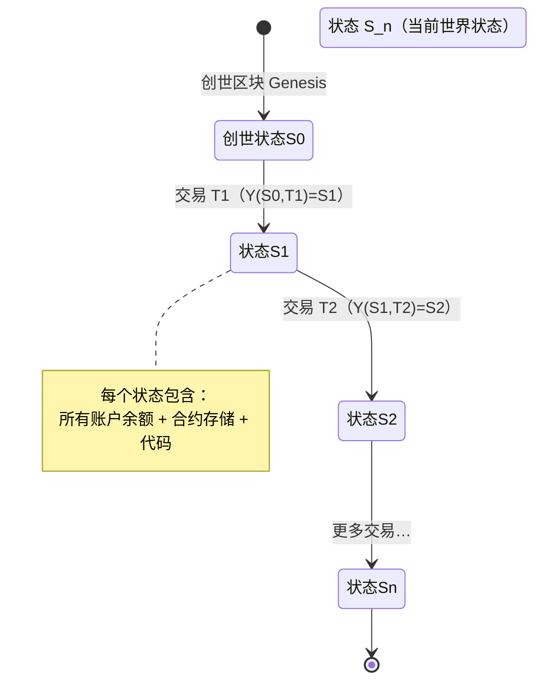
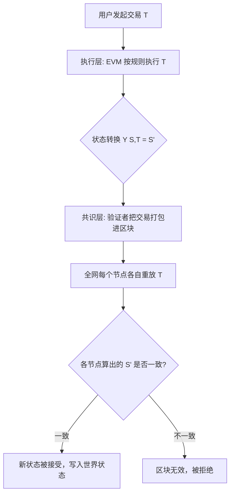

# 01 · 以太坊是什么（Ethereum Overview）
> 一句话说明：以太坊是一台由全球成千上万台电脑共同维护的「世界计算机」，它本质是一个**状态机**——通过交易不断把系统从一个状态推进到下一个状态。

## 📖 知识讲解

### 从比特币到以太坊
比特币是一个「去中心化的账本」，主要记录「谁有多少币」。以太坊在此基础上更进一步：它不仅记账，还能**运行任意程序（智能合约）**。因此以太坊常被称为「世界计算机」（World Computer）。

### 以太坊 = 分布式状态机
官方文档强调：**以太坊不是一个分布式账本，而是一个分布式状态机（distributed state machine）**。

- **状态（State）**：某一时刻整个网络的全部数据快照——所有账户的余额、所有合约的存储、所有代码。这个巨大的数据结构叫**世界状态（World State）**。
- **交易（Transaction）**：由用户发起、能改变状态的「一条指令」（转账、部署合约、调用合约）。
- **状态转换函数（State Transition Function）**：`Y(S, T) = S'`。给定**旧状态 S** 和一笔**合法交易 T**，产生唯一确定的**新状态 S'**。

所有节点重复执行同一批交易，必然得到同一个新状态——这就是「去中心化却能达成一致」的根本原理。

### 三层理解以太坊
| 层次 | 是什么 | 类比 |
| --- | --- | --- |
| 数据层 | 世界状态 + 区块链历史 | 电脑的硬盘 |
| 执行层 | EVM（以太坊虚拟机）执行字节码 | 电脑的 CPU |
| 共识层 | PoS 权益证明，验证者出块 | 一群人共同确认「这台电脑算得对」 |

### 核心名词速览
- **ETH（以太币）**：网络的原生货币，用来支付计算费用（Gas）。
- **账户（Account）**：状态的基本单位，分 EOA（用户）和合约账户（见 02 模块）。
- **Gas**：计算工作量的计量单位，防止有人写死循环拖垮全网（见 04 模块）。
- **EVM**：真正执行代码的虚拟机（见 05 模块）。

## 🔄 流程图 / 原理图

以太坊作为状态机，随每笔交易推进状态：



一笔交易如何被全网一致地执行（分层视角）：



## 💻 代码说明

本模块是概念入门，无需联网。`demo.js` 用最简 JavaScript **模拟**「状态 + 交易 + 状态转换函数」，帮助你直观理解 `Y(S, T) = S'`。

- `worldState`：一个对象，模拟世界状态（地址 → 余额）。
- `applyTransaction(state, tx)`：模拟状态转换函数，对一笔转账做校验并返回**新状态**（不可变思想，返回副本）。
- 依次施加多笔交易，打印每一步的状态演进。

> 注意：这只是**教学模拟**，真实以太坊的状态是 Merkle Patricia Trie，转换规则复杂得多，且由 EVM 执行。这里只演示「状态机」这一核心心智模型。

## ▶️ 运行方式

```bash
# 需要 Node.js（v18+）。不需要联网、不需要装任何依赖。
node demo.js
```

预期输出会打印初始状态、每笔交易后的新状态，以及一笔非法交易（余额不足）被拒绝的过程。

## ⚠️ 常见坑 / 安全提示
- **别把以太坊理解成「更快的数据库」**：它慢且贵，价值在于「无需信任第三方即可全网达成一致」。
- **状态转换是确定性的**：相同输入必然相同输出，因此合约里**不能用真随机数、不能依赖本地时间/网络请求**。
- 本模块纯本地模拟，**不涉及任何私钥、真实资产**；后续模块连链时一律只用测试网。

## 🔗 官方文档
- 以太坊简介：https://ethereum.org/zh/developers/docs/intro-to-ethereum/
- EVM（状态机模型）：https://ethereum.org/zh/developers/docs/evm/
- 以太坊白皮书：https://ethereum.org/zh/whitepaper/
