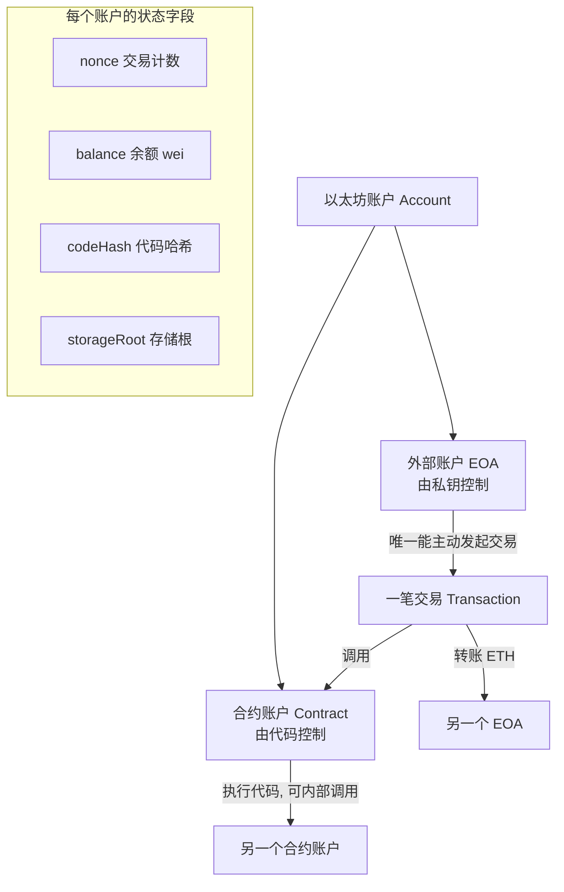
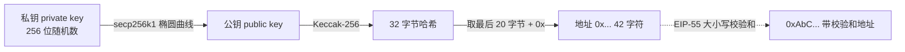

# 02 · 账户模型（Accounts：EOA vs 合约账户）
> 一句话说明：以太坊世界状态的基本单位是「账户」，分为**外部账户（EOA，人持有私钥）**和**合约账户（代码控制）**；每个账户都由 nonce、balance、codeHash、storageRoot 四个字段描述。

## 📖 知识讲解

### 两种账户
| 维度 | 外部账户 EOA（Externally Owned Account） | 合约账户（Contract Account） |
| --- | --- | --- |
| 控制方 | 拥有**私钥**的人 | 部署时写入的**代码** |
| 创建成本 | 免费（生成一对密钥即可） | 需要付 Gas 部署 |
| 能否主动发起交易 | ✅ 可以（一切交易的源头） | ❌ 不能主动，只能被交易「触发」后执行代码 |
| 有代码吗 | 无（codeHash 为空哈希） | 有（codeHash 指向合约字节码） |
| 举例 | 你的 MetaMask 钱包地址 | 一个 ERC-20 代币合约、Uniswap 合约 |

关键点：**只有 EOA 能发起交易**。合约账户像一段「沉睡的代码」，必须由一笔交易调用它，它才会醒来执行。合约内部再去调用别的合约，则叫「内部交易 / message call」。

### 账户状态：四个字段
无论哪种账户，在世界状态里都由这 4 个字段描述：

1. **nonce**：交易计数器。
   - EOA：该账户已发出的交易数量。**防重放/防重复**——每笔交易的 nonce 必须严格递增。
   - 合约账户：该合约已创建的合约数量。
2. **balance**：该账户拥有的 ETH 数量，单位是 **wei**（1 ETH = 10¹⁸ wei）。
3. **codeHash**：账户代码的哈希。
   - EOA：空代码的 Keccak-256 哈希（固定值），代表「没有代码」。
   - 合约账户：合约字节码的哈希，**部署后不可更改**。
4. **storageRoot**：该账户存储内容的 Merkle Patricia Trie 根哈希。
   - EOA：为空。
   - 合约账户：合约所有状态变量都存在这棵树里，根哈希放这里。

### 地址是怎么来的？
- **EOA 地址**：私钥 →（椭圆曲线 secp256k1）→ 公钥 → 取公钥的 **Keccak-256 哈希的最后 20 字节**，前面加 `0x`，得到 42 字符的地址。
- 私钥能推出公钥、公钥能推出地址，但**反向不可行**（这就是安全性来源）。
- 地址常写成 **EIP-55 校验和格式**（大小写混合），钱包据此检测输错。

## 🔄 流程图 / 原理图

账户分类与「谁能发起交易」：



从私钥到地址的推导（单向）：



## 💻 代码说明

`demo.js` 用 **ethers v6** 连接公共 RPC，读取真实的链上账户信息，演示两种账户的差异：

- 用 `Wallet.createRandom()` **本地**生成一个随机 EOA（仅演示地址推导，**不用于任何真实资产**，私钥打印后即丢弃）。
- 用 `provider.getBalance(addr)` 读取余额，`provider.getTransactionCount(addr)` 读取 nonce。
- 用 `provider.getCode(addr)` 判断一个地址是 EOA 还是合约：
  - 返回 `"0x"`（空）→ **EOA**；
  - 返回一大串字节码 → **合约账户**。
- 对比：一个知名合约地址（如 Sepolia 上的合约）会返回代码，普通地址返回 `0x`。

## ▶️ 运行方式

```bash
# 1) 安装依赖（在 02-ethereum 目录下执行一次即可）
npm install

# 2) 运行（默认连 Sepolia 公共 RPC，只读，不花钱、不需私钥）
node demo.js
```

若公共 RPC 偶发超时，多试几次，或在 demo.js 顶部把 `RPC_URL` 换成其他公共节点（文件里已列出备选）。

## ⚠️ 常见坑 / 安全提示
- **私钥 = 账户所有权**。谁拿到私钥就能动你所有资产，**绝不能写进代码或上传仓库**。demo 里生成的随机私钥仅用于演示，请勿转入任何资产。
- **nonce 必须连续**：手动发交易时若 nonce 跳号，交易会卡在 mempool（后面 03 模块细讲）。
- **合约代码不可变**：codeHash 部署后固定，所谓「可升级合约」是用代理模式绕过，并非改代码。
- `getCode` 判断合约有边界情况：合约**正在构造中**时代码为空；EIP-7702 后 EOA 也可能临时带代码。教学场景可忽略。

## 🔗 官方文档
- 以太坊账户：https://ethereum.org/zh/developers/docs/accounts/
- ethers v6 Provider：https://docs.ethers.org/v6/api/providers/
