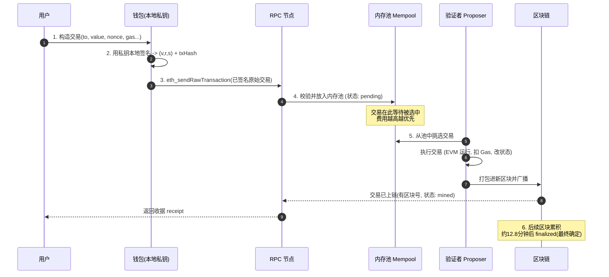
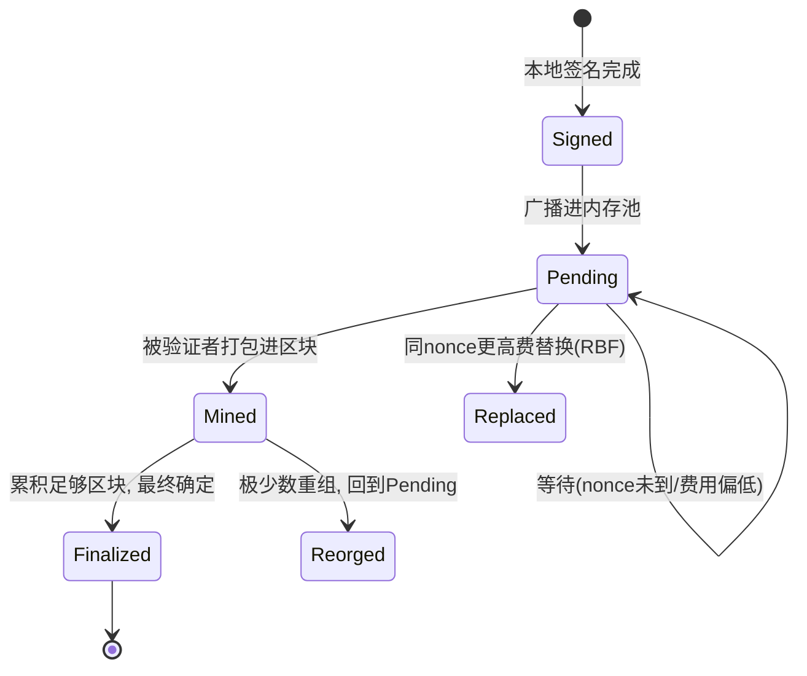

# 03 · 交易生命周期（Transactions Lifecycle）
> 一句话说明：交易是**唯一能改变以太坊状态**的动作；它从「构造 → 签名 → 广播 → 进内存池 → 被打包 → 确认/最终确定」走完一生，理解这条链路是理解一切链上操作的基础。

## 📖 知识讲解

### 交易的结构（EIP-1559 / Type 2，当前标准）
一笔现代以太坊交易包含这些字段：

| 字段 | 含义 |
| --- | --- |
| `nonce` | 发送方账户的交易序号，从 0 递增，**决定交易顺序、防重放** |
| `to` | 接收地址；若为空则表示「部署合约」 |
| `value` | 转账的 ETH 数量（单位 wei） |
| `data` | 附带数据；调用合约时是「函数选择器 + 参数」，纯转账时为空 |
| `gasLimit` | 本交易最多愿意消耗的 Gas 上限（防失控） |
| `maxFeePerGas` | 每单位 Gas 愿付的**最高**总价（含 baseFee + 小费） |
| `maxPriorityFeePerGas` | 给验证者的小费上限（priority fee） |
| `chainId` | 链 ID（主网=1，Sepolia=11155111），**防跨链重放** |
| `signature (v, r, s)` | 用私钥对上述内容签名的结果，证明「确实是我发的」 |

> 旧版「Legacy / Type 0」交易用单一 `gasPrice` 字段；EIP-1559 后拆成 baseFee + priorityFee（见 04 模块）。

### 生命周期六步
1. **构造**：钱包填好上表字段，其中 nonce 通常自动取「当前账户已发交易数」。
2. **签名**：用私钥对交易做椭圆曲线签名，得到 `(v, r, s)`。签名在**本地完成**，私钥永不离开设备。签名后可算出**交易哈希（txHash）**作为唯一标识。
3. **广播**：把「已签名的原始交易」通过 RPC 节点发到网络（`eth_sendRawTransaction`）。
4. **进内存池（mempool）**：交易进入各节点的「待打包池」，等待被选中。此时状态是 **pending**。
5. **被打包**：某个验证者（proposer）在自己出的区块里选入这笔交易并执行（EVM 运行、扣 Gas、改状态）。此时交易「上链」，得到一个区块号。
6. **确认 / 最终确定**：区块之上再叠加更多区块。PoS 下，约 2 个 epoch（≈12.8 分钟）后交易被 **finalized（最终确定）**，几乎不可回滚。

### nonce 为什么这么重要
- nonce 必须**严格连续**（0,1,2,…）。若你发了 nonce=5 但 nonce=4 还没被打包，5 会一直卡在 mempool 等 4。
- nonce 让「同一笔签名」无法被重复执行——**防重放攻击**的核心。
- 想「加速/取消」一笔卡住的交易：用**相同 nonce**、更高的 Gas 费重发一笔即可替换（RBF，Replace-By-Fee）。

## 🔄 流程图 / 原理图

交易一生的时序图（用户 → 钱包 → RPC 节点 → 内存池 → 验证者 → 区块链）：



交易在池中的状态流转：



## 💻 代码说明

`demo.js` 用 ethers v6 **只读**地展示交易结构与生命周期：

- `provider.getTransaction(txHash)`：拿到一笔真实历史交易的**完整字段**（nonce、to、value、gas、type、签名等），逐字段中文打印。
- `provider.getTransactionReceipt(txHash)`：拿到**收据**——是否成功、实际消耗 Gas、所在区块号、日志等（这代表交易已走到「被打包」阶段）。
- 演示如何用 `getTransactionCount(addr, "pending")` 得到「下一笔交易该用的 nonce」。

为避免示例交易哈希失效，demo 里同时提供一段**离线示例数据 + 注释**，讲清每个字段含义；联网部分失败也不影响理解。

## ▶️ 运行方式

```bash
npm install          # 首次在 02-ethereum 目录执行
node demo.js
```

## ⚠️ 常见坑 / 安全提示
- **签名即授权**：一旦签名并广播，交易不可撤销（只能用同 nonce 更高费替换或让它自然失败）。**签名前务必看清 to/value/data**，警惕钓鱼签名。
- **nonce 跳号会卡死**：批量发交易要按序管理 nonce。
- **maxFeePerGas 设太低** 会让交易长时间 pending；设太高只是上限，实际按 baseFee+小费扣，不会真扣满。
- 本模块只做**只读**演示。任何发送交易的操作请只在 **Sepolia 测试网** 用测试币练习，**绝不用主网真实资产**，私钥用 `.env` 且 gitignore。

## 🔗 官方文档
- 交易：https://ethereum.org/zh/developers/docs/transactions/
- 交易生命周期与最终确定：https://ethereum.org/zh/developers/docs/transactions/#transaction-lifecycle
- ethers v6 交易：https://docs.ethers.org/v6/api/providers/#Provider-getTransaction
