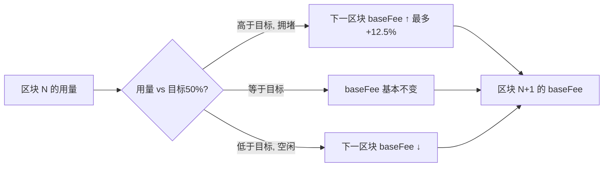

# 04 · Gas 与手续费（Gas & Fees / EIP-1559）
> 一句话说明：Gas 是「计算工作量」的计价单位；EIP-1559 把每单位 Gas 的价格拆成**协议自动定价的 baseFee（基础费，被销毁）**和**用户给验证者的 priorityFee（小费）**，最终手续费 = 消耗的 Gas × (baseFee + priorityFee)。

## 📖 知识讲解

### 为什么要有 Gas？
以太坊是「世界计算机」，如果计算免费，有人写个死循环就能拖垮全网。**Gas 给每一步操作明码标价**：加法便宜、写存储很贵。你必须为消耗的计算资源付费，从而：
- 防止资源滥用 / DoS 攻击；
- 让「越复杂的操作越贵」，激励写高效合约。

### 三个容易混淆的概念
| 概念 | 单位 | 含义 |
| --- | --- | --- |
| **Gas 用量（gas used）** | Gas | 这笔交易实际执行了多少「工作量」。纯 ETH 转账固定 **21000**；调用合约更多。 |
| **Gas 价格（gas price）** | Gwei/Gas | 你**每单位 Gas 愿意付多少钱**。 |
| **手续费（fee）** | ETH | 二者相乘：`fee = gasUsed × gasPrice`。 |

### EIP-1559：把 gasPrice 拆成两部分
现在每单位 Gas 的价格 = **baseFee + priorityFee**：

- **baseFee（基础费）**：由**协议根据上一个区块的拥堵程度自动计算**，所有人同一区块内一致。它会被**销毁（burn）**，不给验证者。
  - 区块用量 > 目标（50%）→ 下个区块 baseFee **最多上涨 12.5%**；
  - 区块用量 < 目标 → baseFee **下降**。
  - 这个负反馈让费用围绕「网络真实需求」自动收敛。
- **priorityFee（优先费 / 小费）**：你**额外**给验证者的激励，让他优先打包你的交易。

用户在钱包里设的是两个上限：
- **maxFeePerGas**：每单位 Gas 你愿付的**总价上限**（必须 ≥ baseFee + 你想给的小费）。
- **maxPriorityFeePerGas**：小费上限。

**实际单价 = min(maxFeePerGas, baseFee + maxPriorityFeePerGas)**；多出的（maxFeePerGas 高于实际）会**退还**。

### 计算公式（务必记住）
```
每单位 Gas 实付 = baseFee + priorityFee
交易手续费     = gasUsed × (baseFee + priorityFee)
其中 baseFee 部分被销毁，priorityFee 部分归验证者
```
**示例**：纯转账 gasUsed = 21000，baseFee = 10 gwei，priorityFee = 2 gwei：
```
21000 × (10 + 2) gwei = 252000 gwei = 0.000252 ETH
```

## 🔄 流程图 / 原理图

一笔交易的手续费是怎么算出来、怎么分配的：

```mermaid
flowchart TD
    A[交易执行] --> B[EVM 累计每个 opcode 的 Gas -> gasUsed]
    P1[协议按上区块拥堵算出 baseFee] --> C
    U[用户设 maxFeePerGas / maxPriorityFeePerGas] --> C
    B --> C[每单位实付 = min(maxFee, baseFee + priorityFee)]
    C --> D[手续费 = gasUsed × 每单位实付]
    D --> E1[baseFee × gasUsed 部分 -> 🔥销毁]
    D --> E2[priorityFee × gasUsed 部分 -> 给验证者]
    D --> E3[maxFee 多出的部分 -> 退还给用户]
```

baseFee 如何随区块拥堵自动调整（负反馈）：



## 💻 代码说明

`demo.js` 分两部分：

1. **纯本地计算**：给定 gasUsed / baseFee / priorityFee，按公式算出手续费，并拆分「销毁 vs 给验证者 vs 退还」，用真实数字讲清 EIP-1559 的钱怎么分。
2. **联网读取**（ethers v6）：用 `provider.getFeeData()` 读取 Sepolia 当前的 `gasPrice / maxFeePerGas / maxPriorityFeePerGas`，并用 `getBlock("latest")` 读出当前区块的 `baseFeePerGas`，代入公式估算「现在发一笔纯转账要花多少钱」。

## ▶️ 运行方式

```bash
npm install     # 首次在 02-ethereum 目录执行
node demo.js
```

## ⚠️ 常见坑 / 安全提示
- **gasLimit ≠ 手续费**。gasLimit 只是「最多允许消耗的 Gas 上限」，是个安全阀；真正扣费按**实际 gasUsed**。设太低会导致交易执行到一半 **out of gas 失败，且已消耗的 Gas 不退**。
- **失败的交易也要付 Gas**！只要上链执行了，无论成功失败都扣 Gas（回滚只退还状态，不退 Gas）。
- **baseFee 会波动**：网络拥堵时 baseFee 飙升，maxFeePerGas 设太低会让交易长期 pending。
- 别被「预估 Gas」骗：合约调用的 gasUsed 依赖执行路径，`estimateGas` 只是估计，复杂交易要留余量。

## 🔗 官方文档
- Gas 与手续费：https://ethereum.org/zh/developers/docs/gas/
- EIP-1559 提案：https://eips.ethereum.org/EIPS/eip-1559
- ethers v6 getFeeData：https://docs.ethers.org/v6/api/providers/#Provider-getFeeData
