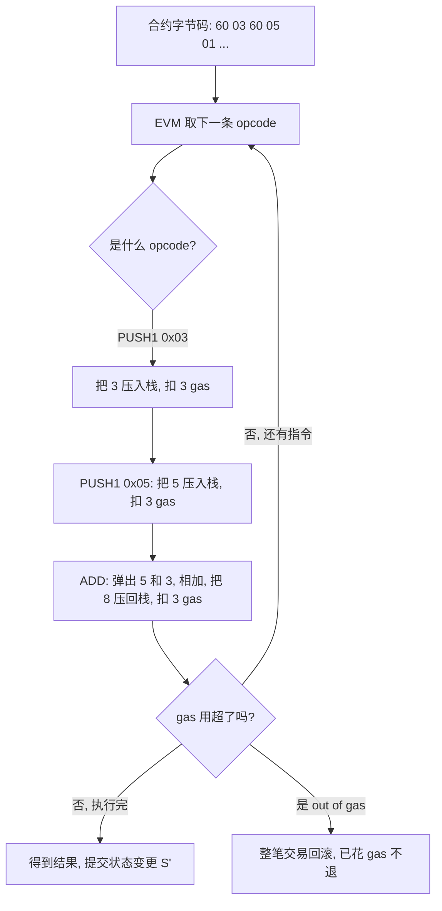
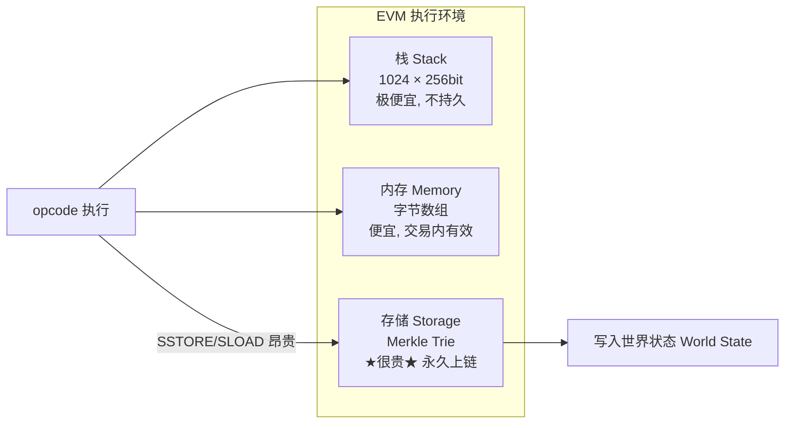

# 05 · 以太坊虚拟机（EVM：Ethereum Virtual Machine）
> 一句话说明：EVM 是运行在所有节点上的**确定性栈式虚拟机**，它把智能合约编译出的**字节码**逐条当作 **opcode（操作码）**执行，每条指令都要花 Gas，从而把「旧状态」变成「新状态」。

## 📖 知识讲解

### EVM 是什么
- 智能合约用 Solidity 写，编译后得到一串**字节码（bytecode）**，例如 `60 80 60 40 52 ...`。
- 这串字节码由一个个 **opcode** 组成：`0x60 = PUSH1`、`0x01 = ADD`、`0x55 = SSTORE` ……
- **EVM 就是执行这些 opcode 的引擎**，它在每个节点上以完全相同的规则运行，保证「同样输入 → 同样输出」（确定性），这是全网达成一致的前提。
- EVM 是**状态转换函数**的实现：`Y(S, T) = S'`（见 01 模块）。

### 栈机模型
EVM 是一台**栈式机器（stack machine）**，不像常见 CPU 用寄存器：
- 有一个**栈（stack）**，最多 **1024 个槽**，每个槽 **256 位（32 字节）**。选 256 位是为了配合 Keccak-256 哈希和椭圆曲线运算。
- 计算方式是「后进先出」：想算 `3 + 5`，就 `PUSH 3`、`PUSH 5`、`ADD`，结果 8 留在栈顶。

### 三个（+1）数据区，务必分清
| 数据区 | 是否持久 | 特点 | 类比 |
| --- | --- | --- | --- |
| **栈 Stack** | 否 | 指令的临时操作数，1024 槽 | CPU 的运算暂存 |
| **内存 Memory** | 否（交易内有效） | 按字节寻址的临时数组，交易结束清空 | 内存/RAM |
| **存储 Storage** | **是**（永久上链） | 合约状态变量存这里，写入**很贵**（SSTORE） | 硬盘 |
| 瞬态存储 Transient | 否（交易内有效） | EIP-1153 新增，交易结束清除 | 临时便签 |

**核心直觉**：**读写 Storage 极贵，栈/内存便宜**。所以省 Gas 的第一原则就是「少碰 storage」。

### Gas 与 opcode 的关系
每个 opcode 都有固定或动态的 Gas 价：
- `ADD` / `PUSH` 很便宜（3 Gas 左右）；
- `SSTORE`（写存储）极贵（首次写一个非零槽 22100 Gas）；
- `SLOAD`（读存储）、`KECCAK256`、外部调用等各有价目。

EVM 一边执行一边累加消耗；若累计超过交易的 `gasLimit`，立即抛 **out of gas**，**整笔交易回滚**（状态复原），但**已花的 Gas 不退**。

## 🔄 流程图 / 原理图

EVM 执行一段字节码的过程（以 `3 + 5` 为例）：



EVM 的数据区与「贵/便宜」关系：



## 💻 代码说明

`demo.js` 是一个**极简 EVM 栈机模拟器**（纯本地，不联网），带 Gas 计量：

- 定义一小段「字节码」——用可读的 opcode 数组表示：`PUSH 3`、`PUSH 5`、`ADD`、`PUSH 2`、`MUL`。
- 用一个数组当**栈**，逐条执行 opcode，`PUSH` 压栈、`ADD/MUL` 弹两个算完压回。
- 每条指令累加 **Gas 消耗**，并打印执行前后的栈状态，直观展示「栈机 + Gas」。
- 附带一个 `gasLimit`，演示超限时 **out of gas 回滚**。

> 这是教学模拟，真实 EVM 有 140+ opcode、内存/存储、调用等，但「压栈—弹栈—计费」的核心机制就是这样。

## ▶️ 运行方式

```bash
# 纯本地，无需联网、无需安装依赖，只要有 Node.js
node demo.js
```

## ⚠️ 常见坑 / 安全提示
- **省 Gas = 少写 Storage**：把多次 `SSTORE` 合并、用内存变量暂存、循环里别反复读写存储。
- **out of gas 会回滚全部**：交易执行到一半没气了，之前的状态改动全部撤销，但 Gas 照扣。
- **EVM 是确定性的**：合约里**不能**依赖 `block.timestamp` 做强随机、不能发网络请求、不能读链下数据——需要预言机（Oracle）。
- 不同链的「EVM 兼容」指支持同一套 opcode，但 Gas 价目、预编译合约可能有差异，跨链部署要测。

## 🔗 官方文档
- EVM：https://ethereum.org/zh/developers/docs/evm/
- EVM opcodes 操作码：https://ethereum.org/zh/developers/docs/evm/opcodes/
- opcode 参考（gas 价目）：https://www.evm.codes/
