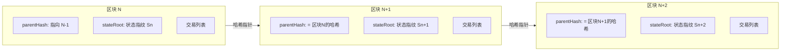
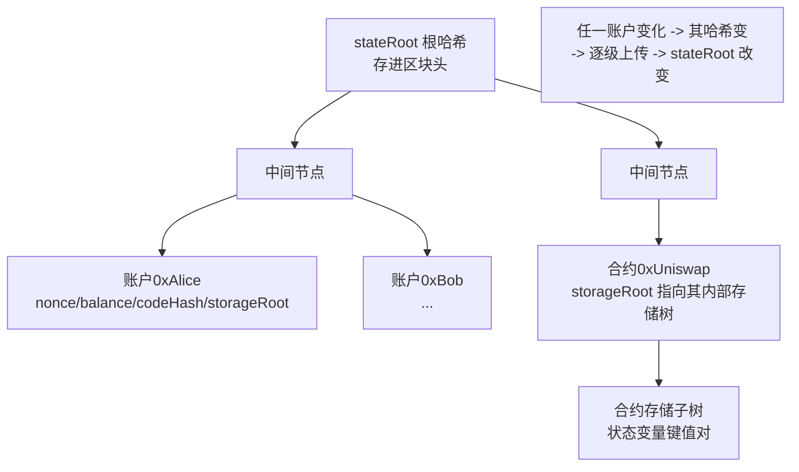

# 06 · 区块与世界状态（Blocks & World State）
> 一句话说明：交易被打包进**区块**，区块通过 `parentHash` 首尾相连成链；每个区块记录执行完这批交易后的**世界状态根（stateRoot）**——一棵存着全网所有账户的 Merkle Patricia Trie 的根哈希。

## 📖 知识讲解

### 区块是什么
区块 = **一批交易** + **一段元数据（区块头）**。以太坊约每 **12 秒**产生一个区块（一个 slot），由被随机选中的验证者（proposer）打包。

### 区块头的关键字段
| 字段 | 含义 |
| --- | --- |
| `parentHash` | **上一个区块的哈希** —— 把区块「链」起来的关键 |
| `number` | 区块高度（第几个区块） |
| `timestamp` | 出块时间戳 |
| `stateRoot` | **执行完本区块所有交易后**，整个世界状态树的根哈希 |
| `transactionsRoot` | 本区块交易列表的 Merkle 根 |
| `receiptsRoot` | 本区块所有交易收据的 Merkle 根 |
| `gasLimit` / `gasUsed` | 本区块 Gas 上限 / 实际用量（目标 3000 万，上限 6000 万） |
| `baseFeePerGas` | 本区块的 EIP-1559 基础费（见 04 模块） |

### 区块如何链接成「链」
每个区块都存着**上一个区块的哈希**。只要改动任意一个历史区块的哪怕 1 个字节，它的哈希就变，导致后面所有区块的 `parentHash` 对不上——**篡改会被立刻发现**。这就是「区块链不可篡改」的来源（与 01-blockchain-basics 模块的哈希链一致）。

### 世界状态（World State）与 stateRoot
- **世界状态**：全网所有账户（EOA + 合约）在某一刻的完整快照——每个账户的 `nonce / balance / codeHash / storageRoot`（见 02 模块）。
- 这份庞大的数据用一棵 **Merkle Patricia Trie（MPT，默克尔帕特里夏树）** 组织，它的根哈希就是 `stateRoot`。
- **stateRoot 是「状态的指纹」**：只要状态有任何变化，stateRoot 必然改变。区块头存 stateRoot，等于给「执行完这批交易后的世界状态」盖了个防伪章。
- 所有节点重放同一批交易，必须算出**相同的 stateRoot**，否则区块无效——这保证了全网状态一致。

### 区块、交易、状态三者的关系
```
交易 T  --被打包进-->  区块 Block  --指向-->  世界状态 State（用 stateRoot 概括）
区块 N+1.parentHash == 区块 N 的哈希      （链式结构）
区块 N.stateRoot == 执行完区块 N 的交易后的状态指纹
```

## 🔄 流程图 / 原理图

区块如何通过 parentHash 链接，并各自锚定一个世界状态：



世界状态树（MPT）与 stateRoot 的关系：



## 💻 代码说明

`demo.js` 用 ethers v6 **只读**地读取真实区块，展示上述概念：

- `provider.getBlock("latest")`：读取最新区块头，打印 `number / hash / parentHash / timestamp / gasUsed / gasLimit / baseFeePerGas / stateRoot`（若 RPC 提供）。
- **验证链式结构**：再用 `getBlock(number - 1)` 读上一个区块，程序断言「当前区块的 `parentHash` == 上一个区块的 `hash`」，亲眼看到区块是怎么链起来的。
- 打印区块内交易数量，说明「区块 = 一批交易 + 元数据」。

## ▶️ 运行方式

```bash
npm install     # 首次在 02-ethereum 目录执行
node demo.js
```

## ⚠️ 常见坑 / 安全提示
- **区块最终性不是即时的**：刚打包的区块理论上可能因链重组（reorg）被替换。等约 2 个 epoch（≈12.8 分钟）交易 **finalized** 后才几乎不可逆——涉及大额务必等确认（见 03 模块）。
- **stateRoot 不是「历史全存」**：节点默认不保存每个历史区块的完整状态（那太大了）。查很旧的状态需要**归档节点（archive node）**。
- 别把 `timestamp` 当可信随机源或精确时钟——它由出块者填写，有一定操纵空间。
- 本模块只读，不涉及任何私钥或资产。

## 🔗 官方文档
- 区块：https://ethereum.org/zh/developers/docs/blocks/
- Merkle Patricia Trie：https://ethereum.org/zh/developers/docs/data-structures-and-encoding/patricia-merkle-trie/
- ethers v6 getBlock：https://docs.ethers.org/v6/api/providers/#Provider-getBlock
