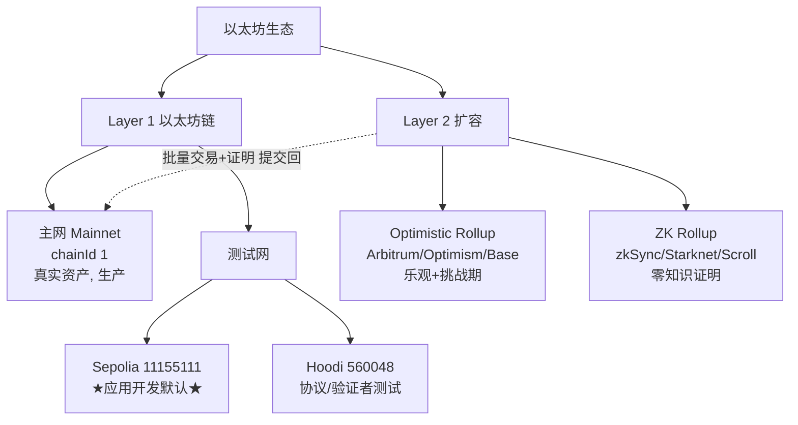
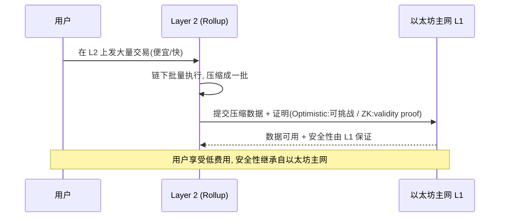

# 07 · 以太坊网络（Networks：主网 / 测试网 / L2）
> 一句话说明：以太坊有多张「网络」——**主网（Mainnet）**跑真钱、**测试网（Sepolia 等）**用免费测试币练手、**Layer 2（Rollup）**在以太坊之上做便宜快速的扩容；它们靠 **chainId** 区分，开发要先在测试网跑通再上主网。

## 📖 知识讲解

### 主网 vs 测试网
| | 主网 Mainnet | 测试网 Testnet |
| --- | --- | --- |
| ETH 价值 | **真金白银** | **免费、无价值**（水龙头领取） |
| 用途 | 生产环境、真实资产 | 开发调试、部署演练、学合约 |
| chainId | 1 | Sepolia = 11155111 |
| 出错代价 | 真亏钱 | 无所谓，随便试 |

官方铁律：**任何合约代码，上主网前都必须先在测试网充分测试。**

### 当前推荐的测试网（2025 年现状）
- **Sepolia（chainId 11155111）**：**应用开发的默认推荐测试网**。验证者是许可制（团队维护），稳定、状态小、领币方便。**学合约、部 dApp 首选它。**
- **Hoodi（chainId 560048）**：面向**验证者与协议开发者**测试质押、网络升级，验证者集合开放。日常应用开发一般用不到。
- **Holesky**：曾用的测试网，**已计划停用/退役**，新项目不要再用。

> 领测试币的「水龙头（Faucet）」：Alchemy、Infura、Chainstack、Google Cloud Web3 等都提供 Sepolia 水龙头，通常需要少量身份验证防刷。

### Layer 2 / Rollup 概念
主网安全但**慢而贵**（每秒十几笔、拥堵时手续费高）。**Layer 2（L2）**在以太坊「之上」扩容：
- 核心思路叫 **Rollup（卷叠）**：把成百上千笔交易**在链下批量执行**，再把**压缩后的数据 + 证明**打包提交回以太坊主网（L1），**安全性继承自 L1**，但费用被摊薄到极低。
- 两大类：
  - **Optimistic Rollup（乐观卷叠）**：默认「假设交易都对」，留一个「挑战期」允许有人举证造假。代表：Arbitrum、Optimism、Base。
  - **ZK Rollup（零知识卷叠）**：用**零知识证明（validity proof）**在数学上证明这批交易正确，无需挑战期，提现更快。代表：zkSync、Starknet、Linea、Scroll、Polygon zkEVM。

L2 也各有自己的测试网（如 Arbitrum Sepolia、Optimism Sepolia）。

### 怎么「连」到某个网络
连一个网络 = 找一个该网络的 **RPC 端点（URL）**。本工程所有 demo 用的就是公共 Sepolia RPC。钱包（MetaMask）里「切换网络」本质也是切换 RPC + chainId。

## 🔄 流程图 / 原理图

网络全景：主网、测试网、L2 的关系与用途：



Rollup 如何把交易「卷」回主网（继承主网安全）：



## 💻 代码说明

`demo.js` 用 ethers v6 连接不同网络的公共 RPC，读取每个网络的**身份信息**，让你直观看到「同样的接口、不同的网络」：

- 对每个 RPC 端点调用 `provider.getNetwork()` 拿到 **chainId** 和名称。
- 调用 `getBlockNumber()` 拿到该网络当前区块高度。
- 内置一张网络对照表（主网 / Sepolia / 一个 L2 测试网），逐个连接并打印。
- 附离线对照表，即使某些 RPC 超时也能看清各网络 chainId。

## ▶️ 运行方式

```bash
npm install     # 首次在 02-ethereum 目录执行
node demo.js
```

## ⚠️ 常见坑 / 安全提示
- **认准 chainId，别连错网**：主网=1、Sepolia=11155111。往「测试网地址」转真主网 ETH 会打水漂。
- **测试币没有价值**，不要买卖，谨防「用测试币换真钱」的骗局。
- **别再用 Holesky/Goerli 等已退役测试网**，新项目一律用 **Sepolia**。
- 公共 RPC 有速率限制、可能不稳定；正式项目用自建节点或 Alchemy/Infura 的 API Key（Key 放 `.env`，别进仓库）。
- L2 的「充值/提现」有跨链桥和挑战期，Optimistic Rollup 提现回 L1 可能要等约 7 天。

## 🔗 官方文档
- 网络：https://ethereum.org/zh/developers/docs/networks/
- Layer 2：https://ethereum.org/zh/developers/docs/scaling/
- Rollup：https://ethereum.org/zh/developers/docs/scaling/#rollups
- chainlist（各网络 chainId/RPC）：https://chainlist.org/
