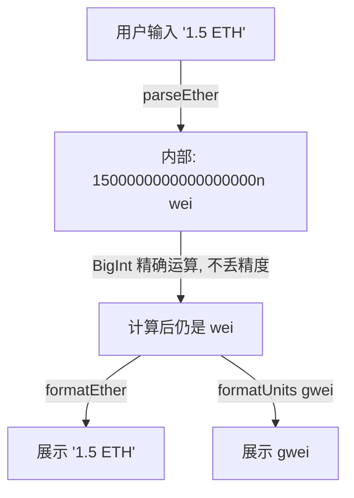

# 08 · 以太币单位换算（Ether Units：wei / gwei / ether）
> 一句话说明：以太坊内部一切金额都用**最小单位 wei（整数）**计算，`1 ether = 10¹⁸ wei`、`1 gwei = 10⁹ wei`；Gas 价格常用 **gwei**，用户余额常用 **ether**——搞混单位是新手最常见的资金错误。

## 📖 知识讲解

### 为什么不用小数？
计算机浮点小数会有精度误差（`0.1 + 0.2 ≠ 0.3`），而钱**绝不能算错**。以太坊的做法：**所有金额都用最小单位 wei 的大整数表示**，永不出现小数。1 个 ETH 在链上其实是整数 `1000000000000000000`（18 个 0）。

### 单位换算表
| 单位 | = 多少 wei | = 多少 ether | 典型用途 |
| --- | --- | --- | --- |
| **wei** | 1 | 10⁻¹⁸ | 链上/合约内部计算的最小单位 |
| **kwei** | 10³ | 10⁻¹⁵ | 少用 |
| **mwei** | 10⁶ | 10⁻¹² | 少用 |
| **gwei** | 10⁹ | 10⁻⁹ | **Gas 价格**（如「20 gwei」） |
| **szabo** | 10¹² | 10⁻⁶ | 少用 |
| **finney** | 10¹⁵ | 10⁻³ | 少用 |
| **ether** | 10¹⁸ | 1 | **用户展示余额、转账金额** |

**只需牢记三个**：
```
1 ether = 1 000 000 000 000 000 000 wei   （10^18）
1 gwei  =             1 000 000 000 wei   （10^9）
1 ether =             1 000 000 000 gwei  （10^9）
```

### 在代码里怎么转
用 ethers v6：
- `ethers.parseEther("1.5")` → `1500000000000000000n`（ether 字符串 → wei，**输入/发送时用**）
- `ethers.formatEther(1500000000000000000n)` → `"1.5"`（wei → ether 字符串，**展示时用**）
- `ethers.parseUnits("20", "gwei")` → `20000000000n`（gwei → wei，**设 Gas 价用**）
- `ethers.formatUnits(20000000000n, "gwei")` → `"20.0"`（wei → gwei）

**原则**：**存储和运算永远用 wei（BigInt）**，只在「显示给人看」时才 format 成 ether/gwei，「接收人输入」时才 parse 回 wei。

## 🔄 流程图 / 原理图

单位换算的阶梯（每级差 10⁹）与「何时转换」：


程序里数据的流向（输入 parse → 内部 wei 运算 → 输出 format）：



## 💻 代码说明

`demo.js`（ethers v6，**纯本地、无需联网**）演示所有换算：

- 用三个记忆点打印 `1 ether / 1 gwei` 到底是多少 wei。
- `parseEther / formatEther / parseUnits / formatUnits` 四个函数来回转换并核对。
- 演示 **BigInt 精确运算**：两笔金额相加、按 Gas 价算手续费，全程整数，无精度误差。
- 一个「反面教材」：用 JavaScript 浮点数算 `0.1 + 0.2` 展示误差，对比说明为什么必须用 wei/BigInt。

## ▶️ 运行方式

```bash
npm install     # 首次在 02-ethereum 目录执行（本 demo 也可单独 npm i ethers）
node demo.js
```

## ⚠️ 常见坑 / 安全提示
- **最致命的坑：单位差 10⁹**。把 gwei 当 ether、或少写/多写几个 0，转账金额可能差十亿倍。发送前务必核对单位。
- **不要用 `Number` 存金额**：JS 的 `Number` 最大安全整数约 9×10¹⁵，装不下 wei（可达 10¹⁸+），会溢出失真。**一律用 BigInt**（字面量后缀 `n` 或 ethers 返回值）。
- **展示才 format，运算永远用 wei**：先 format 成小数再运算 = 引入浮点误差。
- 别把 `formatEther` 的字符串结果直接再做数学运算——它是给人看的字符串。

## 🔗 官方文档
- 以太币与单位：https://ethereum.org/zh/developers/docs/intro-to-ether/
- ethers v6 单位工具：https://docs.ethers.org/v6/api/utils/#about-units
