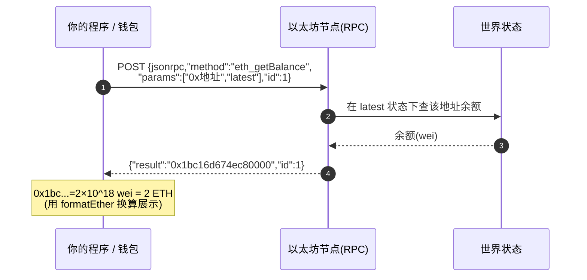
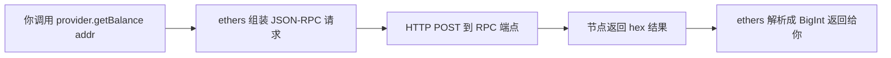

# 09 · JSON-RPC 接口（与节点对话的语言）
> 一句话说明：你的钱包、ethers/viem、区块浏览器，本质都在通过 **JSON-RPC** 这套标准协议向以太坊节点发请求（如 `eth_getBalance`、`eth_call`）读写链上数据——它是「应用 ↔ 区块链」之间唯一的对话接口。

## 📖 知识讲解

### JSON-RPC 是什么
- **JSON-RPC 2.0** 是一种「用 JSON 发起远程函数调用」的规范。以太坊所有客户端（Geth、Nethermind…）都实现同一套方法名，所以你换任何节点，接口都一样。
- 请求格式固定四要素：
```json
{ "jsonrpc": "2.0", "method": "方法名", "params": [参数...], "id": 1 }
```
- 响应里 `result` 是返回值，出错则有 `error` 字段。

### 重要约定：一切用十六进制
- **数量（quantity）**用十六进制字符串，带 `0x` 前缀且无多余前导零，如区块高度 `0x10d4f` = 68943。
- **区块参数**可填具体高度，或标签：`"latest"`（最新）、`"pending"`（待打包）、`"safe"`、`"finalized"`（已最终确定）、`"earliest"`（创世）。
- 余额等返回的是 **wei 的十六进制**，要自己换算（见 08 模块）。

### 常用方法速查
| 方法 | 作用 | params 示例 |
| --- | --- | --- |
| `eth_blockNumber` | 当前区块高度 | `[]` |
| `eth_chainId` | 链 ID（1=主网, 0xaa36a7=Sepolia） | `[]` |
| `eth_getBalance` | 查地址余额（wei，hex） | `["0x地址", "latest"]` |
| `eth_getTransactionCount` | 查 nonce | `["0x地址", "latest"]` |
| `eth_gasPrice` | 当前 Gas 价格 | `[]` |
| `eth_call` | **只读**调用合约函数（不上链、不花钱） | `[{to, data}, "latest"]` |
| `eth_getTransactionByHash` | 按哈希查交易 | `["0x交易哈希"]` |
| `eth_getBlockByNumber` | 按高度查区块 | `["latest", false]` |
| `eth_sendRawTransaction` | 广播已签名交易（**写操作**） | `["0x已签名原始交易"]` |

### 读 vs 写
- **读**（`eth_call`、`eth_getBalance`…）：不改状态、不花钱、不用签名，随便调。
- **写**（`eth_sendRawTransaction`）：改状态、花 Gas，必须**先本地签名**再广播（见 03 模块）。

### eth_call 与「函数选择器」
调用合约的只读函数（如 ERC-20 的 `balanceOf`），`data` 字段 = **函数选择器（函数签名 Keccak-256 的前 4 字节）+ ABI 编码的参数**。ethers 会帮你自动编码，但理解底层就是往 `eth_call` 塞一段 `data`。

## 🔄 流程图 / 原理图

一次 JSON-RPC 调用的往返（以 eth_getBalance 为例）：



ethers 库如何封装 JSON-RPC：



## 💻 代码说明

`demo.js` 用**两种方式**做同一件事，对照理解：

1. **裸 JSON-RPC**：用 Node 内置 `fetch` 直接 POST 一个 JSON body 到公共 RPC，手动调 `eth_blockNumber`、`eth_chainId`、`eth_getBalance`，并**手动把 hex 结果换算**成十进制/ETH——让你看清「底层长什么样」。
2. **ethers v6 封装**：同样的查询用 `provider.getBlockNumber()`、`provider.getBalance()` 一行搞定，对比高层库如何屏蔽 hex 编码细节。
3. **eth_call 只读调用合约**：用 ethers `Contract` 读取一个 ERC-20 代币的 `symbol()`/`decimals()`，演示 `eth_call` 的实际应用（只读、不花钱）。

## ▶️ 运行方式

```bash
npm install     # 首次在 02-ethereum 目录执行
node demo.js
```
> 需要 Node 18+（内置 `fetch`）。

## ⚠️ 常见坑 / 安全提示
- **返回值是 hex 的 wei**，别忘了换算，否则数字会大得离谱（见 08 模块）。
- **`eth_call` 不改状态**：它只是「模拟执行并返回结果」，不会真的转账/写入。真正要写必须 `eth_sendRawTransaction`。
- **公共 RPC 有限流**：批量请求会被限速；生产用带 API Key 的服务商（Key 放 `.env`，别进仓库）。
- **RPC 节点是你信任的一方**：恶意/被劫持的 RPC 可能返回假数据。重要场景用可信节点或自建节点，并交叉验证。
- **绝不把私钥发给 RPC**。签名永远在本地做，只把「已签名的交易」发出去。

## 🔗 官方文档
- JSON-RPC API：https://ethereum.org/zh/developers/docs/apis/json-rpc/
- 方法完整规范：https://ethereum.github.io/execution-apis/api-documentation/
- ethers v6 Provider：https://docs.ethers.org/v6/api/providers/
