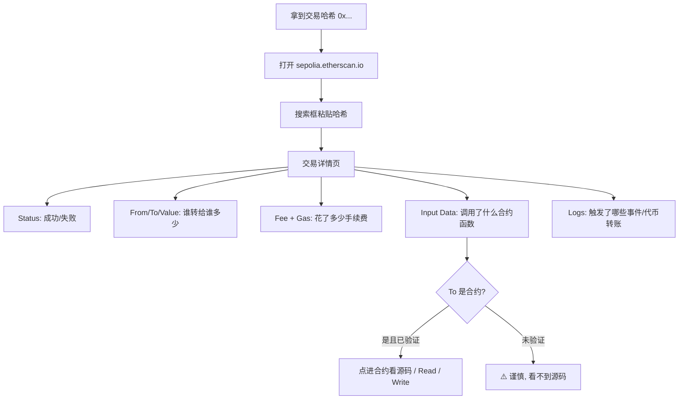
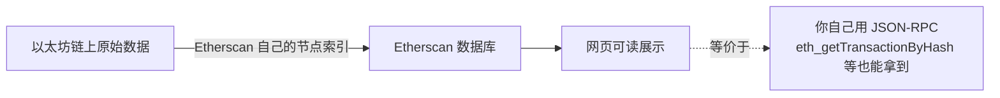

# 10 · 区块浏览器 Etherscan（怎么看交易与合约）
> 一句话说明：Etherscan 是以太坊的「搜索引擎 + 账本查看器」，把链上的地址、交易、区块、合约以人类可读的方式展示出来；学会看它，就能自查任何一笔交易的来龙去脉、任何一个合约的真伪。

## 📖 知识讲解

### Etherscan 是什么
区块浏览器（Block Explorer）是一个网站，它自己跑着以太坊节点，把链上原始数据（见前面各模块）整理成网页。最常用的是 **Etherscan**：
- 主网：https://etherscan.io
- **Sepolia 测试网：https://sepolia.etherscan.io** （本工程都用测试网，主要看这个）

在搜索框粘贴**地址 / 交易哈希 / 区块号 / 合约地址**，即可查看详情。

### 看一笔「交易」页面（Transaction）
对照 03 模块的交易字段，Etherscan 上的关键栏目：
| Etherscan 栏目 | 对应链上概念 |
| --- | --- |
| **Transaction Hash** | 交易哈希，交易的唯一 ID |
| **Status** | Success / Fail（对应收据 status，见 03） |
| **Block** | 所在区块号 + 已确认数（Confirmations） |
| **From / To** | 发送方 / 接收方（To 若是合约会标出合约名） |
| **Value** | 转账的 ETH 数量 |
| **Transaction Fee** | 实付手续费 = gasUsed × 单价（见 04） |
| **Gas Price / Base / Priority** | EIP-1559 的单价拆解（见 04） |
| **Nonce** | 发送方的交易序号（见 02/03） |
| **Input Data** | 调用合约时的 `data`（函数选择器 + 参数） |
| **Logs / Tokens Transferred** | 合约执行发出的事件日志（如代币转账） |

### 看一个「地址」页面（Address）
- **Balance**：ETH 余额；**Token Holdings**：持有的各种代币。
- **Transactions**：该地址所有历史交易列表。
- 若是**合约地址**，会多出 **Contract** 标签页。

### 看一个「合约」页面（Contract）—— 重点：验证
- **Contract 标签**里若有绿色 ✓ **Verified（已验证）**，说明开发者上传了源码且与链上字节码匹配，你可以：
  - **Read Contract**：直接在网页上调用只读函数（相当于 `eth_call`，见 09）。
  - **Write Contract**：连接钱包后调用写函数（会发真交易）。
- **未验证（unverified）**的合约只有字节码，看不到源码——**与陌生未验证合约交互风险极高**。

### 为什么开发者天天用它
- 部署合约后，去 Etherscan 确认交易成功、合约已上链。
- 交易卡住/失败时，看 Status 和错误原因排查（如 out of gas、revert 原因）。
- 核对代币合约地址真伪，**防钓鱼假币**。

## 🔄 流程图 / 原理图

从你手里的交易哈希到「在 Etherscan 上看懂它」的路径：



Etherscan 展示的数据其实来自链（与 09 模块的 RPC 一一对应）：



## 💻 代码说明

`index.html` 是一个**纯前端、免安装、无外部依赖**的小工具（浏览器直接打开）：

- 输入一个**交易哈希**或**地址**，选择网络（Sepolia / 主网），点击按钮即**生成对应的 Etherscan 链接**并可一键打开。
- 页面内嵌一张**「交易页各栏目 → 对应链上概念」对照表**，边看真实 Etherscan 页面边对照学习。
- 附带几个**真实可点的示例链接**（Sepolia 上的地址/合约），点开即可实操。

> 这是演示「如何使用区块浏览器」的引导工具；真正的数据展示在 Etherscan 网站上。

## ▶️ 运行方式

```
用浏览器直接打开本目录下的 index.html 即可（无需 Node、无需联网安装依赖）。
在页面里粘贴交易哈希/地址，点击生成链接 -> 跳转到 Etherscan 对照学习。
```

## ⚠️ 常见坑 / 安全提示
- **认准官方域名**：只用 `etherscan.io` / `sepolia.etherscan.io`。仿冒钓鱼站会诱导你「连接钱包并签名」盗币——**区块浏览器只是看数据，正常浏览绝不需要你签名**。
- **Verified ≠ 安全**：合约已验证只代表「源码与字节码一致」，不代表代码没漏洞或没恶意逻辑，仍需自行审阅。
- **在 Write Contract 里操作会发真交易**：测试练习只在 Sepolia 上做，别在主网乱点。
- **别只看 To 的名字**：假币合约可能取名 “USDC” 骗你，务必核对**合约地址**是否为官方地址。

## 🔗 官方文档
- 区块浏览器介绍：https://ethereum.org/zh/developers/docs/data-and-analytics/block-explorers/
- Etherscan（Sepolia）：https://sepolia.etherscan.io
- Etherscan（主网）：https://etherscan.io
