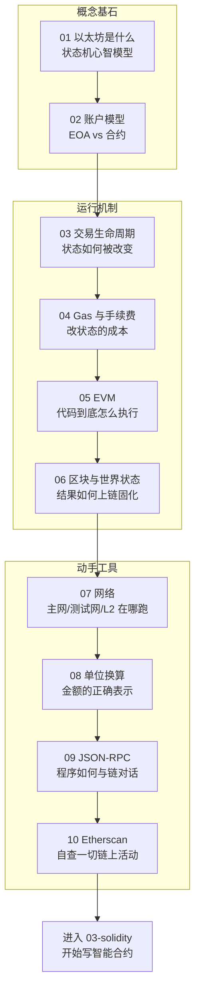

# 02 · 以太坊核心概念（Ethereum Core Concepts）

> 本工程带你把「以太坊」从零讲透：它是一台**分布式状态机**（世界计算机），你在这里会理解账户、交易、Gas、EVM、区块与状态、网络、单位、JSON-RPC 和区块浏览器——为后续写 Solidity 合约（03 工程）打下扎实地基。
>
> 所有 demo **只连公共测试网（Sepolia）/ 公共 RPC 做只读**，或纯本地运行，**不涉及任何私钥、不使用主网真实资产**。

## 📚 模块索引

| 模块 | 知识点 | 一句话 | Demo 形式 |
| --- | --- | --- | --- |
| [01-ethereum-overview](./01-ethereum-overview/) | 以太坊是什么 | 世界计算机 = 分布式状态机 `Y(S,T)=S'` | `node demo.js`（本地模拟） |
| [02-accounts](./02-accounts/) | 账户模型 | EOA vs 合约账户；nonce/balance/codeHash/storageRoot | `node demo.js`（ethers 读链） |
| [03-transactions-lifecycle](./03-transactions-lifecycle/) | 交易生命周期 | 构造→签名→广播→打包→确认（时序图） | `node demo.js`（ethers 读链） |
| [04-gas-and-fees](./04-gas-and-fees/) | Gas 与手续费 | EIP-1559：baseFee + priorityFee | `node demo.js`（本地+读链） |
| [05-evm](./05-evm/) | 以太坊虚拟机 | 栈机 / opcode / 字节码 / Gas 计费 | `node demo.js`（本地模拟器） |
| [06-blocks-and-state](./06-blocks-and-state/) | 区块与世界状态 | parentHash 链接 + stateRoot 状态指纹 | `node demo.js`（ethers 读链） |
| [07-networks](./07-networks/) | 以太坊网络 | 主网 / Sepolia / L2 Rollup；chainId | `node demo.js`（ethers 读链） |
| [08-ether-units](./08-ether-units/) | 单位换算 | wei / gwei / ether；用 BigInt 防误差 | `node demo.js`（本地） |
| [09-json-rpc](./09-json-rpc/) | JSON-RPC 接口 | eth_call / eth_getBalance；裸 RPC vs ethers | `node demo.js`（本地+读链） |
| [10-etherscan](./10-etherscan/) | 区块浏览器 | 怎么看交易/合约/验证 | `index.html`（浏览器打开） |

## 🗺️ 学习路线



**建议顺序**：按 01→10 顺序学。01-02 建立心智模型，03-06 讲清「交易如何改变状态、成本几何、代码如何执行、结果如何上链」，07-10 是与链交互的实用工具。学完即可自然过渡到 03-solidity 写合约。

## ▶️ 运行说明

### 环境准备
- **Node.js 18+**（`node demo.js` 类 demo 需要；09 模块用到内置 `fetch` 需 18+）。
- 浏览器（10 模块的 `index.html` 用）。

### 安装依赖（连链的 demo 需要 ethers v6）
```bash
cd 02-ethereum
npm install          # 安装 ethers v6，仅需一次
```

### 运行某个模块的 demo
```bash
# 本地类（无需联网）：01 / 05 / 08
node 01-ethereum-overview/demo.js
node 05-evm/demo.js
node 08-ether-units/demo.js

# 读链类（连公共 Sepolia RPC，只读）：02 / 03 / 04 / 06 / 07 / 09
node 02-accounts/demo.js
node 09-json-rpc/demo.js

# 浏览器类：10
# 直接用浏览器打开 10-etherscan/index.html
```

### 关于公共 RPC
- 默认使用公共节点 `https://ethereum-sepolia-rpc.publicnode.com`（Sepolia，只读）。
- 公共 RPC 可能**偶发超时/限流**，报错多为此因，**重试**或在各 `demo.js` 顶部更换 `RPC_URL`（文件里已列备选）即可。

## 🔒 安全底线（本工程强制遵守）
- **只用测试网（Sepolia）+ 公共 RPC 只读**，绝不使用主网真实资产。
- **绝不在代码/仓库出现真实私钥、助记词、API Key**；demo 中生成的随机私钥仅用于演示地址结构，用完即弃，切勿转入资产。
- 需要发交易/签名时，私钥放 `.env` 并 `.gitignore`（本工程 demo 均为只读，未涉及）。
- 使用区块浏览器/RPC 时认准官方域名，警惕要求签名的钓鱼站。

## 🔗 官方文档（对照来源）
- 以太坊开发者文档：https://ethereum.org/zh/developers/docs/
- 账户：https://ethereum.org/zh/developers/docs/accounts/
- 交易：https://ethereum.org/zh/developers/docs/transactions/
- Gas：https://ethereum.org/zh/developers/docs/gas/
- EVM：https://ethereum.org/zh/developers/docs/evm/
- 区块：https://ethereum.org/zh/developers/docs/blocks/
- 网络：https://ethereum.org/zh/developers/docs/networks/
- JSON-RPC：https://ethereum.org/zh/developers/docs/apis/json-rpc/
- 以太币与单位：https://ethereum.org/zh/developers/docs/intro-to-ether/
- ethers v6 文档：https://docs.ethers.org/v6/
