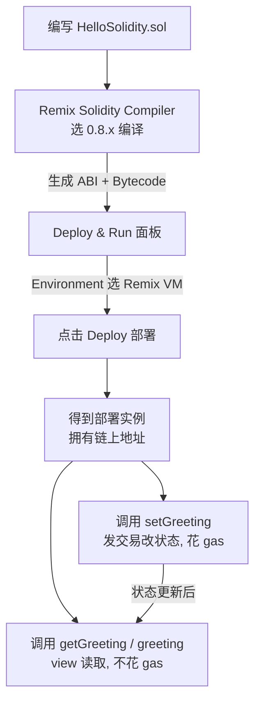

# 01 · 第一个 Solidity 合约（Hello Solidity）
> 从零写下、编译、部署并调用你的第一个智能合约，弄懂 SPDX、pragma、contract 三块「起手式」。

## 📖 知识讲解

一个最小的 Solidity 源文件由三部分开头：

1. **SPDX 许可证标识**
   `// SPDX-License-Identifier: MIT`
   写在文件第一行的注释里，声明源码的开源许可证。它不生成任何字节码，只是给人和工具看的元信息。不写不会报错，但编译器会给一条 warning，所以规范上都会加。教学项目常用最宽松的 `MIT`。

2. **pragma 版本约束**
   `pragma solidity ^0.8.20;`
   约束「用哪个版本的编译器编译本文件」，避免语法在不同版本间不兼容。
   - `^0.8.20` 表示：允许 `>=0.8.20` 且 `<0.9.0` 的编译器。
   - `^` 会锁住「最左边的非零版本号」。这里最左非零是次版本 `8`，所以主版本必须是 `0`、次版本必须是 `8`，补丁号 `>=20` 即可。因此 `0.8.20`、`0.8.35` 都行，`0.9.0` 不行。
   - 用 `0.8.x` 的原因：从 `0.8.0` 起算术默认带溢出检查（溢出会 `revert`），更安全，是当前主流。官方当前最新版本是 `0.8.35`。

3. **contract 关键字**
   `contract HelloSolidity { ... }` 声明一个合约。可以把合约理解为「部署到区块链上的一个对象」：它有自己的数据（状态变量）和方法（函数），部署后拥有一个链上地址。

本模块的合约里有一个 `string public greeting` 状态变量。`public` 让编译器**自动**为它生成一个同名 getter 函数 `greeting()`，外部无需手写就能读取。我们再手写 `setGreeting`（写：改状态、花 gas、是一笔交易）和 `getGreeting`（读：`view` 只读、不花 gas）两个函数来演示读写两条路径。

## 🔄 流程图 / 原理图

从写代码到在 Remix 里跑通的完整流程：

## 💻 代码说明

- **前两行固定起手式**：`SPDX` + `pragma`，缺一编译器都会提醒。
- **`string public greeting = "Hello, Solidity!";`**：状态变量，值永久存于 storage；`public` 自动生成 getter `greeting()`。初始值在部署时写入。
- **`setGreeting(string memory _newGreeting) public`**：写函数。参数是引用类型，必须标数据位置 `memory`（本次调用临时存在于内存）。调用它是一笔交易，会改链上状态并消耗 gas。
- **`getGreeting() public view returns (string memory)`**：读函数。`view` 表示只读不改状态，只读调用不上链、不花 gas。它和自动 getter `greeting()` 功能重叠，纯为演示「读函数」写法。

## ▶️ 运行方式

1. 打开 Remix 在线 IDE：<https://remix.ethereum.org>
2. 在左侧 **File Explorer** 里新建文件 `HelloSolidity.sol`，把本模块的合约源码整段粘贴进去。
3. 打开左侧 **Solidity Compiler** 面板，Compiler 版本选一个 `0.8.x`（如 `0.8.20` 或更新），点击 **Compile HelloSolidity.sol**，无红色报错即成功。
4. 打开 **Deploy & Run Transactions** 面板，**Environment** 选择 **Remix VM**（本地内存链，免费、免钱包、免真钱）。
5. 点击 **Deploy**。部署成功后，下方 **Deployed Contracts** 会出现合约实例。
6. 展开实例调用函数观察：
   - 点蓝色的 `greeting` 或 `getGreeting`（读）→ 直接显示当前问候语。
   - 在 `setGreeting` 输入框填一个新字符串（如 `"Ni Hao"`）→ 点橙色按钮发交易 → 再点 `getGreeting` 看到值已更新。

## ⚠️ 常见坑 / 安全提示

- **忘记写 SPDX / pragma**：会出现 warning 甚至因版本不匹配编译失败；起手式两行务必先写。
- **编译器版本对不上 pragma**：Remix 里选的 Compiler 版本必须落在 `^0.8.20` 允许的范围（`>=0.8.20 <0.9.0`），否则报「source file requires different compiler version」。
- **把「读」当成「免费改」**：`view` 函数只读；真正改状态的 `setGreeting` 是交易，要花 gas、要出块确认。
- **字符串参数忘标 `memory`**：引用类型作参数/返回值必须标数据位置，否则编译不过。
- **安全提示**：本合约仅供教学，未经审计；`setGreeting` 没有任何权限控制，任何人都能改问候语——真实项目里对「谁能改状态」要用访问控制（如 `onlyOwner`）。**只在 Remix VM / 测试网练习，绝不上主网、绝不用真实资产。**

## 🔗 官方文档

- Solidity 中文文档首页：<https://docs.soliditylang.org/zh/latest/>
- 布局与 SPDX 许可证：<https://docs.soliditylang.org/zh/latest/layout-of-source-files.html>
- pragma / 版本 pragma：<https://docs.soliditylang.org/zh/latest/layout-of-source-files.html#version-pragma>
- 合约结构（contract）：<https://docs.soliditylang.org/zh/latest/structure-of-a-contract.html>
- Remix 在线 IDE：<https://remix.ethereum.org>
