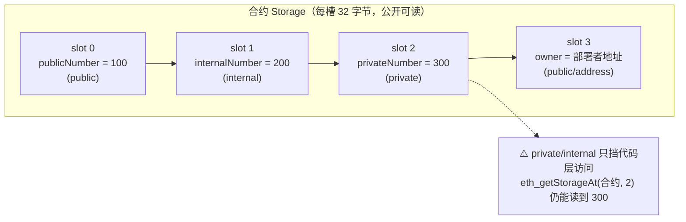

# 03 · 状态变量与可见性（State Variables & Visibility）
> 弄清 public / private / internal / external 四种可见性各自修饰变量还是函数，并理解状态变量在链上如何按槽位顺序存储。

## 📖 知识讲解

**状态变量（state variable）** 是声明在合约里、函数外的变量，值永久保存在区块链的 **storage** 里。

**四种可见性修饰符**，关键区别是「谁能访问」以及「用于变量还是函数」：

| 修饰符 | 能修饰变量？ | 能修饰函数？ | 谁能访问 |
|--------|:---:|:---:|------|
| `public` | ✅（自动生成 getter） | ✅ | 本合约 + 子合约 + 外部 |
| `internal` | ✅（不写时的默认值） | ✅ | 本合约 + 子合约 |
| `private` | ✅ | ✅ | 仅本合约 |
| `external` | ❌ **不能** | ✅ | 仅外部（合约内须用 `this.f()` 调） |

要点逐条：

- **`public` 状态变量会自动生成 getter**：写了 `uint256 public publicNumber;`，编译器就免费给你一个同名函数 `publicNumber()`，外部可读——不需要你手写。
- **`internal` 是状态变量的默认可见性**：不写修饰符时等同 `internal`，即本合约和继承它的子合约可访问，外部不可直接读。
- **`private` 只挡「代码」，不挡「链」**：`private`/`internal` 仅是 Solidity **语言层**的访问限制，防止别的合约代码直接读写。但链上 storage 的所有槽位都是**公开可读**的——任何人都能用 `eth_getStorageAt(合约地址, 槽号)` 读到原始值。**因此绝不要把私钥、密码、明文秘密放进合约变量。**
- **`external` 不能修饰状态变量**：它只能修饰函数；写 `uint public x` 可以，写 `uint external x` 会编译报错。`external` 函数只能被外部调用，合约内部要调得写 `this.f()`（相当于一次外部调用，较贵），但它读取 `calldata` 参数时往往比 `public` 更省 gas。

**storage 槽位布局**：状态变量按**声明顺序**依次占用槽位 slot 0、slot 1、slot 2 ……每个槽 32 字节。小于 32 字节的相邻变量可能被「打包」进同一个槽（本模块的变量都是 32 字节，正好一个一个槽），理解「顺序存储」是读懂链上数据、写内联汇编、做代理合约升级的基础。

## 🔄 流程图 / 原理图

合约 storage 槽位布局（本合约的状态变量按声明顺序排列）：

## 💻 代码说明

- **状态变量按序占槽**：`publicNumber`（slot 0）、`internalNumber`（slot 1，默认可见性演示）、`privateNumber`（slot 2）、`owner`（slot 3）。
- **构造函数** `constructor()`：部署时执行一次，把 `owner = msg.sender`（部署者地址）。
- **函数可见性四例**：
  - `readAll()` `public`：本合约内可读全部三个变量（含 private/internal）。
  - `setPublicNumber()` `external`：只能外部调用，合约内要调得用 `this.setPublicNumber(...)`。
  - `_double()` `internal`：本合约 + 子合约可用的复用逻辑。
  - `_tripleImpl()` `private`：仅本合约可用，子合约都看不到。
  - `compute()` `public`：演示在函数里同时调用 internal 与 private 函数都合法。
- **`privateNumberSlot()`**：用内联汇编返回 `privateNumber.slot`（= 2），配合运行方式说明「private 变量的原始值链上仍可被任何人读出」。

## ▶️ 运行方式

1. 打开 Remix：<https://remix.ethereum.org>
2. 在 **File Explorer** 新建 `StateVariables.sol`，粘贴本模块合约源码。
3. 打开 **Solidity Compiler**，版本选 `0.8.x`，点击 **Compile StateVariables.sol**。
4. 打开 **Deploy & Run Transactions**，**Environment** 选 **Remix VM**，点击 **Deploy**。
5. 在 **Deployed Contracts** 观察可见性：
   - 你能看到自动生成的蓝色 getter：`publicNumber`、`owner`。
   - **看不到** `internalNumber` / `privateNumber` 的按钮——因为它们不是 `public`，没有自动 getter。
   - 点 `readAll` 会一次返回三个值（`100, 200, 300`），证明本合约内部能读到 private/internal。
6. 验证「private 仍公开」：
   - 点 `privateNumberSlot`，得到 `2`（privateNumber 在 slot 2）。
   - 复制上方 **Deployed Contracts** 里合约的地址；理论上用 `eth_getStorageAt(合约地址, 2)` 即可读到 `300`（十六进制 `0x...012c`）。在 Remix 里可结合 **Debugger** 或外部 RPC 验证，直观感受「链上数据无秘密」。
7. 调用 `setPublicNumber` 改 `publicNumber`，再点 `publicNumber` getter 看到更新。

## ⚠️ 常见坑 / 安全提示

- **`external` 修饰状态变量会编译报错**：变量只能 `public`/`internal`/`private`。
- **把 `private` 当成保密**：这是最危险的误区。链上 storage 公开可读，**任何秘密都不能明文存进合约**（要存也应只存哈希/承诺值，且注意可被暴力猜解）。
- **忘了 `public` 就没有 getter**：外部读不到变量时，先确认它是不是 `public`；不是的话需要自己写一个读函数。
- **`external` 函数内部直接调用会失败**：合约内部调用 `external` 函数必须写 `this.f()`，否则编译报错，而 `this.f()` 走的是外部调用、更贵。
- **槽位顺序影响升级**：可升级/代理合约里，随意增删或调整状态变量顺序会「错位」读到别的槽，属于严重 bug；变量布局要谨慎、只追加不插入。
- **安全提示**：本合约仅供教学，未经审计；`setPublicNumber` 没有权限控制。只在 Remix VM / 测试网练习，绝不上主网、绝不放真实私钥或资产。

## 🔗 官方文档

- 可见性与 getter（中文）：<https://docs.soliditylang.org/zh/latest/contracts.html#visibility-and-getters>
- 状态变量可见性：<https://docs.soliditylang.org/zh/latest/contracts.html#state-variable-visibility>
- 合约结构 - 状态变量：<https://docs.soliditylang.org/zh/latest/structure-of-a-contract.html#state-variables>
- storage 存储布局（槽位规则）：<https://docs.soliditylang.org/zh/latest/internals/layout_in_storage.html>
