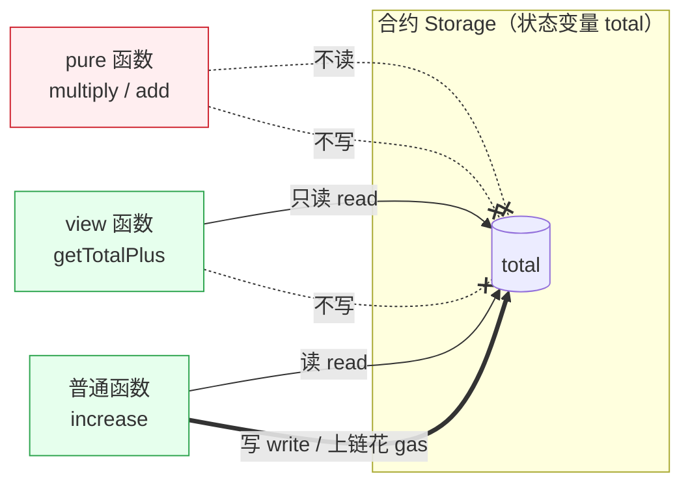

# 04 · 函数（Functions）
> 学会定义函数、传参与返回，掌握多返回值与解构，并分清 view（读状态）、pure（不读不改）与会改状态的普通函数。

## 📖 知识讲解

**函数定义语法**：

```solidity
function 名字(参数列表) 可见性 状态可变性 returns (返回值列表) { ... }
```

- **参数列表**：`(uint256 a, uint256 b)`，多个参数逗号分隔。引用类型参数需标数据位置（`memory`/`calldata`）。
- **返回值**：用 `returns (...)` 声明，可以有多个，也可以**命名**。
- **可见性**：`public` / `external` / `internal` / `private`（见模块 03）。
- **状态可变性（state mutability）**：描述函数对链上状态的读写能力，是本模块重点：

| 修饰 | 能读状态？ | 能改状态？ | 调用是否花 gas |
|------|:---:|:---:|------|
| （普通，无修饰） | ✅ | ✅ | 是（发交易上链） |
| `view` | ✅ | ❌ | 只读 call 不花 gas |
| `pure` | ❌ | ❌ | 只读 call 不花 gas |
| `payable` | ✅ | ✅ + 可收 ETH | 是（本模块不展开） |

- **`view`**：承诺不修改状态，但可以**读取**状态变量。
- **`pure`**：承诺既不读也不写状态，只依赖入参和局部变量做纯计算。若在 `pure` 里读/写了状态变量，编译器直接报错。
- **普通函数（无 view/pure）**：可以修改状态，调用它是一笔**交易**，会上链并消耗 gas。

**多返回值与命名返回值**：

- `returns (uint256 quotient, uint256 remainder)` 一次返回多个值。
- 命名返回值相当于预先声明好的局部变量，赋值后可直接 `return;`。
- 调用方用**解构**接收：`(uint256 q, uint256 r) = f(...)`；不需要的值用空位跳过：`(, uint256 r) = f(...)`。

**函数可见性交互**：`public` 函数内部可自由调用 `internal` / `private` 函数；`external` 函数只能被外部调用，合约内部要调需写 `this.f()`（走一次外部调用，较贵），但它读取 `calldata` 参数时通常更省 gas。

## 🔄 流程图 / 原理图

view / pure / 普通函数对 storage 的读写权限差异：



## 💻 代码说明

- **`add(a,b)` `pure`**：纯计算入参之和，不碰状态。
- **`increase(_by)` 普通函数**：`total += _by`，写状态，调用是交易、花 gas。
- **`getTotalPlus(_extra)` `view`**：读了 `total` 但不改它。
- **`multiply(a,b)` `pure`**：只用入参，既不读也不改。
- **`divmod(a,b)` 命名返回值**：一次返回商 `quotient` 与余数 `remainder`，演示给命名返回值赋值后 `return`。
- **`onlyRemainder(a,b)` 解构**：`(, uint256 r) = divmod(a,b)` 跳过商、只取余数。
- **可见性交互**：`_square`（`internal`）、`_addOne`（`private`）被 `public` 的 `squarePlusOne` 内部调用；`externalDouble` 为 `external`，只能外部调用。

## ▶️ 运行方式

1. 打开 Remix：<https://remix.ethereum.org>
2. 在 **File Explorer** 新建 `Functions.sol`，粘贴本模块合约源码。
3. 打开 **Solidity Compiler**，版本选 `0.8.x`，点击 **Compile Functions.sol**。
4. 打开 **Deploy & Run Transactions**，**Environment** 选 **Remix VM**，点击 **Deploy**。
5. 在 **Deployed Contracts** 里体会不同函数：
   - **蓝色按钮**（`add`、`multiply`、`getTotalPlus`、`divmod`、`total` getter 等）是 `view`/`pure`/getter，点击直接出结果、不花 gas。
   - **橙色按钮**（`increase`）会改状态、发交易；先点 `increase` 传个数，再点 `total` getter 看到累加结果。
   - 点 `divmod` 输入如 `17, 5` → 返回 `quotient=3, remainder=2`。
   - 点 `onlyRemainder` 输入 `17, 5` → 返回 `2`（演示解构跳过商）。
   - 点 `squarePlusOne` 输入 `4` → 返回 `17`（`4*4+1`），演示 internal/private 内部调用。

## ⚠️ 常见坑 / 安全提示

- **`pure` 里碰了状态会编译报错**：`pure` 既不能读也不能写 `total`；只需读不改就用 `view`。
- **误把 `view` 当「免费改状态」**：`view`/`pure` 的只读 call 不花 gas 也不改链；真正改状态必须走交易（花 gas）。
- **`view`/`pure` 通过交易调用其实也会花 gas**：从合约内部或在交易上下文里调用 `view`/`pure` 会计入 gas；「不花 gas」特指从外部直接发起的只读 `call`。
- **`external` 函数内部直调失败**：合约内部调用 `external` 函数要写 `this.f()`，否则报错，且 `this.f()` 更贵。
- **命名返回值忘赋值**：命名返回值默认是 0 值，若忘了赋值会静默返回 0，容易出逻辑 bug。
- **参数校验**：真实合约里对外部可调用函数要做入参校验（如除数不为 0、地址非零、金额范围），用 `require` / 自定义 `error` 提前 `revert`。
- **安全提示**：本合约仅供教学，未经审计；只在 Remix VM / 测试网练习，绝不上主网、绝不使用真实资产。

## 🔗 官方文档

- 函数（中文）：<https://docs.soliditylang.org/zh/latest/contracts.html#functions>
- 状态可变性 view / pure：<https://docs.soliditylang.org/zh/latest/contracts.html#state-mutability>
- 返回多个值与解构赋值：<https://docs.soliditylang.org/zh/latest/control-structures.html#destructuring-assignments-and-returning-multiple-values>
- 函数可见性：<https://docs.soliditylang.org/zh/latest/contracts.html#visibility-and-getters>
