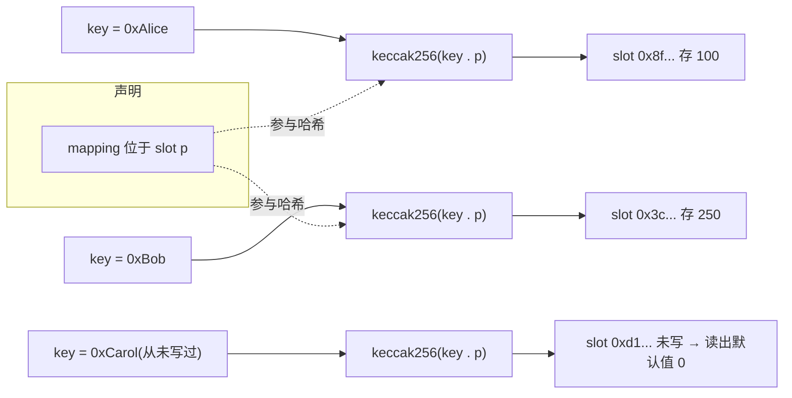

# 05 · 映射与数组（Mappings & Arrays）
> mapping 是键值对哈希表，array 是有序列表；二者是 Solidity 里存储集合数据最常用的两种引用类型。

## 📖 知识讲解

### mapping（映射）
- 语法：`mapping(KeyType => ValueType) 变量名;`。Key 可以是几乎任何基本类型（address、uint、bytes32、bool…），**不能是引用类型**（如另一个 mapping、动态数组、struct）；Value 可以是任意类型（包括嵌套 mapping、数组、struct）。
- **所有 key 天生「已存在」**：从未写过的 key 读出来是 Value 类型的默认值（uint→0，address→零地址，bool→false）。因此无法区分「值为 0」和「从未设置」。
- **不可遍历、没有 length**：EVM 底层用 `keccak256(key . slot)` 算出存储槽位来存值，并没有保存 key 的集合。要遍历必须自己额外维护一个 key 数组。
- 只能作为 **storage** 状态变量存在，不能作为函数参数/返回值/局部变量整体传递。
- 嵌套 mapping：`mapping(address => mapping(address => uint256))`，访问用 `m[a][b]`，典型场景是 ERC20 的 `allowance[owner][spender]`。

### array（数组）
- **定长数组** `T[N]`：长度编译期固定，不能 push/pop，越界访问 revert（Panic 0x32）。
- **动态数组** `T[]`：`push(x)` 尾部追加、`pop()` 删尾、`.length` 取长度。
- `delete arr[i]` 只是把该位置重置为默认值，**长度不变、不补位**。
- 保序删除需搬移后续元素（O(n)、贵）；不保序可用 **swap & pop**（把末尾元素换到 i 再 pop，O(1)）。
- **memory 动态数组**用 `new T` 分配，长度固定、不能 push/pop。

## 🔄 流程图 / 原理图

mapping 的 key → 存储槽位（storage slot）哈希示意：

> 关键点：mapping 没有「一份 key 列表」，只有「按需算槽位」，所以无法遍历、无 length。

## 💻 代码说明
- `balances`：`mapping(address => uint256)` 余额表，`deposit` 写、`balanceOf` 读。
- `allowance`：嵌套 mapping，`approve` / `getAllowance` 演示 `m[a][b]` 读写。
- `users` + `_seen` + `depositAndTrack`：**mapping 不可遍历**的解决方案——额外维护 key 数组；`totalBalance` 遍历求和（并标注 gas 风险）。
- `fixedNumbers`（定长）与 `dynamicNumbers`（动态）：`push` / `pop` / `length` / `removeAt`（delete 不补位）/ `removeUnordered`（swap & pop）。
- `getAll` 返回整个数组（大数组的 gas 风险）；`buildInMemory` 演示 `new uint256` 分配 memory 数组。

## ▶️ 运行方式
1. 打开 https://remix.ethereum.org 。
2. File Explorer 新建 `MappingsArrays.sol`，粘贴本目录合约源码。
3. Solidity Compiler 选 0.8.x 编译。
4. Deploy & Run Transactions 里 Environment 选 **Remix VM (Cancun)**，点 Deploy 部署。
5. 调用观察：
   - `deposit(地址, 100)` 后 `balanceOf(地址)` 返回 100；查一个没充过值的地址返回 0（体会「默认值」）。
   - `approve(A, B, 50)` 后 `getAllowance(A, B)` 返回 50。
   - 多次 `push(...)` 后看 `length()` 和 `getAll()`；`removeAt` 看某位变 0 但长度不变；`removeUnordered` 看末位补到该位。

## ⚠️ 常见坑 / 安全提示
- **不能靠 mapping 判断 key 是否存在**：值为 0 可能是「没设过」也可能是「设成了 0」。需要区分时另存一个 `mapping(key => bool) exists`。
- **无界循环遍历数组 = DoS 风险**：数组随用户增长会让 `totalBalance` 这类循环 gas 爆炸、函数永久失败。链上尽量避免遍历大数组，改为增量维护聚合值。
- **数组越界**会 revert（Panic 0x32）；`pop` 空数组同样 revert。
- `delete arr[i]` **不会缩短数组**，只是把该槽清零；真正删除要 pop 或搬移。
- 把大数组作为 `external`/`public` 返回值代价高；链上合约间调用尤其谨慎，前端只读 `eth_call` 相对安全但也有节点限制。

## 🔗 官方文档
- 映射类型：https://docs.soliditylang.org/zh/latest/types.html#mapping-types
- 数组：https://docs.soliditylang.org/zh/latest/types.html#arrays
- 数据位置（storage/memory/calldata）：https://docs.soliditylang.org/zh/latest/types.html#data-location
