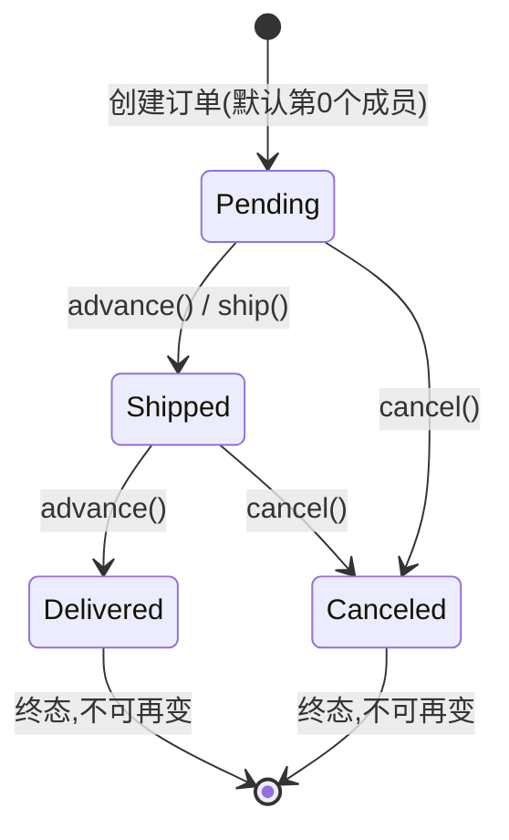

# 06 · 结构体与枚举（Structs & Enums）
> struct 把多个字段打包成一个自定义类型，enum 用有限的命名常量表示状态；二者常一起用来建模「带状态的业务对象」（如订单）。

## 📖 知识讲解

### struct（结构体）
- 定义：`struct Order { uint256 id; address buyer; ... }`，把若干字段组合成新类型。
- **三种初始化方式**：
  1. 具名字段 `Order({id: 1, buyer: addr, ...})`——最推荐，顺序无关、可读性好。
  2. 按位置 `Order(1, addr, amount, Status.Pending)`——顺序必须与声明一致，易错。
  3. 先建空 struct 再逐字段赋值——常配合 `storage` 引用使用。
- 可以存进 **mapping**（`mapping(uint => Order)`）和 **数组**（`Order[]`），也可嵌套 enum / 其它 struct。
- **修改 storage 中的 struct 的关键**：
  - `Order storage o = orders[id];` 拿到的是**引用**，改 `o.xxx` 会真正写回链上。
  - `Order memory o = orders[id];` 拿到的是**拷贝**，改它不影响链上数据。这是初学者最常踩的坑。

### enum（枚举）
- 定义：`enum Status { Pending, Shipped, Delivered, Canceled }`，底层就是 `uint8`，从 **0** 开始编号。
- **默认值是第 0 个成员**（这里是 `Pending`）——未赋值的 enum 状态变量即为它。
- 转换：`uint256(status)` 把 enum 转成数字；`Status(n)` 把数字转回 enum。**0.8 起 `Status(n)` 越界会 revert（Panic 0x21）**，天然做了边界检查。
- 常用来表示**状态机**：用 `Status(uint(s)+1)` 推进到下一个状态，并用 `require` 限制合法流转。

## 🔄 流程图 / 原理图

用 `stateDiagram` 画订单状态（enum）流转：

## 💻 代码说明
- `enum Status`：4 个成员，`Pending=0` 为默认值。
- `struct Order`：含 `id / buyer / amount / status`，其中 `status` 嵌套 enum。
- 存储：`orders`（mapping）与 `orderList`（动态数组）都存 `Order`。
- 三种初始化：`createNamed`（具名）、`createPositional`（按位置）、`createEmptyThenFill`（storage 引用逐字段填）。
- **storage vs memory 对照**：`ship` 用 `storage` 引用能改到链上；`shipButWrong` 用 `memory` 拷贝改了个寂寞（返回值变了但 `orders[id]` 没变）——部署后可亲自验证。
- enum 转换与状态机：`statusAsUint` / `setStatusByUint`（越界 revert）/ `advance`（推进）/ `cancel`。

## ▶️ 运行方式
1. 打开 https://remix.ethereum.org 。
2. File Explorer 新建 `StructsEnums.sol`，粘贴本目录合约源码。
3. Solidity Compiler 选 0.8.x 编译。
4. Deploy & Run Transactions 里 Environment 选 **Remix VM (Cancun)**，Deploy 部署。
5. 调用观察：
   - `createNamed(你的地址, 100)` 创建订单（返回 id 0），`statusOf(0)` 返回 0（Pending）。
   - `advance(0)` 后 `statusOf(0)` 返回 1（Shipped），再 `advance` 到 2（Delivered）。
   - 调 `shipButWrong(0)` 返回 1（Shipped），但随后 `statusOf(0)` 仍是原值——体会 memory 拷贝不改链上。
   - `setStatusByUint(0, 9)` 观察越界 revert（Panic 0x21）。

## ⚠️ 常见坑 / 安全提示
- **memory vs storage 最易错**：想修改链上 struct 必须用 `storage` 引用；`memory` 只是副本。
- **enum 默认值是第 0 个成员**：把「无效/未初始化」语义放在第 0 个（如本例 `Pending`）时要小心，有时会专门留一个 `None/Invalid` 作 0 值。
- `Status(n)` 越界在 0.8 会 revert，别依赖它「截断」；老版本（<0.8）行为不同，注意别抄过时代码。
- struct 存进数组/mapping 是**值拷贝**：`orderList.push(orders[id])` 之后，改 `orders[id]` 不会同步改 `orderList` 里那份，反之亦然。
- struct 里放动态数组/mapping 时，拷贝规则更复杂（mapping 成员不能被拷贝到 memory），初学阶段尽量保持字段为值类型。

## 🔗 官方文档
- 结构体：https://docs.soliditylang.org/zh/latest/types.html#structs
- 枚举：https://docs.soliditylang.org/zh/latest/types.html#enums
- 数据位置：https://docs.soliditylang.org/zh/latest/types.html#data-location-and-assignment-behaviour
