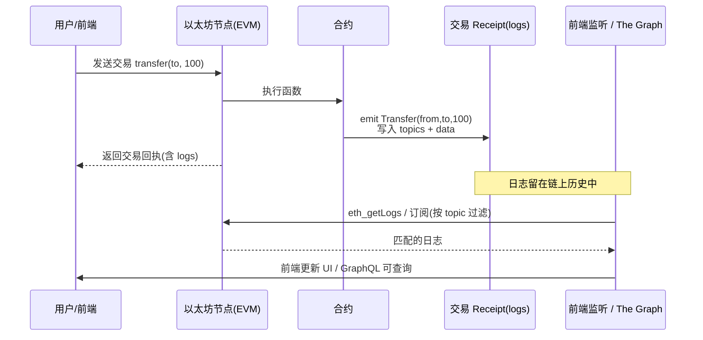

# 08 · 事件与日志（Events & Logs）
> event 让合约把「发生了什么」写进交易日志，供前端监听和链下索引（如 The Graph）读取；它便宜、只写，合约自己读不到。

## 📖 知识讲解

### event / emit
- 定义：`event Transfer(address indexed from, address indexed to, uint256 value);`
- 触发：`emit Transfer(a, b, 100);`——事件数据被写入这笔交易的 **receipt logs**。
- 事件是**只写**的：写给链下世界看。EVM 没有指令能让合约把日志读回来，所以**事件不能当存储用**。

### indexed：topics vs data
- 每条日志最多 **4 个 topic**：
  - `topic0` = 事件签名的哈希 `keccak256("Transfer(address,address,uint256)")`（匿名事件除外）；
  - 其余最多 **3 个 topic** 留给 `indexed` 参数。所以**一个事件最多 3 个 indexed**。
- `indexed` 参数进 **topics**：可被前端/节点按精确值**高效过滤**（如「只听某地址的转账」）。
- 非 `indexed` 参数进 **data** 区：ABI 编码在一起，能读出值，但**不能按它过滤**。
- 经验法则：需要「按它筛选」的字段（地址、id）设 indexed；只是随日志带出的值（金额、备注）放 data。

### 成本与用途
- 日志（LOG opcode）比 `SSTORE`（写 storage）**便宜得多**。只给链下看的信息优先用事件。
- 典型用途：前端用 ethers/viem 订阅（`contract.on("Transfer", ...)`）、区块浏览器展示、The Graph 建立可查询索引。

## 🔄 流程图 / 原理图

合约 emit 事件 → 交易 receipt logs → 前端 / The Graph 监听：

## 💻 代码说明
- `event Transfer(address indexed from, address indexed to, uint256 value)`：2 个 indexed（可按地址过滤）+ 1 个 data（金额）。
- `mint` / `transfer`：用 `emit Transfer(...)` 触发，`mint` 的 from 用零地址表示铸造。
- `event Action`：演示 **3 个 indexed 上限**（who / actionId / tag），第 4 个参数 `note` 只能进 data。
- `event AnonLog ... anonymous`：匿名事件（无 topic0），仅作认知。
- `whyEvents()`：注释强调「日志只写、合约读不到、比 storage 便宜」。

## ▶️ 运行方式
1. 打开 https://remix.ethereum.org 。
2. File Explorer 新建 `Events.sol`，粘贴本目录合约源码。
3. Solidity Compiler 选 0.8.x 编译。
4. Deploy & Run Transactions 里 Environment 选 **Remix VM (Cancun)**，Deploy 部署。
5. 调用观察日志：
   - 调 `mint(你的地址, 100)`，在 Remix 下方终端展开这笔交易，看 `logs` 里 `Transfer` 事件：`from = 0x000...0`、`to = 你的地址`、`value = 100`。
   - 调 `transfer(另一个地址, 30)`，同样在交易详情的 `logs` 中看到 `Transfer` 事件。
   - 调 `doAction(1, 某bytes32, "hi")`，观察 3 个 indexed 参数出现在 topics、`note` 在 data 里。
   - 想直观看 topic 结构，可点交易详情里的 `logs` 的原始视图，`topic0` 即事件签名哈希。

## ⚠️ 常见坑 / 安全提示
- **合约读不到自己 emit 的事件**：需要在链上逻辑里用到的数据，必须存 storage；事件只给链下。
- **最多 3 个 indexed**：多写会编译报错。别把该过滤的字段（地址/id）忘了加 indexed，否则前端无法高效筛选。
- **indexed 的引用类型（string/bytes/数组）存的是哈希**：topic 里放的是 `keccak256(值)` 而非原值，前端拿不到原始内容（要原文就别 indexed，放 data）。
- **日志不是隐私**：链上公开可查，别 emit 敏感信息。
- **日志会被链重组影响**：监听时要处理区块重组/确认数，别只凭一次事件就当最终确认。
- 事件虽便宜，但也要 gas；别在循环里无节制 emit。

## 🔗 官方文档
- 事件：https://docs.soliditylang.org/zh/latest/contracts.html#events
- 底层日志与 ABI 编码：https://docs.soliditylang.org/zh/latest/abi-spec.html#events
