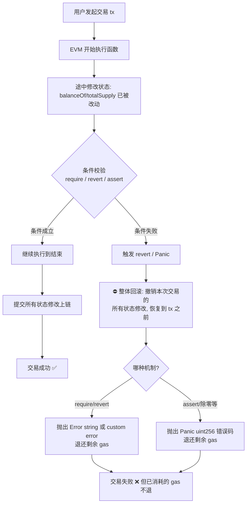

# 09 · 错误处理（Errors: require / revert / assert / custom error）
> 讲清 Solidity 里「一笔交易失败时如何整体回滚」，以及 require、revert、assert、custom error 四种机制各自的用途、gas 表现和抛出的错误类型。

## 📖 知识讲解

Solidity 的交易是**全有或全无（all-or-nothing）**的：一旦执行途中发生「回滚（revert）」，本次交易对链上状态做过的**所有修改都会被整体撤销**，就像这笔交易从未发生过。区别只在于用哪种机制触发回滚、gas 怎么处理、抛出的错误类型是什么。

| 机制 | 典型用途 | 抛出的错误 | gas 处理 | 何时用 |
| --- | --- | --- | --- | --- |
| `require(cond, "msg")` | 校验**输入 / 前置条件 / 权限** | `Error(string)` | 失败**退还**剩余 gas | 最常用，校验外部输入 |
| `revert("msg")` | 复杂 `if` 分支里主动回滚 | `Error(string)` | 失败**退还**剩余 gas | 条件复杂、一行写不下 |
| `revert CustomError(args)` | 带参数、省 gas 的错误 | 你的 **custom error** | 失败**退还**剩余 gas | 现代推荐，前端可解析参数 |
| `assert(cond)` | 校验**内部不变量** | `Panic(uint256)` | 失败**退还**剩余 gas（0.8.0 起） | 断言「绝不该发生」的 bug |

**三者区别一句话：**
- **require / revert** 面向「外部输入 / 业务条件」，失败属于**可预期的失败**，退还剩余 gas。
- **assert** 面向「代码内部不变量」（例如「余额绝不可能为负」），失败代表**代码有 bug**，抛出 `Panic` 错误码，正常逻辑下永远不该触发。

**custom error（自定义错误）**用 `error` 关键字定义。相比 `require` 里的长字符串，它在字节码里只保留一个 4 字节选择器，**部署和触发都更省 gas**，还能携带结构化参数便于前端解析，是当前官方推荐写法。

## 🔄 流程图 / 原理图

一次交易中「条件校验失败 → revert → 状态回滚 & gas 处理」的流程：



> 注意：回滚只撤销**状态修改**，但**已经消耗掉的 gas 不会退**（退还的只是「剩余未用完」的 gas）。

## 💻 代码说明

见 [`Errors.sol`](./Errors.sol)。核心示例：

- `deposit(amount)`：用 `require(amount > 0, "...")` 校验输入。
- `withdraw(amount)`：用 `if (...) revert("...")` 演示复杂分支下的主动回滚。
- `withdrawWithCustomError(amount)`：用 `if (!cond) revert InsufficientBalance(...)` 演示带参数的 custom error。
- `onlyOwnerAction()`：用 `revert Unauthorized(msg.sender)` 做权限校验。
- `requireWithCustomError_compatible(amount)`：演示 **`require(bool, CustomError())` 重载需 0.8.26+**，本模块 `^0.8.20` 用兼容写法 `if (!cond) revert CustomError();`。
- `checkInvariant()`：用 `assert` 断言内部不变量。
- `triggerDivByZeroPanic(a, b)`：`b=0` 时触发 `Panic(0x12)`（除零），观察 Panic 错误类型。

### ⭐ 关于 `require(bool, CustomError())`

从 **Solidity 0.8.26** 起，`require` 新增重载，可直接写：

```solidity
require(amount > 0, AmountZero());   // 仅 0.8.26+ 可用
```

本模块 `pragma` 用 `^0.8.20`，因此给出**兼容写法**（任何 0.8.4+ 都能用）：

```solidity
if (amount == 0) revert AmountZero();
```

在 0.8.20 上写 `require(bool, CustomError())` 会**编译报错**，务必注意。

## ▶️ 运行方式

1. 打开 [https://remix.ethereum.org](https://remix.ethereum.org)。
2. 在 **File Explorer** 新建文件 `Errors.sol`，粘贴本模块 `Errors.sol` 的内容。
3. 切到 **Solidity Compiler**，编译器版本选 `0.8.20` 或更高（0.8.35 亦可），点 **Compile Errors.sol**。
4. 切到 **Deploy & Run Transactions**，Environment 选 **Remix VM (Cancun)**，点 **Deploy**。
5. 调用函数观察：
   - `deposit` 填 `100` → 成功；填 `0` → 交易失败，报 `deposit: amount must be > 0`。
   - `withdrawWithCustomError` 填一个超过余额的数 → 失败，Remix 控制台展开可看到 `InsufficientBalance` 及 `available/required` 参数。
   - `onlyOwnerAction`（用非部署账户调用）→ 失败，抛出 `Unauthorized`。
   - `triggerDivByZeroPanic` 填 `a=10, b=0` → 失败，报 `Panic(0x12)`（除零）。
   - `checkInvariant` → 返回 `true`（不变量成立）。

## ⚠️ 常见坑 / 安全提示

- **教学用途，未经审计，勿直接上主网。**
- **权限校验用 `msg.sender`，不要用 `tx.origin`**：`tx.origin` 是「整条调用链的最初发起者」，用它做鉴权会被钓鱼合约中转攻击。
- **`assert` 不要用于校验外部输入**：`assert` 是给「内部不变量」用的，失败意味着代码有 bug。校验用户输入请用 `require` / `revert`。
- **别被过时资料误导**：0.8.0 之前 `assert` 会**吃光所有 gas**；0.8.0 起 `assert` 失败也退还剩余 gas，只是抛的是 `Panic` 而非 `Error`。
- **回滚不退已消耗的 gas**：`revert` 只撤销状态修改，已经跑掉的计算所消耗的 gas 不会退回。
- **custom error 省 gas**：能用 custom error 就别堆长字符串 reason，尤其是高频触发的路径。
- **`require(bool, CustomError())` 需 0.8.26+**：低版本请用 `if (!cond) revert CustomError();`。

## 🔗 官方文档

- 错误处理与回滚：https://docs.soliditylang.org/zh/latest/contracts.html#errors-and-the-revert-statement
- `require` / `revert` / `assert` 语义与 Panic 码：https://docs.soliditylang.org/zh/latest/control-structures.html#error-handling-assert-require-revert-and-exceptions
- 自定义错误（custom errors）：https://docs.soliditylang.org/zh/latest/contracts.html#errors
