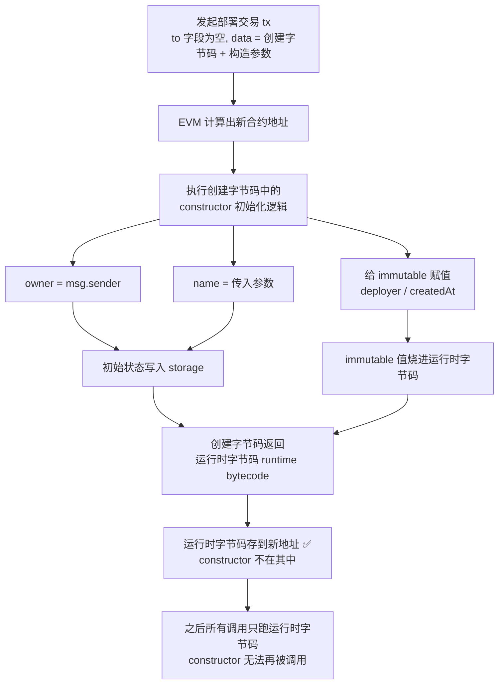

# 10 · 构造函数（Constructor）
> 讲清 `constructor` 只在部署时执行一次、用于初始化合约状态，以及带参数构造、`immutable` 变量和「部署交易如何生成运行时字节码」的原理。

## 📖 知识讲解

**构造函数（constructor）是合约的初始化逻辑，只在「部署」这一刻执行一次，之后永远不能再被调用。**

- 用 `constructor(...) { ... }` 声明（旧的「与合约同名的函数」写法已废弃）。
- 最经典的用法是 `owner = msg.sender`：谁部署合约，谁就是 owner，作为后续权限控制的基础。
- 构造函数**可以带参数**：部署时把参数一并传入。在 Remix 里，Deploy 按钮旁会出现输入框让你填。
- 可以是 `payable`，即部署时顺便向合约转入 ETH（本例未用）。

**`immutable`（不可变量）**：只能在声明处或构造函数里赋值一次，部署后永不可改。它的值在部署时被直接「烧」进运行时字节码，读取不走 storage，因此**比普通状态变量更省 gas**。适合「部署时确定、之后永不改变」的值。

**`constant` vs `immutable`：**

| | `constant` | `immutable` |
| --- | --- | --- |
| 何时确定 | **编译期**（写代码时就固定） | **部署时**（可用 `msg.sender`、`block.timestamp`） |
| 可否用运行时值初始化 | ❌ 不可 | ✅ 可以 |
| 部署后可改 | ❌ | ❌ |
| gas | 最省 | 很省（比普通状态变量省） |

## 🔄 流程图 / 原理图

部署交易 → EVM 执行 constructor → 存储初始状态 → 返回运行时字节码：

> 关键：constructor 属于「创建阶段」，不会进入运行时字节码。部署完成后合约里根本不存在 constructor，自然也无法二次调用。

## 💻 代码说明

见 [`ConstructorDemo.sol`](./ConstructorDemo.sol)：

- `constructor(string memory _name)`：带参数的构造函数，初始化 `owner = msg.sender`、`name = _name`，并给 `immutable` 的 `deployer`、`createdAt` 赋值。
- `owner`（普通状态变量，可通过 `transferOwnership` 转让）与 `deployer`（`immutable`，永不可改）的对比。
- `changeDeployer`（被注释）：演示给 `immutable` 再次赋值会**编译报错**。
- `VERSION`（`constant`）与 `createdAt`（`immutable`）对比 constant / immutable。
- `info()`：一次性返回所有变量值，方便观察。

## ▶️ 运行方式

1. 打开 [https://remix.ethereum.org](https://remix.ethereum.org)。
2. 在 **File Explorer** 新建 `ConstructorDemo.sol`，粘贴本模块代码。
3. 切到 **Solidity Compiler**，选 `0.8.20`+，点 **Compile ConstructorDemo.sol**。
4. 切到 **Deploy & Run Transactions**，Environment 选 **Remix VM (Cancun)**。
5. **注意 Deploy 按钮旁的输入框**：因为构造函数有 `_name` 参数，需先填入一个字符串（例如 `"MyContract"`），再点 **Deploy**。
6. 部署成功后，在下方展开合约实例，调用：
   - `info()` → 观察 `owner` / `deployer` 都是你的部署地址、`name` 是你填的值、`createdAt` 是部署时间戳、`version` = 1。
   - `transferOwnership` 填另一个账户地址 → 再看 `owner` 变了，但 `deployer` 不变（immutable）。

## ⚠️ 常见坑 / 安全提示

- **教学用途，未经审计，勿直接上主网。**
- **忘了填构造参数**：构造函数有参数时，Remix 必须先在 Deploy 旁的输入框填值，否则部署会失败。
- **不要在 constructor 里做能被外部重复触发的假设**：它只跑一次，初始化逻辑要一次性写全。
- **`immutable` 只能赋值一次**：在函数里再写它会编译报错（`Cannot write to immutable here`）。
- **`constant` 不能用运行时值**：`constant address o = msg.sender;` 会报错，因为 `msg.sender` 部署时才知道，这种要用 `immutable`。
- **owner 初始化别写错地址**：用 `msg.sender` 而不是硬编码地址，避免部署后 owner 落到别人手里。
- **部署顺序陷阱**：父合约的 constructor 会先于子合约执行（见 11-inheritance 模块的构造参数传递）。

## 🔗 官方文档

- 构造函数（Constructors）：https://docs.soliditylang.org/zh/latest/contracts.html#constructors
- `constant` 与 `immutable` 状态变量：https://docs.soliditylang.org/zh/latest/contracts.html#constant-and-immutable-state-variables
- 合约创建（Creating Contracts）：https://docs.soliditylang.org/zh/latest/contracts.html#creating-contracts
