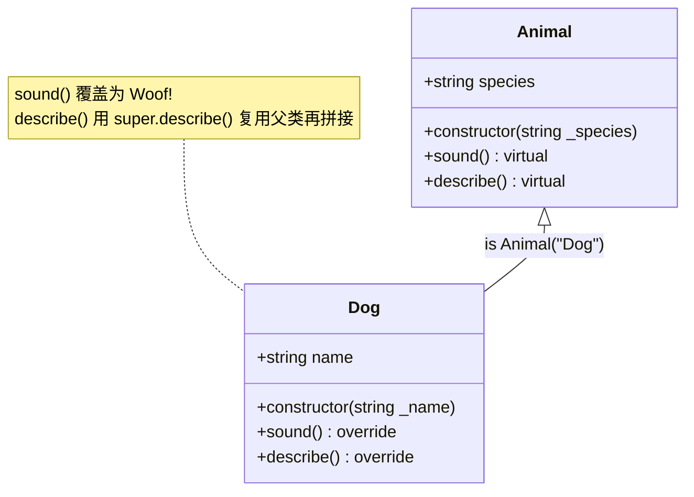
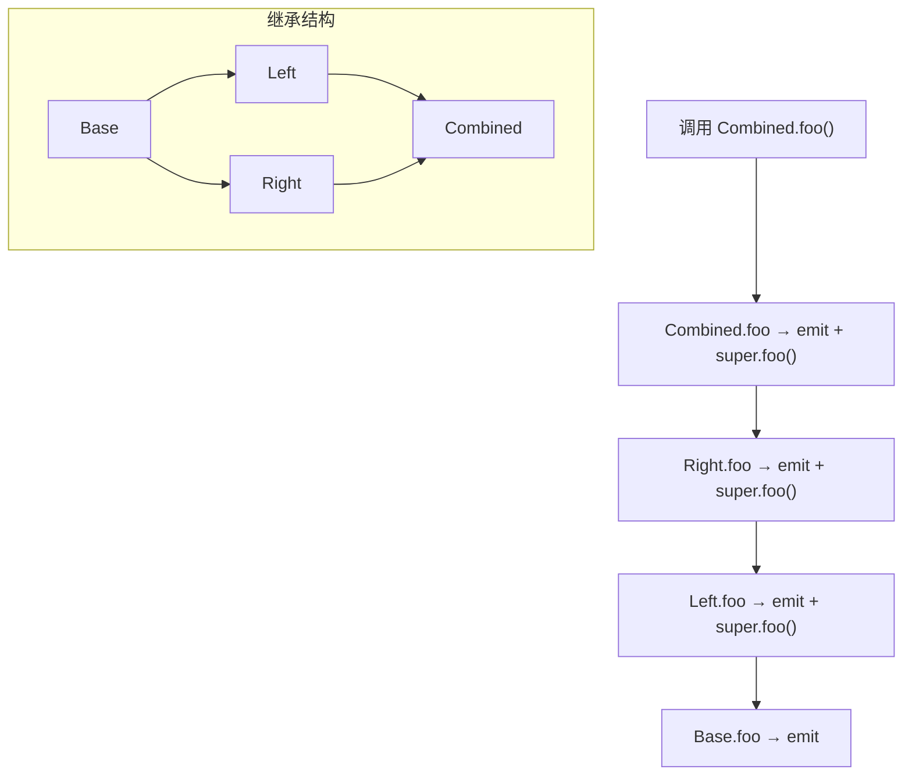

# 11 · 继承（Inheritance: is / virtual / override / super）
> 讲清合约如何用 `is` 继承父合约、`virtual`/`override` 如何覆盖方法、`super` 如何调用上一层实现，以及多重继承下的 C3 线性化顺序。

## 📖 知识讲解

**继承**让子合约复用父合约的状态变量和函数，是组织代码、复用逻辑（如 OpenZeppelin 的 `Ownable`、`ERC20`）的基础。

- **`is`**：`contract Dog is Animal` 表示 Dog 继承 Animal，自动拥有其状态变量与函数。
- **`virtual`**：父合约函数标 `virtual` 才**允许被子合约覆盖**。不标就不能被 override。
- **`override`**：子合约覆盖父函数时必须标 `override`。
- **`super`**：在子合约里调用「继承链上一层」的同名函数，用于**在覆盖的同时复用父类逻辑**（例如先跑父类的检查，再加自己的逻辑）。
- **向父构造函数传参**：两种等价写法——
  - 写法 A：`contract Dog is Animal("Dog")`（继承处直接传常量）；
  - 写法 B：`constructor(...) Animal("Dog") { ... }`（构造函数修饰符处传，可转发子类参数，更灵活）。
- **部署顺序**：部署子合约时，**先执行父合约 constructor，再执行子合约 constructor**。

**多重继承与 C3 线性化**：一个合约可继承多个父合约（`is Left, Right`）。Solidity 用 **C3 线性化**确定继承的线性顺序（MRO）：
- `is` 列表里**越靠右 = 越接近基类，越靠左 = 越派生**。
- `super` 按线性化顺序从当前合约往「更基类」方向逐个调用。
- 若多个父合约都定义了同名 `virtual` 函数，子类 override 时要写 `override(A, B)` 列出它们。

## 🔄 流程图 / 原理图

### 继承层次与方法覆盖（Animal → Dog）

### 多重继承的 C3 线性化调用顺序（Combined.foo）

> C3 线性化（派生→基类）：`Combined → Right → Left → Base`。所以 `Combined.foo()` 内 `super` 的传导顺序为 Combined → Right → Left → Base。

## 💻 代码说明

见 [`Inheritance.sol`](./Inheritance.sol)：

- `Animal`：基类，带 `virtual` 的 `sound()`、`describe()`，构造函数需传 `_species`。
- `Dog is Animal`：
  - `constructor(_name) Animal("Dog")` 演示**向父构造函数传参**；
  - `sound()` 用 `override` 覆盖为 `"Woof!"`；
  - `describe()` 用 `super.describe()` 复用父类结果再拼接名字。
- `Base` / `Left` / `Right` / `Combined`：演示多重继承。`Combined.foo()` 用 `override(Left, Right)`，`super.foo()` 触发 C3 链式调用，用 `Log` 事件记录调用轨迹。

## ▶️ 运行方式

1. 打开 [https://remix.ethereum.org](https://remix.ethereum.org)。
2. 在 **File Explorer** 新建 `Inheritance.sol`，粘贴本模块代码。
3. 切到 **Solidity Compiler**，选 `0.8.20`+，点 **Compile Inheritance.sol**。
4. 切到 **Deploy & Run Transactions**，Environment 选 **Remix VM (Cancun)**。
5. 在 **Contract 下拉框**选 `Dog`，Deploy 旁填名字（如 `"Buddy"`）→ **Deploy**：
   - 调 `sound()` → `Woof!`；`species()` → `Dog`（来自父构造）；`describe()` → `I am a Dog, my name is Buddy`（`super` 复用父类）。
6. 再选 `Combined` 部署，调 `foo()`，展开交易日志（logs）观察 `Log` 事件顺序：`Combined.foo → Right.foo → Left.foo → Base.foo`，即 C3 线性化顺序。

## ⚠️ 常见坑 / 安全提示

- **教学用途，未经审计，勿直接上主网。**
- **忘了 `virtual`**：父函数没标 `virtual`，子类 `override` 会编译报错。
- **忘了 `override`**：子类覆盖同名函数没标 `override` 也会报错。
- **多父同名函数**：多个父合约都有同名 `virtual` 函数时，子类必须写 `override(A, B)` 显式列出，否则报错。
- **`super` ≠ 直接指定父类**：`super.foo()` 走的是 **C3 线性化的下一个**，不一定是你直觉中的那个父类；要精确调用某个父类可用 `Left.foo()`。
- **继承列表顺序影响 C3**：`is Left, Right` 与 `is Right, Left` 的线性化顺序不同，会改变 `super` 的调用链。
- **构造顺序**：父合约 constructor 先于子合约执行；父构造有参数时务必在继承处或构造修饰符处传入。
- **状态变量不能被 override**：只有函数（以及 public 变量生成的 getter）能被覆盖，不要试图「覆盖」父类的存储变量。

## 🔗 官方文档

- 继承（Inheritance）：https://docs.soliditylang.org/zh/latest/contracts.html#inheritance
- 函数覆盖（Function Overriding，virtual/override）：https://docs.soliditylang.org/zh/latest/contracts.html#function-overriding
- 多重继承与线性化（C3）：https://docs.soliditylang.org/zh/latest/contracts.html#multiple-inheritance-and-linearization
