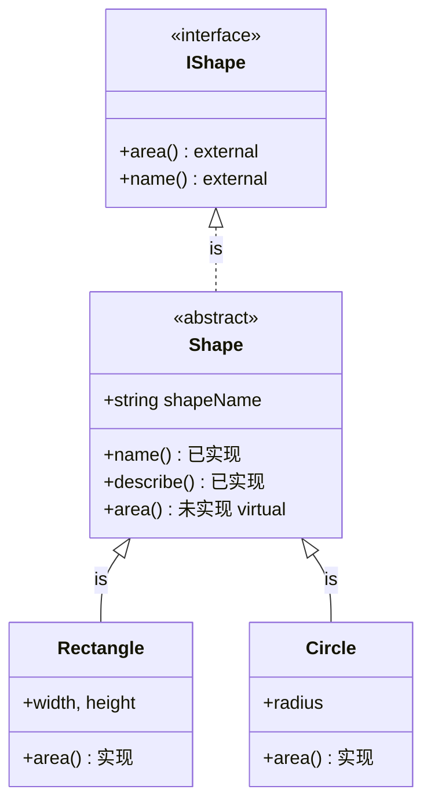
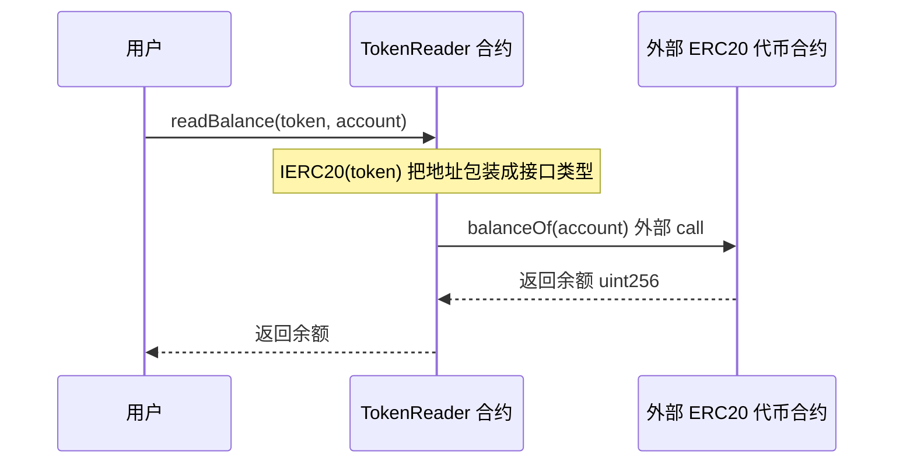

# 12 · 接口与抽象合约（Interfaces & Abstract Contracts）
> 讲清 `interface`（纯契约、只有函数签名）与 `abstract contract`（可含部分实现）的区别与用法，以及如何通过接口与外部已部署合约（如 ERC20 代币）交互。

## 📖 知识讲解

**`interface`（接口）** 是一份纯粹的「契约/规范」，规定「谁实现谁就必须提供这些函数」。硬性规则：

- **只有函数签名，没有任何实现**；
- **不能声明状态变量、不能有构造函数**；
- 所有函数**隐式且必须是 `external`**（不用写、也不能写 `public`/`internal`）；
- 可声明 `event`、`error`，也可含 `enum`/`struct` 类型定义。

**`abstract contract`（抽象合约）** 比接口灵活得多：

- **可以有状态变量、构造函数**；
- **既能有已实现的函数，也能有未实现的函数**（`virtual` 且无函数体）；
- 只要存在「未实现函数」，合约就**必须标 `abstract`**，且**不能被直接部署**，只能被继承。

**二者区别与使用场景：**

| | `interface` | `abstract contract` |
| --- | --- | --- |
| 函数实现 | 全部无实现 | 可部分实现 |
| 状态变量 | ❌ 不能有 | ✅ 可以有 |
| 构造函数 | ❌ 不能有 | ✅ 可以有 |
| 函数可见性 | 强制 `external` | 任意 |
| 能否部署 | ❌ | ❌（含未实现函数时） |
| 典型场景 | 定义标准（ERC20/ERC721）、跨合约调用 | 复用公共逻辑 + 留抽象方法给子类（模板方法） |

**通过接口与外部合约交互**：只要知道对方合约的**地址**和它遵循的**接口**，就能把地址「包装」成接口类型来调用，无需对方源码。例如 `IERC20(tokenAddress).balanceOf(user)` —— 这是与 ERC20 代币等外部合约交互的通用套路。

## 🔄 流程图 / 原理图

### 接口 → 抽象合约 → 具体实现 的关系

### 通过接口调用外部合约（IERC20）时序

## 💻 代码说明

见 [`InterfacesAbstract.sol`](./InterfacesAbstract.sol)：

- `IShape`：接口，只声明 `area()`、`name()` 签名。
- `Shape is IShape`（**abstract**）：实现了 `name()`、`describe()`，把 `area()` 留为未实现的 `virtual`，因此必须标 `abstract`、不能部署。
- `Rectangle` / `Circle`：继承 `Shape` 并各自实现 `area()`，成为**可部署的具体合约**，演示「同一抽象，多种实现」。
- `IERC20`：精简版代币接口（`balanceOf`、`transfer`）。
- `TokenReader`：用 `IERC20(token).balanceOf(...)` / `.transfer(...)` 演示**通过接口调用外部合约**。

## ▶️ 运行方式

1. 打开 [https://remix.ethereum.org](https://remix.ethereum.org)。
2. 在 **File Explorer** 新建 `InterfacesAbstract.sol`，粘贴本模块代码。
3. 切到 **Solidity Compiler**，选 `0.8.20`+，点 **Compile InterfacesAbstract.sol**。
4. 切到 **Deploy & Run Transactions**，Environment 选 **Remix VM (Cancun)**。
5. 在 **Contract 下拉框**：
   - 选 `Rectangle`，填 `_w=3, _h=4` → Deploy → 调 `area()` 得 `12`，`name()` 得 `Rectangle`。
   - 选 `Circle`，填 `_r=10` → Deploy → 调 `area()` 得约 `314`。
   - **试选 `Shape` 会发现无法部署**（Deploy 按钮不可用/报错），因为它是 abstract。
6. 演示接口调用外部合约（可选，需要一个 ERC20）：先部署任意 ERC20 代币，拿到其地址，部署 `TokenReader`，调 `readBalance(代币地址, 账户地址)` 观察返回余额。

## ⚠️ 常见坑 / 安全提示

- **教学用途，未经审计，勿直接上主网。**
- **接口里别写 `public`**：接口函数必须是 `external`，写 `public` 会编译报错。
- **接口不能有状态变量/构造函数/函数体**：需要这些就用 abstract contract。
- **abstract 不能部署**：含未实现函数的合约必须标 `abstract`；忘了标会报错，标了就不能直接 Deploy。
- **接口调用要确认对方地址真的实现了该接口**：把随便一个地址当 `IERC20` 调用，若对方没有该函数会 revert；调用不受信任的外部合约还要防重入。
- **ERC20 的 `transfer` 返回值坑**：部分早期代币不返回 `bool`，直接用接口调用可能出问题，生产环境请用 OpenZeppelin 的 `SafeERC20`。
- **无限授权/钓鱼签名风险**：涉及 `approve`/`transferFrom` 的交互要谨慎，别授权无限额度给不明合约。

## 🔗 官方文档

- 接口（Interfaces）：https://docs.soliditylang.org/zh/latest/contracts.html#interfaces
- 抽象合约（Abstract Contracts）：https://docs.soliditylang.org/zh/latest/contracts.html#abstract-contracts
- 通过 `address`/接口调用其他合约：https://docs.soliditylang.org/zh/latest/contracts.html#creating-contracts-via-new
