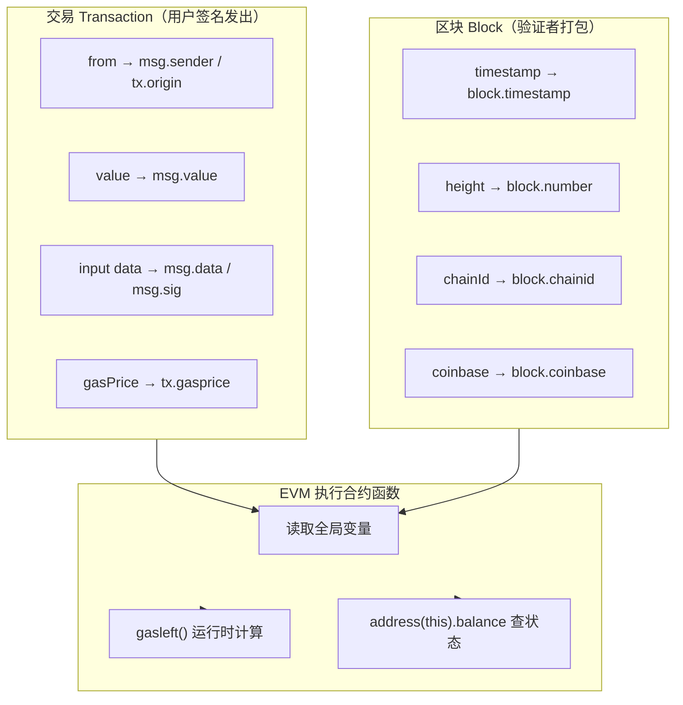

# 13 · 全局变量（Global Variables）
> Solidity 里一批由 EVM 自动注入、无需声明就能读的「上下文变量」，让合约在运行时知道「谁在调用、带了多少钱、现在是哪个区块」。

## 📖 知识讲解

全局变量（也叫特殊变量 special variables）不是你在合约里声明的，而是 EVM 在执行每一笔交易时，把当时的「交易上下文」和「区块上下文」直接塞进来的。它们分两大来源：

**一、交易层面（每次调用都可能不同）**

| 变量 | 类型 | 含义 |
|------|------|------|
| `msg.sender` | `address` | 本次调用的**直接**发起者（可能是 EOA，也可能是合约） |
| `msg.value` | `uint256` | 本次调用随交易发送的 ETH，单位 **wei**；只有 `payable` 函数能收 |
| `msg.data` | `bytes calldata` | 完整 calldata：函数选择器(4 字节) + ABI 编码后的参数 |
| `msg.sig` | `bytes4` | calldata 的前 4 字节，即函数选择器 |
| `tx.origin` | `address` | 整条调用链**最初的 EOA** 发起者 ⚠️ 不要用于鉴权 |
| `tx.gasprice` | `uint256` | 本次交易的 gas 价格 |

**二、区块层面（同一区块内所有交易相同）**

| 变量 | 类型 | 含义 |
|------|------|------|
| `block.timestamp` | `uint256` | 出块时间戳（秒，Unix time） |
| `block.number` | `uint256` | 当前区块高度 |
| `block.chainid` | `uint256` | 链 ID（主网=1，Sepolia=11155111） |
| `block.coinbase` | `address payable` | 当前区块矿工/验证者 |
| `block.basefee` | `uint256` | 当前区块基础手续费（EIP-1559） |

**三、其它常用**

- `gasleft()`：函数，返回此刻剩余 gas。
- `address(this).balance`：当前合约自身的 ETH 余额（wei）。

**`msg.sender` vs `tx.origin` 的关键区别**：当 EOA 直接调用合约 A 时，二者相等；当 EOA → 合约 A → 合约 B 时，在 B 里 `msg.sender` 是 A，而 `tx.origin` 始终是最初的 EOA。这就是为什么鉴权必须用 `msg.sender`。

## 🔄 流程图 / 原理图

一次合约调用中，这些全局变量从「交易 / 区块上下文」注入到 EVM 执行环境的来源关系：

## 💻 代码说明

见 [`GlobalVariables.sol`](./GlobalVariables.sol)：

- `readAll()`：一次性读出 `msg.sender / tx.origin / msg.value / block.timestamp / block.number / block.chainid / gasleft() / address(this).balance`。声明为 `payable`，方便你在 Remix 里填 Value 观察 `msg.value` 非 0。
- `readCalldata(uint256)`：读取 `msg.data`（完整 calldata）与 `msg.sig`（函数选择器），传个参数就能看到参数如何被编码进 calldata。
- `senderVsOrigin()`：对比 `msg.sender` 与 `tx.origin`，并注释说明为什么**不能**用 `tx.origin` 鉴权（钓鱼攻击）。
- `receive()`：允许合约直接收 ETH，方便观察余额变化。

## ▶️ 运行方式

1. 打开 [https://remix.ethereum.org](https://remix.ethereum.org) 。
2. 在左侧 **File Explorer** 新建 `GlobalVariables.sol`，粘贴本目录合约源码。
3. 切到 **Solidity Compiler**，编译器版本选 `0.8.20` 或更高，点 **Compile**。
4. 切到 **Deploy & Run Transactions**，ENVIRONMENT 选 **Remix VM (Cancun)**，点 **Deploy**。
5. 展开已部署合约，调用函数观察：
   - 直接点 `readAll`，展开返回值看 `msg.sender`、`block.number` 等。
   - 想看到 `msg.value` 非 0：先在 Deploy 面板顶部的 **Value** 输入框填一个数（比如 `1`），右边单位下拉选 **ether**，再点 `readAll`，返回的 `value` 就是 `1000000000000000000`（1 ether = 10^18 wei）。
   - 调用 `readCalldata`，随便填个数字，观察返回的 `rawData`（十六进制 calldata）与 `selector`。
6. 提示：Remix VM 里 `block.chainid` 通常是一个固定的开发链 ID；换到真实网络才会看到 1 / 11155111 等。

## ⚠️ 常见坑 / 安全提示

- **`tx.origin` 千万别用于鉴权**。用 `require(tx.origin == owner)` 会被「钓鱼合约」绕过：owner 被诱导调用恶意合约，恶意合约再转调你的合约，`tx.origin` 仍是 owner。鉴权一律用 `msg.sender`。
- **`block.timestamp` 可被验证者小幅操纵**（秒级），不要用作强随机数来源或精确到秒的资金判定；只适合粗粒度时间（如「至少过了 1 天」）。
- **`block.number` 不等于时间**：不同链出块间隔不同，别拿区块数当秒表。
- **`msg.value` 单位是 wei**：1 ether = 10^9 gwei = 10^18 wei，写数值时别少数量级。
- 非 `payable` 函数无法接收 ETH，给它转账会直接 revert。

## 🔗 官方文档

- 全局变量（Units and Globally Available Variables）：https://docs.soliditylang.org/zh/latest/units-and-global-variables.html
- 关于 `tx.origin` 的安全警告：https://docs.soliditylang.org/zh/latest/security-considerations.html#tx-origin
