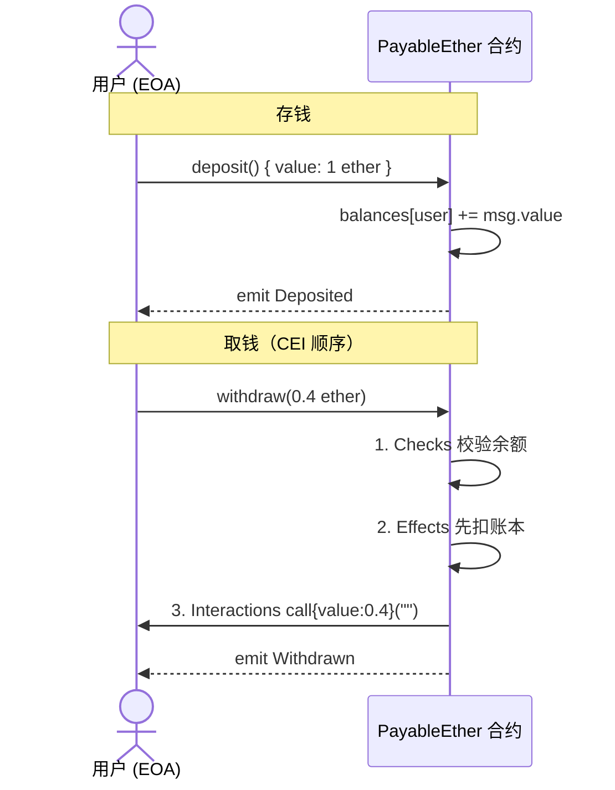

# 14 · 收发以太（Payable / Receive / Fallback）
> 让合约能安全地收 ETH、存 ETH、取 ETH：搞懂 `payable`、`receive()`、`fallback()` 的触发规则，以及为什么提款要用 `call` 而不是 `transfer`。

## 📖 知识讲解

**1. `payable` —— 收钱的开关**
一个函数只有标了 `payable`，被调用时才能接收随交易发来的 ETH（`msg.value`）。非 `payable` 函数收到 ETH 会直接 revert。地址也分 `address` 和 `address payable`，只有后者能作为 `transfer/send/call` 的转账目标（用 `payable(addr)` 转换）。

**2. `receive()` external payable —— 纯转账入口**
当有人向合约地址「纯转账」（`msg.data` 为空，比如钱包直接转 ETH、或 `addr.call{value:x}("")`）时，自动触发 `receive()`。它必须是 `external payable`，无参数、无返回值、不写 `function` 关键字。

**3. `fallback()` external payable —— 兜底入口**
两种情况触发 `fallback()`：
- 调用了合约里**不存在**的函数（函数选择器匹配不到）；
- 转账时 `msg.data` 为空但合约**没有** `receive()`。
只有加了 `payable`，`fallback()` 才能接收 ETH。

**4. 提款为什么用 `call` 而不是 `transfer`/`send`？**
历史上大家用 `to.transfer(amount)`：它只转发 **2300 gas**，失败自动 revert。但 EIP-1884（2019，Istanbul 升级）上调了部分操作码的 gas 成本，导致一些「收款方是合约」的场景在 2300 gas 下不够用而失败。因此现在官方推荐：

```solidity
(bool ok, ) = payable(to).call{value: amount}("");
require(ok, "transfer failed");
```

`call` 会转发全部剩余 gas、更抗未来 gas 调价。**代价是 `call` 打开了重入的门**，所以必须配合下面的防护。

**5. 重入防护 + Checks-Effects-Interactions（CEI）**
`call` 转账会把控制权交给收款方，收款方可能在 `receive/fallback` 里「回头再调你的 `withdraw`」形成重入。两道防线：
- **CEI 顺序**：先 **C**hecks 校验 → 再 **E**ffects 改状态（把余额先扣掉）→ 最后 **I**nteractions 转账。这样即使被重入，账本已清零，取不出第二笔。
- **重入锁**（`nonReentrant` 修饰器）：进入时上锁，禁止再次进入。

## 🔄 流程图 / 原理图

**图① 资金流向：存钱 / 取钱**



**图② `receive` vs `fallback` 触发判定**

```mermaid
flowchart TD
    Start([收到一笔调用]) --> Empty{msg.data 为空?}
    Empty -- 是（纯转账） --> HasRecv{合约有 receive()?}
    HasRecv -- 有 --> R["执行 receive()"]
    HasRecv -- 没有 --> Fpay{fallback 是 payable?}
    Empty -- 否（带函数数据） --> Match{匹配到某个函数?}
    Match -- 匹配到 --> Fn["执行对应函数"]
    Match -- 匹配不到 --> Fpay
    Fpay -- 是 --> F["执行 fallback()"]
    Fpay -- 否且带 ETH --> Rev["revert 拒收"]
    Fpay -- 否且无 ETH --> F
```

## 💻 代码说明

见 [`PayableEther.sol`](./PayableEther.sol)：

- `deposit()`（payable）：显式存款，把 `msg.value` 记进 `balances` 账本。
- `withdraw(amount)`：提款，严格按 **CEI**（先扣账本再转账）+ `nonReentrant` 锁 + `call{value:}("")` + 检查返回值。
- `contractBalance()` / `balanceOf(who)`：查合约总余额、查某地址账本余额。
- `receive()`：纯转账（calldata 为空）时触发，也计入账本。
- `fallback()`：调用未知函数或无 receive 时兜底，带 payable 可收 ETH，并记录原始 `msg.data`。
- 事件 `Deposited / Withdrawn / ReceiveCalled / FallbackCalled`：在 Remix 日志里直观看到资金流向和走了哪个入口。

## ▶️ 运行方式

1. 打开 [https://remix.ethereum.org](https://remix.ethereum.org) ，新建 `PayableEther.sol` 粘贴源码。
2. **Solidity Compiler** 选 `0.8.20+` 编译。
3. **Deploy & Run**，ENVIRONMENT 选 **Remix VM (Cancun)**，Deploy。
4. **如何带着 ETH 调用 payable 函数（关键）**：
   - 看 Deploy 面板上方的 **Value** 输入框，它旁边有个单位下拉：**Wei / Gwei / Finney / Ether**。
   - 先在 Value 里填数额、选单位（例如填 `1`、选 **Ether**）。
   - 再点橙色的 `deposit` 按钮，这笔调用就会带上 1 ETH，`msg.value = 1e18 wei`。
5. 观察：
   - 调 `contractBalance` 看合约余额涨了 1 ether；调 `balanceOf` 填自己地址看账本。
   - 调 `withdraw`，参数填 `400000000000000000`（0.4 ether 的 wei 值），看余额减少、日志出 `Withdrawn`。
   - 触发 `receive()`：在 Value 填个数额、**CALLDATA 留空**，用 Deploy 面板底部的 **Low level interactions**（Transact 按钮，calldata 空）向合约地址发 ETH，日志会出 `ReceiveCalled`。
   - 触发 `fallback()`：在 Low level interactions 的 calldata 里随便填一段不匹配任何函数的字节（如 `0x12345678`）再 Transact，日志出 `FallbackCalled`。

> 单位换算：1 ether = 10^9 gwei = 10^18 wei。填 wei 值时注意数量级。

## ⚠️ 常见坑 / 安全提示

- **重入攻击（Reentrancy）是头号杀手**。经典 The DAO 事件就是提款时先转账后扣账本被反复重入掏空。务必 **Checks-Effects-Interactions**：先改状态再转账；敏感函数加 `nonReentrant`。
- **优先 `call`，别再用 `transfer`/`send`**。`transfer`/`send` 固定只给 2300 gas，EIP-1884 之后可能不够，导致给某些合约收款方转账莫名失败。用 `call{value:}("")` 并**务必检查返回值** `require(ok)`（`call` 失败不会自动 revert）。
- **`fallback`/`receive` 里别写复杂逻辑**。它们能用的 gas 可能很有限（尤其被 `transfer` 触发时只有 2300 gas），逻辑太重会失败。
- **忘了 `payable`**：`fallback()` 不加 `payable` 时收到 ETH 会 revert；想纯收款却没写 `receive()` 也可能落到 fallback。
- **不要假设 `receive`/`fallback` 一定被触发**：合约可通过 `selfdestruct` 或作为区块奖励地址被「强制打钱」，绕过这两个函数，因此**别用 `address(this).balance == 期望值` 做核心逻辑判断**。

## 🔗 官方文档

- 接收 ETH 的函数 receive / fallback：https://docs.soliditylang.org/zh/latest/contracts.html#receive-ether-function
- 发送与接收 ETH（transfer / send / call 对比）：https://docs.soliditylang.org/zh/latest/security-considerations.html#sending-and-receiving-ether
- 重入与 Checks-Effects-Interactions：https://docs.soliditylang.org/zh/latest/security-considerations.html#reentrancy
