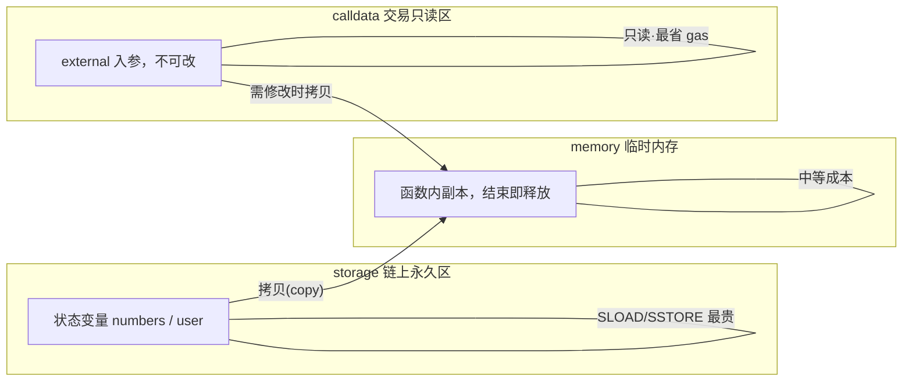
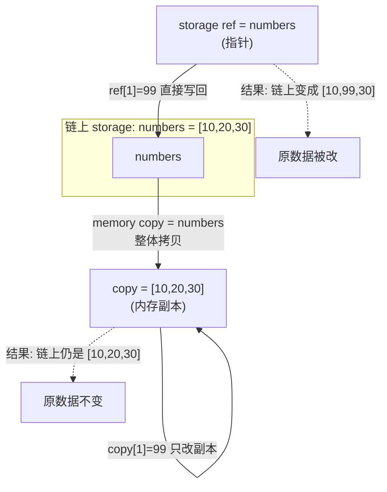

# 15 · 数据位置（Data Location: storage / memory / calldata）
> 引用类型（数组 / struct / string / mapping）必须标注数据存在哪，它决定了「能不能改原数据」和「花多少 gas」——这是 Solidity 新手最容易踩坑的地方。

## 📖 知识讲解

在 Solidity 里，**值类型**（`uint`、`bool`、`address`、`bytes32` 等）总是按值拷贝，不用写数据位置。但**引用类型**（`数组`、`struct`、`mapping`、`string`、`bytes`）体积可能很大，编译器要求你显式写清它存在哪个「数据位置」：

| 位置 | 生命周期 | 可写性 | gas | 典型用途 |
|------|----------|--------|-----|----------|
| `storage` | **永久**存链上 | 可写，且**改的是原始状态** | 最贵（SLOAD/SSTORE） | 状态变量；函数内的 storage 引用 |
| `memory` | 函数执行期间，结束即释放 | 可写，但**只是拷贝**，不影响原状态 | 中等 | 函数内临时数据、需要修改的入参 |
| `calldata` | 随交易存在，**只读** | **不可修改** | 最省 | `external` 函数的引用类型入参 |

**三个必须记住的语义：**

1. **`storage` 引用是「指针」**：`uint256[] storage ref = numbers;` 里的 `ref` 指向状态变量本身，`ref[0] = x` 等价于 `numbers[0] = x`，会真正写回链上。
2. **`memory` 是「拷贝」**：`uint256[] memory copy = numbers;` 把数据整体复制一份到内存，改 `copy` 不会动到链上的 `numbers`。
3. **`calldata` 只读、最省**：`external` 函数的数组/字符串入参用 `calldata`，编译器直接读交易数据、不做拷贝，最省 gas；代价是你**不能修改**它（`data[0]=x` 会编译报错）。若函数内确实要改这份数据，才改用 `memory`（会把 calldata 拷进内存）。

一句话决策：**external 入参默认 `calldata`，需要就地修改再换 `memory`；想改链上状态就用 `storage` 引用。**

## 🔄 流程图 / 原理图

**图① 三种数据位置对比（生命周期 / 可写性 / gas）**

**图② storage 指针 vs memory 拷贝**

## 💻 代码说明

见 [`DataLocation.sol`](./DataLocation.sol)：

- `updateViaStorage(index, newValue)`：用 `storage` 引用改数组，**真正改链上** `numbers`。
- `updateViaMemory(index, newValue)`：用 `memory` 拷贝改，返回副本，**链上不变**。
- `sumCalldata(uint256[] calldata)`：`calldata` 只读入参求和，最省 gas。
- `sumMemory(uint256[] memory)`：`memory` 入参，语义相同但会把数据拷进内存、可写、略贵。
- `renameUserStorage` / `renameUserMemory`：对 `struct` 分别用 storage 指针 / memory 拷贝，对比是否改到链上。
- `getNumbers()`：读取当前 `numbers`，方便前后对比。

## ▶️ 运行方式

1. 打开 [https://remix.ethereum.org](https://remix.ethereum.org) ，新建 `DataLocation.sol` 粘贴源码。
2. **Solidity Compiler** 选 `0.8.20+` 编译。
3. **Deploy & Run**，ENVIRONMENT 选 **Remix VM (Cancun)**，Deploy（构造函数会初始化 `numbers=[10,20,30]`、`user=("Alice",100)`）。
4. 对比实验：
   - 先调 `getNumbers` 记下当前值。
   - 调 `updateViaMemory`，参数 `index=1, newValue=99`，返回值里第 2 个元素变成 99，但再调 `getNumbers` 会发现**链上没变**（memory 是拷贝）。
   - 调 `updateViaStorage`，参数 `index=1, newValue=99`，再调 `getNumbers`，这次链上**真的变成 [10,99,30]**（storage 是指针）。
   - 调 `sumCalldata`，参数填 `[1,2,3]`（Remix 数组入参写法：`[1,2,3]`），返回 6。
   - 调 `renameUserMemory("Bob")` 返回的 name 是 Bob，但 `user` getter 仍是 Alice；调 `renameUserStorage("Bob")` 后 `user` 才真正变 Bob。

## ⚠️ 常见坑 / 安全提示

- **误以为 memory 能改链上**：把 `storage` 写成 `memory` 拿去改，编译通过但改的是副本，状态根本没更新——最隐蔽的逻辑 bug 之一。
- **误以为 storage 引用是拷贝**：`User storage u = user; u.score = 0;` 会把链上 `user.score` 清零，别当成安全的临时变量。
- **给 calldata 赋值会编译报错**：`calldata` 只读；需要就地修改时才改成 `memory`。
- **省 gas 优先 calldata**：`external` 函数的大数组/字符串入参用 `calldata` 比 `memory` 便宜不少（省去一次内存拷贝）。
- **未初始化的 storage 指针很危险**（老版本）：现代 `^0.8.x` 已强制要求显式数据位置并禁止危险的悬空 storage 指针，但仍要养成显式标注习惯。
- **值类型不要画蛇添足**：给 `uint256` 写 `memory` 会编译报错，值类型不需要数据位置。

## 🔗 官方文档

- 数据位置（Data location）：https://docs.soliditylang.org/zh/latest/types.html#data-location
- 引用类型（Reference Types）：https://docs.soliditylang.org/zh/latest/types.html#reference-types
