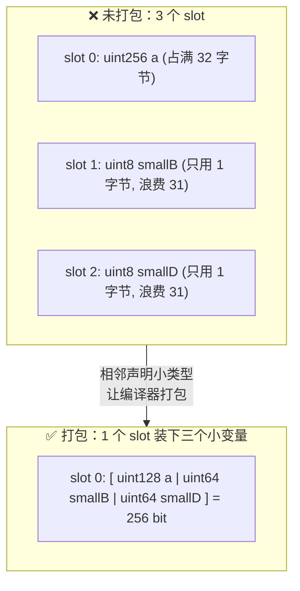
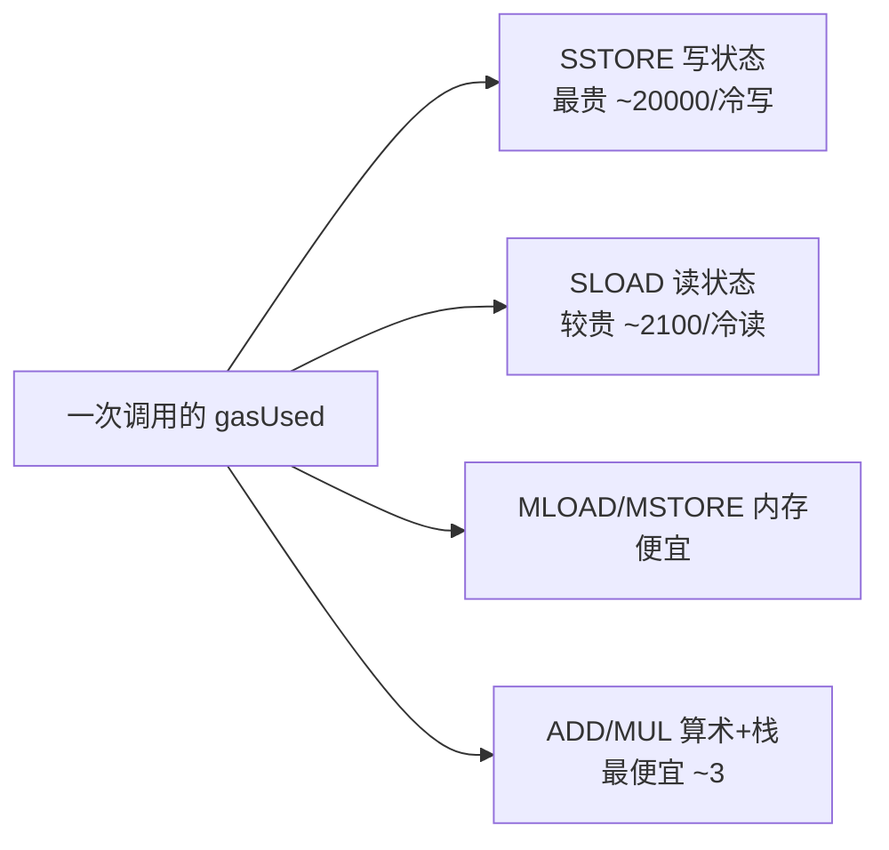

# 16 · Gas 消耗与优化（Gas & Optimization）
> Gas 是 EVM 每个操作的计价单位，手续费 = gasUsed × gasPrice。学会几招常见优化，能显著降低部署与调用成本。

## 📖 知识讲解

**Gas 是什么**：EVM 执行每条指令都要「烧」一定量的 gas，防止死循环、并给验证者付费。一笔交易的费用 = `gasUsed × gasPrice`（EIP-1559 下 = `gasUsed × (baseFee + priorityFee)`）。所以**省 gas = 省钱**。

各类操作大致成本（从贵到便宜）：**写状态 `SSTORE`（冷写高达 ~20000）> 读状态 `SLOAD` > 内存操作 > 栈/算术**。优化的核心就是**少写、少读 storage**。

**常见优化技巧：**

1. **变量打包（storage packing）**：storage 以 32 字节（256 bit）为一个 slot。把多个小变量（如 `uint128 + uint64 + uint64`）**相邻声明**，编译器会把它们塞进**同一个 slot**，减少 slot 数量、省 SSTORE。注意：被大变量（`uint256`）隔开就打包不了。
2. **`calldata` 代替 `memory`**：`external` 函数的只读引用类型入参用 `calldata`，省去一次内存拷贝。
3. **custom error 代替 `require` 字符串**：`error ValueIsZero();` + `if(...) revert ValueIsZero();` 比 `require(cond, "长字符串")` 更省部署字节码和调用 gas。
4. **`constant` / `immutable`**：编译期/部署期确定的值不占 storage、读取无 SLOAD。`constant` 编进字节码；`immutable` 部署时写入字节码，只能在构造函数赋值一次。
5. **缓存 storage 到 memory**：循环里反复读同一个状态变量会每轮 SLOAD。先把它读进局部/内存变量，循环内操作局部变量，结束再一次性写回。
6. **减少 SSTORE 次数**：累加先用局部变量算完，最后写一次 storage，而不是循环里每轮都写。
7. **短路求值**：`&&` / `||` 左侧能定结果就不算右侧，把便宜/大概率的条件放左边。
8. **`unchecked`**：在确定不会溢出的地方（如循环计数 `++i`）用 `unchecked { }` 省掉 0.8 默认的溢出检查。
9. **小整数并非总是更省**：在**非打包**场景，单个 `uint8` 反而可能因需要额外的掩码/截断操作而比 `uint256` 略贵——只有**能打包**时用小类型才划算。

## 🔄 流程图 / 原理图

**storage slot packing（多个小变量塞进一个 32 字节 slot）：**

**gas 消耗构成（按操作贵贱）：**

## 💻 代码说明

见 [`GasOptimization.sol`](./GasOptimization.sol)，含两个对照合约：

- **`GasUnoptimized`（反面）**：`uint256` 把小变量隔开导致无法打包；`require` 带长字符串；`sumAll` 循环里反复 SLOAD/SSTORE；`sumInput` 用 `memory` 入参。
- **`GasOptimized`（正面）**：
  - `uint128 a / uint64 smallB / uint64 smallD` 相邻声明 → 打包进 1 个 slot。
  - `constant MAX_SUPPLY` 与 `immutable owner` 不占 storage。
  - `error ValueIsZero()` + `revert` 代替 require 字符串。
  - `sumAll` 把 `items` 缓存进 memory、缓存 length、用局部累加器，最后只写一次 `total`。
  - `sumInput` 用 `calldata` 入参。
  - `countUnchecked` 用 `unchecked { ++i; }` 省循环溢出检查。

## ▶️ 运行方式

1. 打开 [https://remix.ethereum.org](https://remix.ethereum.org) ，新建 `GasOptimization.sol` 粘贴源码。
2. **Solidity Compiler** 选 `0.8.20+`。想看优化器效果，可在 Compiler 高级设置里勾选 **Enable optimization**（runs 默认 200），点 Compile。
3. **Deploy & Run**，ENVIRONMENT 选 **Remix VM (Cancun)**，分别 Deploy `GasUnoptimized` 和 `GasOptimized`。
4. 对比 gas：
   - 先给两个合约都调几次 `pushItem`（填入相同数据，如依次 1、2、3、4、5）。
   - 分别调用两个合约的 `sumAll` / `sumInput`（`sumInput` 参数填 `[1,2,3,4,5]`）。
   - **在每次交易执行后，展开 Remix 底部终端的那条交易日志，查看 `transaction cost` / `execution cost` 字段**，对比未优化与优化版的 gas 差异（数组越大差距越明显）。
   - 观察 `setA`：未优化版失败会返回长字符串，优化版返回 `ValueIsZero` custom error。

## ⚠️ 常见坑 / 安全提示

- **打包要「相邻声明」小类型**：被 `uint256` 隔开就打不进同一 slot；调整声明顺序才有效。
- **`unchecked` 要确有把握不溢出**：滥用会把溢出保护关掉，引入安全漏洞。只在循环计数等可证明安全处使用。
- **过度优化牺牲可读性/安全**：为省一点 gas 写晦涩汇编（inline assembly）容易出 bug，权衡收益。
- **`immutable` 只能构造函数赋一次**，`constant` 必须编译期常量；用错会编译报错。
- **小整数不是银弹**：非打包场景下 `uint8` 因掩码操作可能比 `uint256` 还贵，只有能打包时才用小类型。
- **优化器开关会影响结果**：开/关 optimizer 的 gas 数字不同，对比时保持编译设置一致。

## 🔗 官方文档

- 存储布局 / slot 打包（Layout of State Variables in Storage）：https://docs.soliditylang.org/zh/latest/internals/layout_in_storage.html
- 自定义错误 custom errors：https://docs.soliditylang.org/zh/latest/contracts.html#errors-and-the-revert-statement
- constant / immutable：https://docs.soliditylang.org/zh/latest/contracts.html#constant-and-immutable-state-variables
- unchecked 算术：https://docs.soliditylang.org/zh/latest/control-structures.html#checked-or-unchecked-arithmetic
