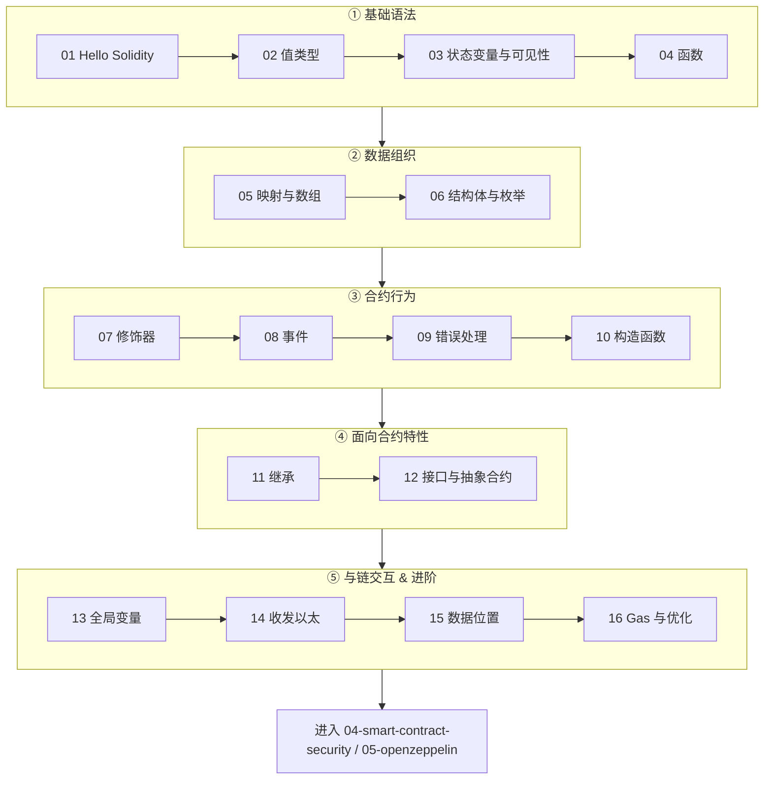

# 03 · Solidity 智能合约语言

> Solidity 是运行在以太坊虚拟机（EVM）上的合约编程语言。本工程用 16 个由易到难的模块，从「第一个合约」讲到「gas 优化」，每个模块都能在浏览器里的 Remix 在线 IDE 免安装编译、部署、调用。

---

## 📖 Solidity 简介

Solidity 是一门**静态类型、面向合约（contract-oriented）**的高级语言，语法接近 JavaScript / C++。你写的 `.sol` 源码会被 `solc` 编译器编译成 **EVM 字节码**，部署到以太坊（或任意 EVM 兼容链）后成为一段**不可篡改、公开可读、按 gas 计费执行**的程序。

- **版本**：本合集统一使用 `pragma solidity ^0.8.20;`（当前最新稳定版为 0.8.35，2026 年）。0.8.x 起内置**整数溢出检查**，无需再手动引入 SafeMath。
- **运行环境**：一切代码都在 EVM 上执行，状态存在链上，读操作免费、写操作与部署都要花 gas。
- **学习工具**：全程使用 [Remix 在线 IDE](https://remix.ethereum.org)，浏览器打开即用，内置 **Remix VM**（本地模拟链）可免费部署调用，无需钱包、无需测试币。

> ⚠️ 本工程所有合约均为**教学用途，未经审计，勿直接部署到主网管理真实资产**。

---

## 🗂️ 模块索引表

| 模块 | 知识点 | 合约文件 | 一句话说明 |
| --- | --- | --- | --- |
| [01](./01-hello-solidity/) | Hello Solidity | `HelloSolidity.sol` | 第一个合约：SPDX / pragma / contract / Remix 上手 |
| [02](./02-value-types/) | 值类型 | `ValueTypes.sol` | bool / uint / int / address / bytes 及其默认值与范围 |
| [03](./03-state-variables-visibility/) | 状态变量与可见性 | `StateVariables.sol` | public / private / internal / external 与自动 getter，storage 槽位布局 |
| [04](./04-functions/) | 函数 | `Functions.sol` | 参数 / 返回值 / 多返回值 / view / pure |
| [05](./05-mappings-arrays/) | 映射与数组 | `MappingsArrays.sol` | mapping 与 array 的用法、特性与 gas 风险 |
| [06](./06-structs-enums/) | 结构体与枚举 | `StructsEnums.sol` | struct 组织数据、enum 表示状态机 |
| [07](./07-modifiers/) | 函数修饰器 | `Modifiers.sol` | modifier 与 `_` 占位符、onlyOwner 权限控制 |
| [08](./08-events/) | 事件与日志 | `Events.sol` | event / emit / indexed，供前端与链下索引监听 |
| [09](./09-errors/) | 错误处理 | `Errors.sol` | require / revert / assert / custom error |
| [10](./10-constructor/) | 构造函数 | `ConstructorDemo.sol` | 部署时执行一次的初始化逻辑与 immutable |
| [11](./11-inheritance/) | 继承 | `Inheritance.sol` | is / virtual / override / super 与多重继承 |
| [12](./12-interfaces-abstract/) | 接口与抽象合约 | `InterfacesAbstract.sol` | interface / abstract contract 与外部合约交互 |
| [13](./13-global-variables/) | 全局变量 | `GlobalVariables.sol` | msg.sender / msg.value / block.timestamp 等上下文 |
| [14](./14-payable-ether/) | 收发以太 | `PayableEther.sol` | payable / receive / fallback / 安全提款（配图） |
| [15](./15-data-location/) | 数据位置 | `DataLocation.sol` | storage / memory / calldata 区别（配图） |
| [16](./16-gas-and-optimization/) | Gas 与优化 | `GasOptimization.sol` | gas 计费原理与常见优化技巧 |

---

## 🧭 学习路线图

**建议节奏**：先把 ①②③ 一口气过完（能写出一个带权限、事件、错误处理的合约），再学 ④ 面向合约的复用能力，最后 ⑤ 深入 EVM 层面的以太收发、数据位置与 gas，为后续「安全」与「OpenZeppelin」工程打底。

---

## ▶️ Remix 统一运行说明

所有模块都用 [Remix 在线 IDE](https://remix.ethereum.org) 运行，步骤统一如下：

1. **打开 Remix**：浏览器访问 https://remix.ethereum.org 。
2. **新建文件**：左侧 `File Explorer` → 在 `contracts/` 下点「新建文件」图标 → 命名为该模块的合约文件名（如 `HelloSolidity.sol`）→ 把模块目录里的 `.sol` 内容整段粘贴进去。
3. **编译**：左侧 `Solidity Compiler` 面板 → 编译器版本选 `0.8.20`（或任意 0.8.x ≥ 文件要求版本）→ 点 `Compile Xxx.sol`。看到绿色对勾即编译成功。
4. **部署**：左侧 `Deploy & Run Transactions` 面板 → `ENVIRONMENT` 选 **`Remix VM (Cancun)`**（本地模拟链，含 100 个测试账户，每个 100 ETH，免费且不碰真实资产）→ 若构造函数有参数则在 `Deploy` 按钮旁填入 → 点 `Deploy`。
5. **调用**：部署成功后在面板下方 `Deployed Contracts` 展开合约 → 蓝色按钮是读函数（view/pure，免 gas）、橙色按钮是写函数（发交易，消耗 gas）。
6. **收发以太的模块（14）**：在调用 `payable` 函数前，先在面板上方 `VALUE` 输入框填入金额并选择单位（`Wei` / `Gwei` / `Ether`），再点对应的红色 payable 按钮。

> 💡 Remix VM 是纯本地模拟，刷新页面即重置。想连真实测试网时，`ENVIRONMENT` 改选 `Injected Provider - MetaMask` 并切到 **Sepolia 测试网**（用水龙头领测试币），**切勿使用主网真实资产**。

---

## 🔗 官方文档

- Solidity 官方文档（中文）：https://docs.soliditylang.org/zh/latest/
- Solidity 官方文档（英文 latest）：https://docs.soliditylang.org/en/latest/
- Remix 在线 IDE：https://remix.ethereum.org
- Remix 文档：https://remix-ide.readthedocs.io/
- Solidity by Example：https://solidity-by-example.org/
