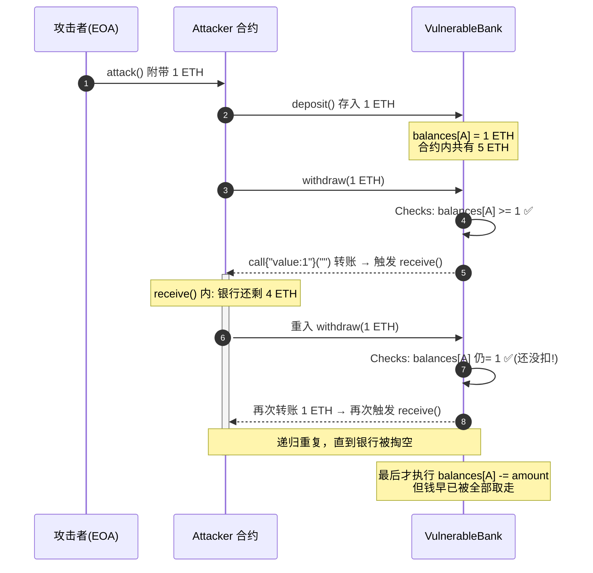

# 01 · 重入攻击（Reentrancy）
> 合约在"更新自己的状态之前"就调用了外部地址，攻击者利用回调递归重入，把资金反复提走。这是智能合约史上最著名、损失最惨重的漏洞（The DAO，2016）。

> ⚠️ 本模块的 `Vulnerable.sol` 与 `Attacker.sol` **仅供学习、请勿用于攻击真实合约**。仅在 Remix VM 本地沙盒复现。

## 📖 知识讲解

### 什么是重入
以太坊里，当合约 A 用 `call` 向地址 B 转账 ETH 时，如果 B 是合约，会自动触发 B 的 `receive()` / `fallback()` 函数。**控制权在这一刻交给了 B。** 如果 A 在转账之后才更新自己的账本，B 就能在回调里"趁账本还没更新"再次调用 A 的提款函数——这就是"重入"。

### 漏洞根因
有漏洞的 `withdraw` 执行顺序是：

1. 检查余额（Checks）✅
2. **转账 ETH（Interaction，触发攻击者回调）** ⚠️
3. 扣减余额（Effects）❌ 太晚

由于第 3 步排在第 2 步后面，攻击者在第 2 步的回调里重入时，看到的仍是**未扣减的旧余额**，检查恒过，于是递归掏空。

### 三种变体（了解）
- **单函数重入**：如本例，重入同一个 `withdraw`。
- **跨函数重入**：重入另一个共享同一状态变量的函数。
- **只读重入（read-only reentrancy）**：在回调中读取一个"尚未更新"的 view 函数（如价格/份额），使依赖它的第三方合约得到错误数据。ReentrancyGuard 默认保护不了只读重入，需额外注意。

## 🔄 攻击时序图

## 💻 代码说明

| 文件 | 作用 | 关键点 |
| --- | --- | --- |
| `Vulnerable.sol` | 有漏洞的银行 | `withdraw` 先转账后扣款，顺序错误 |
| `Secure.sol` | 修复版 | ① Checks-Effects-Interactions 顺序；② `nonReentrant` 互斥锁 |
| `Attacker.sol` | 攻击合约 | `receive()` 中递归重入 `withdraw` |

**两道防线（Secure.sol）**：
1. **Checks-Effects-Interactions**：先扣余额，再转账。重入时余额已为 0，检查失败。
2. **ReentrancyGuard**：`nonReentrant` 修饰器在进入时上锁，重入调用直接 `revert`。生产环境请用 [OpenZeppelin ReentrancyGuard](https://docs.openzeppelin.com/contracts/5.x/api/utils#ReentrancyGuard)。

## ▶️ 运行方式（Remix 复现）

1. 打开 [Remix](https://remix.ethereum.org)，新建 3 个文件，分别粘贴 `Vulnerable.sol`、`Attacker.sol`、`Secure.sol`。
2. 编译（Compiler ≥ 0.8.20）。Environment 选 **Remix VM (Cancun)**。
3. **制造资金池**：部署 `VulnerableBank`。用账户 1/2/3 各调用一次 `deposit()`，在 VALUE 处填 `2` `ether` 存入（让银行里有约 5 ETH）。
4. **部署攻击合约**：切到账户 4，部署 `Attacker`，构造参数填 `VulnerableBank` 的地址。
5. **发起攻击**：调用 `attack()`，VALUE 填 `1` `ether`。
6. 观察：`VulnerableBank.getContractBalance()` 归零；`Attacker.stolenBalance()` ≈ 6 ETH。攻击成功。
7. **验证修复**：对 `SecureBank` 重复上述步骤，`attack()` 会因 `nonReentrant` / 余额已清零而 `revert`，攻击失败。

## ⚠️ 常见坑 / 安全提示
- 只用 `.transfer()`（限 2300 gas）**不是**可靠防御：EIP-1884 后 gas 成本变化，`transfer` 可能误伤正常合约钱包，社区已不推荐用它来"防重入"。正确姿势是 **CEI 顺序 + ReentrancyGuard + `call`**。
- `nonReentrant` **防不了只读重入**，涉及价格/份额的 view 也要小心。
- 跨合约调用（尤其 ERC777、带 hook 的代币、外部预言机）都可能成为重入入口。
- 本模块漏洞合约 **仅供学习，请勿用于攻击真实合约**。

## 🔗 官方文档
- Solidity 安全考量（重入）：https://docs.soliditylang.org/zh/latest/security-considerations.html#reentrancy
- SWC-107 Reentrancy：https://swcregistry.io/docs/SWC-107
- OpenZeppelin ReentrancyGuard：https://docs.openzeppelin.com/contracts/5.x/api/utils#ReentrancyGuard
- Consensys Best Practices – Reentrancy：https://consensysdiligence.github.io/smart-contract-best-practices/attacks/reentrancy/
