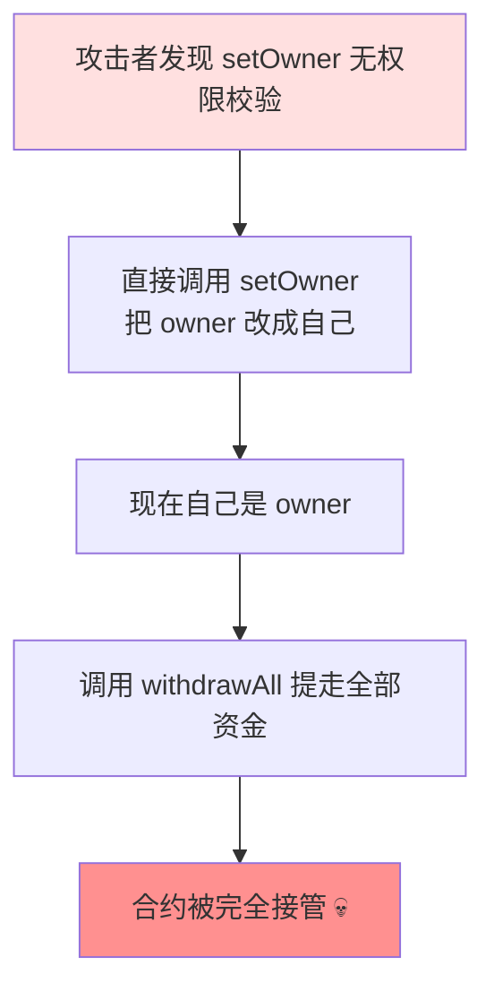

# 02 · 访问控制失效（Access Control / Missing onlyOwner）
> 关键函数（改所有权、提资金、升级、初始化）忘了做权限校验，任何人都能调用并接管合约。这是被审计报告标记次数最多的漏洞类别之一。

> ⚠️ `Vulnerable.sol` **仅供学习、请勿用于攻击真实合约**。

## 📖 知识讲解

访问控制 = "谁能调用这个函数"。写合约时最容易犯的错误就是**默认可见性太宽 + 忘加权限判断**：

- **缺失 `onlyOwner`**：管理型函数（提现、暂停、铸币）没有身份校验。
- **初始化函数可重入**：`initialize()` 没有"只跑一次"的保护，攻击者重新调用把 owner 改成自己。Parity 多签钱包 2017 年就因此被冻结 51 万 ETH。
- **权限转移一步到位**：`transferOwnership` 直接改 owner，若填错地址（如打错的地址、无私钥地址），所有权永久丢失。
- **用 `tx.origin` 判身份**：见模块 04。

**分级授权**：简单合约用单一 `owner`（OpenZeppelin `Ownable`）；复杂系统用**基于角色**的 `AccessControl`（如 `MINTER_ROLE`、`PAUSER_ROLE`），做到最小权限。

## 🔄 攻击流程图

## 💻 代码说明

| 漏洞点 (`Vulnerable.sol`) | 后果 | 修复 (`Secure.sol`) |
| --- | --- | --- |
| `setOwner` 无校验 | 任何人夺取所有权 | `transferOwnership` 加 `onlyOwner` |
| `withdrawAll` 无校验 | 任何人提走资金 | 加 `onlyOwner` |
| `initialize` 可重复调用 | 反复夺权 | `initialized` 标志，只初始化一次 |
| 一步转移所有权 | 转错即永久丢失 | 两步法（提名 + `acceptOwnership`） |

## ▶️ 运行方式（Remix 复现）

1. Remix 部署 `VulnerableVault`（账户 1），并向其转入一点 ETH（在合约地址的 receive）。
2. **切换到账户 2**（模拟攻击者），调用 `setOwner`，参数填账户 2 地址。
3. 读取 `owner()`：已变成账户 2。再调用 `withdrawAll()`，资金进了账户 2。攻击成功。
4. **验证修复**：部署 `SecureVault`，用账户 2 调用 `withdrawAll()` / `transferOwnership()`，均因 `onlyOwner` 而 `revert`。

## ⚠️ 常见坑 / 安全提示
- **每个改状态的敏感函数都要问一句"谁能调用"**，宁可显式写 `onlyOwner` 也别依赖默认。
- 生产环境用 [OpenZeppelin `Ownable2Step`](https://docs.openzeppelin.com/contracts/5.x/api/access#Ownable2Step) 或 `AccessControl`，别自己造轮子。
- 代理/可升级合约里，`initialize` 必须用 `initializer` 修饰器（OpenZeppelin `Initializable`）。
- `constructor` 不能用于代理实现合约的初始化（代理不会执行实现的构造函数）。
- 别把 owner 设成不可控地址；考虑用多签（Gnosis Safe）或 Timelock 做管理员。

## 🔗 官方文档
- OpenZeppelin Access Control：https://docs.openzeppelin.com/contracts/5.x/access-control
- SWC-105 Unprotected Ether Withdrawal：https://swcregistry.io/docs/SWC-105
- SWC-118 Incorrect Constructor / Initialization：https://swcregistry.io/docs/SWC-118
- Solidity 可见性与修饰器：https://docs.soliditylang.org/zh/latest/contracts.html#function-modifiers
