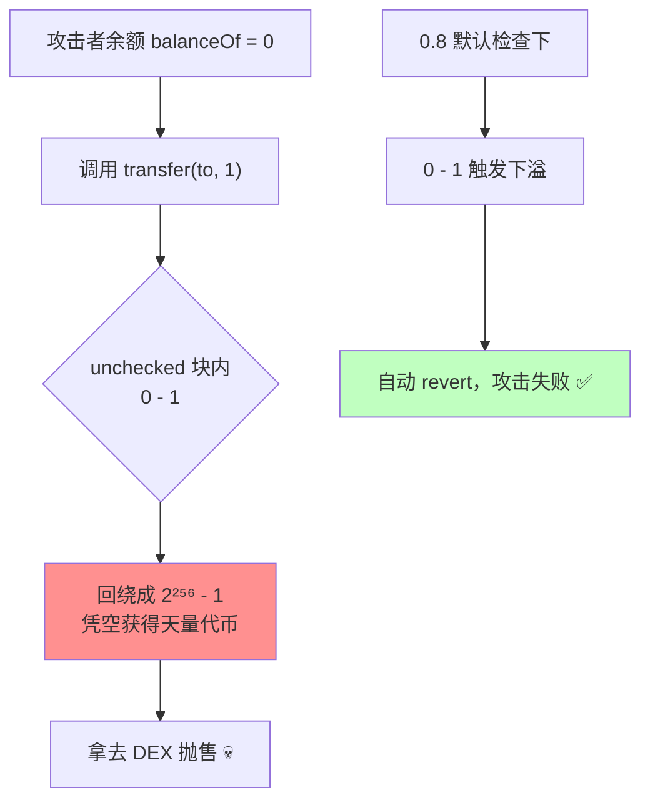

# 03 · 整数溢出 / 下溢与 unchecked 风险（Integer Overflow / Underflow）
> 无符号整数运算超出取值范围会"回绕"（255+1=0，0-1=2²⁵⁶-1）。0.8 之前这是默认行为，酿成多起无限增发盗币事件；0.8 之后默认自动检查，但 `unchecked` 块会重新打开这扇门。

> ⚠️ `Vulnerable.sol` **仅供学习、请勿用于攻击真实合约**。

## 📖 知识讲解

### 溢出与下溢
- **上溢 Overflow**：`uint8` 最大 255，`255 + 1` 回绕成 `0`。
- **下溢 Underflow**：`uint` 最小 0，`0 - 1` 回绕成 `2²⁵⁶ - 1`（约 1.15×10⁷⁷）。

### 历史分水岭：Solidity 0.8.0
| 版本 | 默认算术行为 |
| --- | --- |
| < 0.8.0（0.6 / 0.7） | **不检查**，溢出静默回绕 → 必须手动用 **SafeMath** |
| ≥ 0.8.0 | **默认检查**，溢出/下溢自动 `revert`（无需 SafeMath） |

### `unchecked` 的双刃剑
0.8 之后仍可写 `unchecked { ... }` 关闭检查以**节省 gas**。它在两种情况下危险：
1. 用在有资金语义的加减法上（余额、总供应量）。
2. 用在乘法上（`batchOverflow` 事件：2018 年 BEC / SMT 等代币因 `amount * count` 乘法溢出被无限增发，交易所一度暂停充提）。

**只有能数学证明不会溢出时**（如 `for` 循环的 `++i`）才该用 `unchecked`。

## 🔄 下溢盗币原理图

## 💻 代码说明
- `Vulnerable.sol`：用 `unchecked` 块**模拟** 0.8 之前的行为，演示 `transfer` 下溢、`increment` 上溢、`batchTransfer` 乘法溢出绕过 `require`。
- `Secure.sol`：去掉多余 `unchecked` + 补齐业务 `require`；并演示"安全使用 `unchecked` 于循环计数器"的正确姿势。

## ▶️ 运行方式（Remix 复现）

1. 部署 `VulnerableToken`（部署者初始余额 100）。
2. **切换到一个余额为 0 的账户**，调用 `transfer(自己地址, 1)`。读取该账户 `balanceOf`：变成一个巨大的天文数字 —— 下溢成功。
3. 调用 `increment(255)` 再 `increment(1)`，读 `counter()`：从 255 回绕成 0 —— 上溢。
4. **验证修复**：部署 `SecureToken`，对余额为 0 的账户调用 `transfer`，交易直接 `revert`（下溢被拦）。

## ⚠️ 常见坑 / 安全提示
- 用 **≥ 0.8.x** 就自带溢出保护，绝大多数场景**不需要** SafeMath。
- 谨慎使用 `unchecked`：只在"证明安全"且真需要省 gas 时用，且写清注释。
- 类型转换（`uint256` → `uint8`）会**截断**高位，不触发溢出检查，是隐蔽的 bug 来源。
- 除法向下取整、先乘后除避免精度丢失。
- 定点/百分比计算注意 `a * b / c` 的顺序。

## 🔗 官方文档
- Solidity 0.8 溢出检查（Checked/Unchecked 算术）：https://docs.soliditylang.org/zh/latest/control-structures.html#checked-or-unchecked-arithmetic
- SWC-101 Integer Overflow and Underflow：https://swcregistry.io/docs/SWC-101
- OpenZeppelin SafeMath（老版本用）：https://docs.openzeppelin.com/contracts/5.x/api/utils#SafeMath
