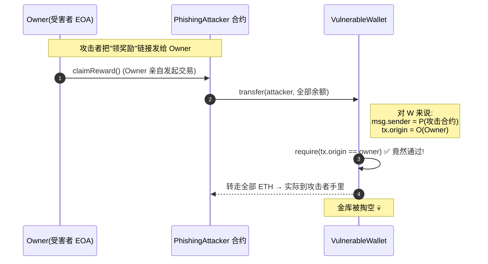

# 04 · tx.origin 钓鱼（tx.origin Phishing）
> 用 `tx.origin` 做身份校验，会被"中间人合约"钓鱼绕过。永远用 `msg.sender` 做授权。

> ⚠️ `Vulnerable.sol` / `Attacker.sol` **仅供学习、请勿用于攻击真实合约**。

## 📖 知识讲解

### tx.origin vs msg.sender

```
EOA(Alice) ──调用──▶ 合约A ──调用──▶ 合约B
```
在合约 B 的视角：
- `tx.origin` = **Alice**（整条交易最初的外部账户，永远是 EOA，调用链多深都不变）。
- `msg.sender` = **合约A**（当前这次调用的直接调用者）。

### 为什么用 tx.origin 校验会被钓鱼
攻击者部署一个看起来无害的合约（例如"领空投 `claimReward`"），把链接发给受害者 owner。owner 一旦点击调用：
- 对攻击合约：`msg.sender = owner`。
- 攻击合约内部再调用受害金库的 `transfer`，对金库而言：`msg.sender = 攻击合约`，但 `tx.origin` 仍 `= owner`。
- 金库里 `require(tx.origin == owner)` 竟然通过，资金被转走。

**结论**：`tx.origin` 只能回答"这笔交易最初是谁签的"，回答不了"谁在直接调用我"。授权必须用 `msg.sender`。

## 🔄 钓鱼时序图



## 💻 代码说明
- `Vulnerable.sol`：`transfer` 用 `require(tx.origin == owner)`。
- `Attacker.sol`：`claimReward()` 在内部调用金库 `transfer`，把钱转给攻击者。
- `Secure.sol`：`onlyOwner` 改用 `require(msg.sender == owner)`，攻击合约作为中间人时 `msg.sender` 是合约地址，检查失败。

## ▶️ 运行方式（Remix 复现）

1. 用**账户1（owner）**部署 `VulnerableWallet`，并向其转入一些 ETH。
2. 用**账户2（攻击者）**部署 `PhishingAttacker`，构造参数填金库地址。
3. **模拟受害**：切回**账户1（owner）**，调用 `PhishingAttacker.claimReward()`。
4. 观察：金库余额清零，ETH 到了账户2（攻击者）。钓鱼成功。
5. **验证修复**：换成 `SecureWallet` 重做，`claimReward()` 会因 `msg.sender` 是攻击合约而 `revert`。

## ⚠️ 常见坑 / 安全提示
- **授权一律用 `msg.sender`，永不用 `tx.origin`**（Vitalik 早年就明确建议）。
- `tx.origin` 唯一相对合理的用途是"禁止合约调用（要求调用者是 EOA）"，但账户抽象（EIP-4337）普及后连这个用法也不再可靠。
- 提醒用户：不要随便对不明合约签署交易，钓鱼常伪装成"领空投 / 领奖励 / 授权"。

## 🔗 官方文档
- Solidity 安全考量 – tx.origin：https://docs.soliditylang.org/zh/latest/security-considerations.html#tx-origin
- SWC-115 Authorization through tx.origin：https://swcregistry.io/docs/SWC-115
- Consensys – tx.origin Phishing：https://consensysdiligence.github.io/smart-contract-best-practices/attacks/#tx-origin
