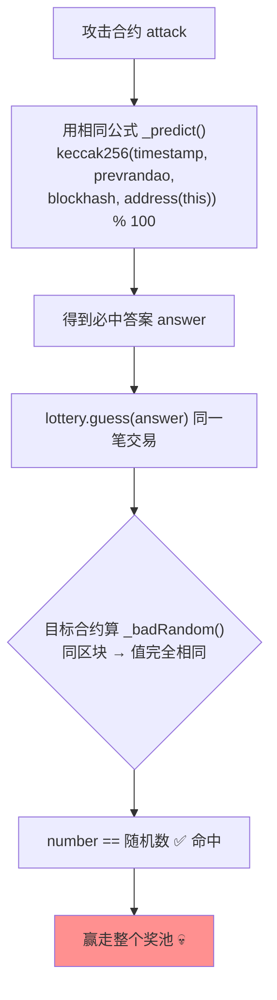

# 05 · 不安全的链上随机数（Insecure Randomness）
> 用 `block.timestamp`、`block.prevrandao`、`blockhash` 等链上公开变量生成"随机数"，会被同区块内的攻击者用同样的公式提前算出，从而稳赢彩池/抽奖/NFT 抽卡。

> ⚠️ `Vulnerable.sol` / `Attacker.sol` **仅供学习、请勿用于攻击真实合约**。

## 📖 知识讲解

### 为什么链上算不出真随机
以太坊是**确定性**系统：同样的输入必然产生同样的输出，否则所有节点无法就状态达成共识。因此合约里能拿到的一切"随机源"其实都是**公开且可复现**的：

| "随机源" | 为什么不安全 |
| --- | --- |
| `block.timestamp` | 矿工/验证者可在一定范围内操纵；对同区块交易是已知值 |
| `block.prevrandao`（原 `difficulty`） | 同一区块内对所有交易是**同一个已知值**，可被读取复现 |
| `blockhash(n)` | 历史区块哈希公开可查；`blockhash(当前块)` 返回 0 |
| `msg.sender` / `nonce` | 攻击者自己完全掌握 |

**攻击方式**：攻击者部署一个合约，在**同一笔交易**里用与目标**完全相同的公式**先把"随机数"算出来，只有当结果对自己有利时才下注 —— 100% 命中。

## 🔄 预测攻击流程图

## 💻 代码说明
- `Vulnerable.sol`：`_badRandom()` 用一堆 block 变量取模生成"随机数"，`guess` 猜中即赢奖池。
- `Attacker.sol`：`_predict()` 复刻同一公式（`msg.sender` 用 `address(this)`，因为下注者是攻击合约），一笔交易内算出答案再下注。
- `Secure.sol`：两条正路 ——
  - **Chainlink VRF**（生产首选，链下生成 + 链上验证密码学证明，接口示意）。
  - **Commit-Reveal**（先提交 `hash(secret,salt)`，若干区块后揭示，用未来区块哈希混合，提交时无人可预测）。

## ▶️ 运行方式（Remix 复现）

1. 部署 `VulnerableLottery` 时在 VALUE 填 `1 ether` 注入奖池。
2. 部署 `RandomnessAttacker`，构造参数填奖池地址。
3. 调用 `RandomnessAttacker.attack()`，VALUE 填 `0.01 ether`。
4. 观察：奖池被转入攻击合约；调用 `withdraw()` 取走。稳赢演示成功。
5. 对照 `Secure.sol` 的 Commit-Reveal：`commit` 时提交 `keccak256(abi.encodePacked(secret, salt))`，等 5 个区块后再 `reveal(secret, salt)`，说明下注时无法预测结果。

## ⚠️ 常见坑 / 安全提示
- **绝不要**用任何 block 变量单独或组合生成有经济价值的随机数（抽奖、NFT 稀有度、开箱）。
- **生产环境用 Chainlink VRF**（可验证随机函数）。
- 自建 Commit-Reveal 要防"揭示阶段拒绝揭示"的问题（用押金/惩罚机制），并注意 `blockhash` 只能取最近 256 个区块。
- 链下签名随机数需防重放；预言机方案要评估其去中心化与成本。

## 🔗 官方文档
- Chainlink VRF：https://docs.chain.link/vrf
- SWC-120 Weak Sources of Randomness from Chain Attributes：https://swcregistry.io/docs/SWC-120
- Solidity 区块与交易属性：https://docs.soliditylang.org/zh/latest/units-and-global-variables.html#block-and-transaction-properties
- Consensys – Bad Randomness：https://consensysdiligence.github.io/smart-contract-best-practices/attacks/#bad-randomness
