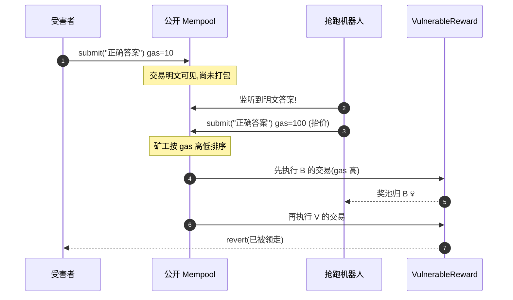

# 06 · 抢跑 / 抢先交易（Front-Running & MEV）
> 交易在被打包前会先进入公开的内存池（mempool）。攻击者盯着 mempool，复制别人的盈利交易并抬高 gas 费抢先执行，把利润据为己有。commit-reveal + 滑点保护是主要防御。

> ⚠️ `Vulnerable.sol` **仅供学习、请勿用于攻击真实合约**。

## 📖 知识讲解

### 交易是怎么被抢跑的
1. 你发出的交易先进入**公开 mempool**，等待矿工/验证者打包。
2. 打包顺序主要由 **gas 出价**决定（价高者先上）。
3. 攻击机器人监听 mempool，发现一笔"照抄就能赚"的交易，就用**更高 gas** 发一笔一样的，抢先被打包。

### MEV（Maximal Extractable Value）常见形态
| 形态 | 说明 |
| --- | --- |
| **抢跑 Front-run** | 复制别人的盈利交易，抢在其之前执行 |
| **夹子 Sandwich** | 在受害者 DEX 兑换的前后各插一笔，人为制造滑点吃差价 |
| **尾随 Back-run** | 紧跟某交易之后套利（如清算、套利机会） |

### 防御手段
- **Commit-Reveal（提交-揭示）**：先只提交答案的哈希（且绑定 `msg.sender`），过一段时间再揭示明文。抢跑者从 mempool 只能看到哈希，抄不到内容，抄了哈希也因 `msg.sender` 不符而无效。
- **滑点保护**：DEX 兑换设 `minAmountOut` 和 `deadline`，即便被夹，也不会成交到坏于底线的价格。
- **私有交易通道**：如 Flashbots Protect / MEV-Boost 私有内存池，交易不进公开 mempool。
- **批量拍卖 / 频繁批量结算**：让同一批交易统一价格，消除排序优势。

## 🔄 抢跑时序图

## 💻 代码说明
- `Vulnerable.sol`：`submit(answer)` 用**明文**提交答案，先到先得 → mempool 里被抄袭抢跑。
- `Secure.sol`：两步 `commit` / `reveal`，承诺哈希绑定 `msg.sender` + `salt`；附 `computeCommit` 便于链下计算承诺。

## ▶️ 运行方式（Remix 复现）

> Remix VM 是单人本地环境，无法真实模拟 mempool 竞争。这里用"角色扮演"说明流程。

1. 链下算好谜底哈希：`keccak256(abi.encodePacked("hello"))`（可用 Remix 的 `computeCommit` 思路或在线工具），部署 `VulnerableReward`，构造参数填该哈希，VALUE 注入奖池。
2. 直观理解：任何账户调用 `submit("hello")` 都能领奖 —— 想象若在公链上，你的 `"hello"` 会先暴露在 mempool，被机器人抢先。
3. **验证修复**：部署 `SecureReward`。用 `computeCommit("hello", 你的地址, 某 salt)` 得到承诺哈希，调用 `commit(哈希)`；等 3 个区块（Remix 里可多发几笔交易推进区块）后 `reveal("hello", salt)` 领奖。用别人地址抄袭该承诺会因 `msg.sender` 不符而 `revert`。

## ⚠️ 常见坑 / 安全提示
- **任何"明文提交即可获利"的设计都可能被抢跑**：拍卖出价、答案提交、抢注域名、清算等。
- DEX / AMM 交互务必带 `minAmountOut`（滑点）和 `deadline`。
- Commit-Reveal 要绑定 `msg.sender` 和随机 `salt`，否则承诺本身会被复制。
- 揭示阶段要设计激励，防止"故意不揭示"。
- 抢跑无法被合约 100% 根除（这是排序层问题），需组合链上设计 + 私有通道。

## 🔗 官方文档
- SWC-114 Transaction Order Dependence：https://swcregistry.io/docs/SWC-114
- Consensys – Front-Running：https://consensysdiligence.github.io/smart-contract-best-practices/attacks/#frontrunning
- ethereum.org – MEV：https://ethereum.org/zh/developers/docs/mev/
- Flashbots 文档：https://docs.flashbots.net/
