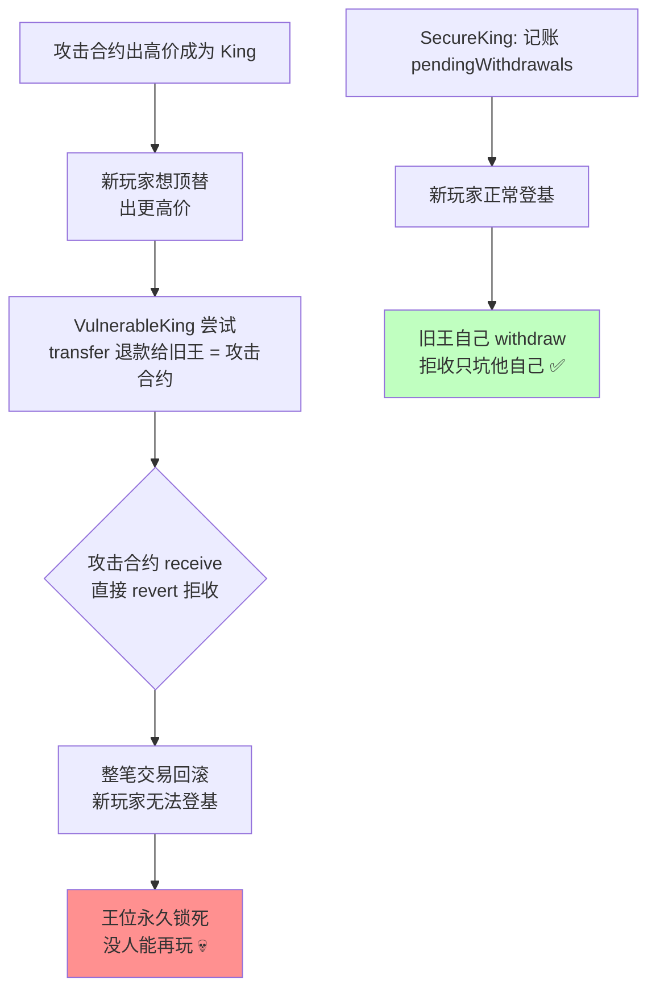

# 07 · 拒绝服务（Denial of Service, DoS）
> 合约主动"推送"资金给别人（push payment），或在一笔交易里遍历可无限增长的数组。一个恶意参与者拒收、或数组撑爆区块 gas 上限，就能让关键功能对所有人永久失效、资金锁死。

> ⚠️ `Vulnerable.sol` / `Attacker.sol` **仅供学习、请勿用于攻击真实合约**。

## 📖 知识讲解

### 两类经典 DoS

**A. revert 型 DoS（依赖外部调用成功）**
合约在一笔交易里主动把 ETH `transfer` 给某个地址。如果该地址是"拒收"的恶意合约（`receive` 里 `revert`），这笔转账失败会导致**整个交易回滚**。若这个转账是流程的必经步骤（如 King of the Hill 退款给旧王），则**没有人能推进流程**。

**B. 无界循环 / gas 耗尽型 DoS**
遍历一个**可被外部无限灌入元素**的数组做转账或计算。当元素多到循环消耗超过**区块 gas 上限**（约 3000 万），函数**永远无法执行成功**，资金/状态被锁死。

### 防御核心：Pull over Push
> **不要主动把钱推给别人，而是记账，让每个人自己来取（withdraw / claim）。**

这样"某人拒收"或"某人 gas 用尽"只影响**他自己**，不会连累全局。配套手段：
- **分页处理**大数组（每次只处理一段）。
- **Circuit Breaker（熔断/暂停）**：出问题时可暂停危险功能。
- 限制单次操作规模，避免无界循环。

## 🔄 revert 型 DoS 流程图

## 💻 代码说明
| 合约 | 类型 | 问题 / 修复 |
| --- | --- | --- |
| `VulnerableKing` | revert 型 | `transfer` 退款给旧王，旧王拒收即卡死 |
| `KingDoSAttacker` | 攻击 | `receive()` 里 `revert`，永占王位 |
| `VulnerableDistributor` | 循环型 | `distribute` 遍历无界数组转账 |
| `SecureKing` | 修复 | Pull Payment：记账 `pendingWithdrawals`，各自 `withdraw` |
| `SecureDistributor` | 修复 | 只记账 `shares`，用户各自 `claim` |

## ▶️ 运行方式（Remix 复现）

**revert 型：**
1. 部署 `VulnerableKing`。
2. 用普通账户向其转 `1 ether`（成为 king），再用另一账户转 `2 ether`（正常顶替，退款给上一位）。一切正常。
3. 部署 `KingDoSAttacker`（构造参数填 King 游戏地址），调用 `seizeThrone()` 出价 `3 ether` 夺位。
4. 现在任何账户想再出更高价顶替，都会 `revert`（退款给攻击合约失败）—— 王位锁死。
5. **验证修复**：换 `SecureKing`，攻击合约拒收也无妨，新王照样登基，旧王自己 `withdraw` 取不到只坑自己。

**循环型：**
1. 部署 `VulnerableDistributor`，多次 `join()`（想象攻击者脚本灌入上万地址）。
2. 说明：`distribute()` 遍历数组，当参与者极多时 gas 超过区块上限，永远失败。
3. `SecureDistributor` 改为记账 + 各自 `claim()`，O(1) 领取，无 DoS。

## ⚠️ 常见坑 / 安全提示
- **Pull over Push**：退款、分红、奖励一律让用户主动领取。
- 不要 `for` 循环遍历"外部可无限增长"的数组做转账/重计算。
- 关键路径不要强依赖某个外部调用必须成功。
- 用 OpenZeppelin `PullPayment` / `Pausable`（熔断）辅助。
- 注意：`selfdestruct` 强制打款、`this.balance` 判断（见模块 09 提示）也可能被用来构造 DoS。

## 🔗 官方文档
- Solidity 安全考量 – 优先 pull 而非 push：https://docs.soliditylang.org/zh/latest/security-considerations.html
- SWC-113 DoS with Failed Call：https://swcregistry.io/docs/SWC-113
- SWC-128 DoS With Block Gas Limit：https://swcregistry.io/docs/SWC-128
- Consensys – Denial of Service：https://consensysdiligence.github.io/smart-contract-best-practices/attacks/denial-of-service/
