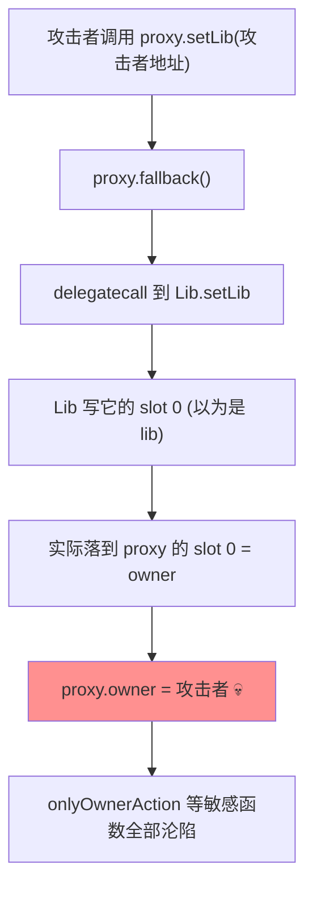

# 08 · delegatecall 存储冲突与代理风险（Delegatecall Storage Collision）
> `delegatecall` = "借用别人的代码，改自己的存储"。存储按**槽位序号**对齐而非变量名，一旦代理与逻辑合约的存储布局不一致，逻辑合约的写入会覆盖代理的关键变量（如 owner）。Parity 多签冻结 51 万 ETH 即源于此。

> ⚠️ `Vulnerable.sol` / `Attacker.sol` **仅供学习、请勿用于攻击真实合约**。

## 📖 知识讲解

### delegatecall 的语义
`A.delegatecall(B)`：
- 执行 **B 的代码**；
- 但读写的是 **A 的存储**；
- `msg.sender` / `msg.value` 保持为 **A 的上下文**。

一句话："用别人的逻辑，改自己的家。" 这正是**可升级代理**的基础：Proxy 存数据，Logic 存代码，Proxy 用 `delegatecall` 把调用转发给 Logic。

### 为什么会存储冲突
EVM 存储是一排编号的槽位（slot 0, 1, 2 …）。变量放在第几槽，取决于**声明顺序**，与变量名无关。

```
VulnerableProxy:      slot 0 = owner       slot 1 = libAddress
Lib:                  slot 0 = lib
```

当通过代理 `delegatecall` 到 `Lib.setLib(x)`，`Lib` 写它的 "slot 0"（它以为是 `lib`），实际落到**代理的 slot 0 = `owner`**。于是攻击者一句 `setLib(攻击者地址)` 就把代理的 `owner` 改成了自己。

### 修复思路
- **存储布局严格对齐**：代理与逻辑合约的变量顺序、类型必须完全一致（继承同一存储基类）。
- **非结构化存储 / EIP-1967**：把 `owner`、`implementation` 存到 `keccak256(...) - 1` 得到的**固定伪随机槽**，远离逻辑合约的普通变量槽（0,1,2…），从根本上不可能相撞。
- **直接用 OpenZeppelin** 的透明代理（Transparent Proxy）或 UUPS，别手写代理。

## 🔄 存储冲突攻击流程图



## 💻 代码说明
- `Vulnerable.sol`：`Lib.lib`（slot 0）与 `VulnerableProxy.owner`（slot 0）撞槽；通过 fallback delegatecall 覆盖 owner。
- `Attacker.sol`：`attack(proxy, newOwner)` 借代理触发 `setLib`，改写 owner。
- `Secure.sol`：`SecureProxy` 用 **EIP-1967 固定槽**存 admin/impl，配 `LogicV1` 演示逻辑变量永不撞关键槽。

## ▶️ 运行方式（Remix 复现）

1. 部署 `Lib`。部署 `VulnerableProxy`，构造参数填 `Lib` 地址。读 `owner()` = 部署者。
2. 部署 `ProxyStorageAttacker`。用**攻击者账户**调用 `attack(proxy地址, 攻击者地址)`。
3. 重新读代理的 `owner()`：已变成攻击者地址 —— 存储冲突夺权成功。（在 Remix 里可用代理地址、以 `Vulnerable` 的 ABI "At Address" 方式读取 `owner`。）
4. **验证修复**：部署 `LogicV1`，再部署 `SecureProxy(LogicV1地址)`。通过代理调用 `setValue` 修改逻辑变量，`admin()` 始终不变（存在固定伪随机槽，逻辑写入撞不到）。

## ⚠️ 常见坑 / 安全提示
- 升级逻辑合约时，**只能在存储末尾追加变量**，绝不能插入/重排/删除已有变量，否则新旧布局错位。
- `delegatecall` 到**不可信合约**极其危险（等于把自己的存储和余额交给对方），务必只 delegatecall 自己审计过的实现。
- `delegatecall` 的目标若是 `selfdestruct`，可摧毁代理（历史 Parity library 事件）。
- 生产用 [OpenZeppelin Upgradeable / UUPS](https://docs.openzeppelin.com/contracts/5.x/api/proxy) + `@openzeppelin/upgrades` 插件自动检查存储布局。

## 🔗 官方文档
- Solidity – delegatecall / 库调用：https://docs.soliditylang.org/zh/latest/introduction-to-smart-contracts.html#delegatecall-and-libraries
- EIP-1967 代理存储槽标准：https://eips.ethereum.org/EIPS/eip-1967
- SWC-112 Delegatecall to Untrusted Callee：https://swcregistry.io/docs/SWC-112
- OpenZeppelin Proxy Upgrade Pattern：https://docs.openzeppelin.com/upgrades-plugins/proxies
