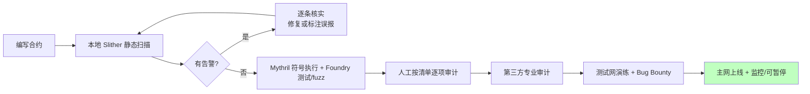

# 10 · 审计工具与审计清单（Audit Tools & Checklist）
> 漏洞不能只靠肉眼。用 Slither（静态分析）、Mythril（符号执行）等工具自动扫描，再配合人工审计清单逐项核对，才能系统性地发现问题。本模块提供一个"埋了多个漏洞的靶场合约"供你练手。

> ⚠️ `PracticeContract.sol` **故意含多个漏洞，仅供学习、请勿用于攻击真实合约**。

## 📖 知识讲解

### 安全防线是分层的
```
写代码时:  遵循最佳实践 + 用 OpenZeppelin 经审计的库
提交前:    静态分析(Slither) + 符号执行(Mythril) + 单元/模糊测试(Foundry)
上线前:    第三方专业审计 + 测试网充分演练 + 形式化验证(可选)
上线后:    Bug Bounty + 监控 + 应急暂停(Pausable) + Timelock
```

### 主流工具对比
| 工具 | 类型 | 特点 | 安装 |
| --- | --- | --- | --- |
| **Slither** | 静态分析 | 快、误报少、检测器全，CI 首选 | `pip install slither-analyzer` |
| **Mythril** | 符号执行 | 深入路径探索，能找复杂逻辑漏洞，较慢 | `pip install mythril` |
| **Echidna** | 属性模糊测试 | 基于不变量做 fuzzing | 见官方 |
| **Foundry (`forge`)** | 测试/fuzz/invariant | 主流开发+测试框架，内置模糊测试 | `foundryup` |
| **Aderyn** | 静态分析(Rust) | 新一代、快速，输出 Markdown 报告 | `cyfrinup` |
| **Manticore** | 符号执行 | 深度分析（较重） | `pip install manticore` |

### 常用命令
```bash
# Slither：直接扫单文件（需本地装好 solc / solc-select）
slither PracticeContract.sol

# Slither：扫整个 Hardhat / Foundry 工程
slither .

# 只看高危、打印人类可读摘要
slither . --print human-summary

# Mythril：符号执行分析单个合约
myth analyze PracticeContract.sol

# Foundry 模糊测试
forge test        # 跑测试
forge fmt         # 格式化
```

## 🔄 审计工作流



## ✅ 人工审计清单（Checklist）

**资金安全**
- [ ] 所有提款/转账遵循 Checks-Effects-Interactions，且有 ReentrancyGuard（模块 01）
- [ ] 外部调用返回值都已检查 `require(success)`（模块 09）
- [ ] 优先 Pull Payment，避免 push 支付导致 DoS（模块 07）

**权限与初始化**
- [ ] 每个敏感函数都有正确的访问控制（`onlyOwner`/角色）（模块 02）
- [ ] `initialize` 仅能执行一次（`initializer`）；代理不依赖 constructor
- [ ] 身份校验用 `msg.sender`，绝不用 `tx.origin`（模块 04）
- [ ] 所有权转移用两步法；关键权限考虑多签 + Timelock

**算术与数据**
- [ ] 使用 ≥0.8.x 的溢出检查；`unchecked` 均有证明与注释（模块 03）
- [ ] 除法精度、先乘后除、类型截断已审查

**随机与排序**
- [ ] 随机数用 Chainlink VRF 或 commit-reveal，未用 block 变量（模块 05）
- [ ] 抢跑/MEV 风险已评估（commit-reveal / 滑点保护）（模块 06）

**代理与外部依赖**
- [ ] 代理与逻辑存储布局一致 / 用 EIP-1967 + OZ 升级插件（模块 08）
- [ ] `delegatecall` 目标可信；升级只追加存储变量
- [ ] 预言机取价防操纵（用 TWAP / Chainlink，避免现货价）

**工程与运维**
- [ ] 无硬编码私钥/密钥（`.env` + gitignore）
- [ ] 事件（event）覆盖关键状态变更，便于监控
- [ ] 具备紧急暂停（Pausable）与升级/回滚预案
- [ ] Slither / Mythril 无未处理的高危告警
- [ ] 单元测试 + 模糊测试覆盖核心路径，已第三方审计

## ▶️ 运行方式（工具复现）

**准备环境**
```bash
python3 -m venv venv && source venv/bin/activate
pip install slither-analyzer mythril
pip install solc-select && solc-select install 0.8.20 && solc-select use 0.8.20
```

**扫描靶场合约**
```bash
cd 10-audit-tools
slither PracticeContract.sol           # 应报出 reentrancy / tx-origin / 弱随机 / 未检查返回值 等
myth analyze PracticeContract.sol      # 符号执行进一步验证
```

**练习目标**：对照 `PracticeContract.sol` 顶部注释里"故意埋下的 6 个问题"，看工具命中了哪几个、漏了哪几个（工具无法覆盖所有业务逻辑漏洞，这正说明人工审计不可或缺）。修好后重扫，告警应消失。

> 若不想本地装环境，也可把合约贴进 [Remix](https://remix.ethereum.org)，安装官方 **Solidity Static Analysis** 插件做基础静态检查。

## ⚠️ 常见坑 / 安全提示
- **工具不是万能**：静态分析长于模式化漏洞（重入、tx.origin），但**业务逻辑漏洞、经济模型漏洞**仍需人工 + 审计。
- 误报要人工确认，别盲目"消警"；漏报要靠测试和审计补齐。
- 上线前务必**第三方专业审计** + **测试网演练** + **Bug Bounty**。
- 合约默认标注"教学用途，未经审计，勿直接上主网"。

## 🔗 官方文档
- Slither：https://github.com/crytic/slither
- Mythril：https://github.com/Consensys/mythril
- Echidna：https://github.com/crytic/echidna
- Foundry Book：https://book.getfoundry.sh/
- SWC Registry（漏洞分类总表）：https://swcregistry.io/
- Consensys Smart Contract Best Practices：https://consensysdiligence.github.io/smart-contract-best-practices/
- Solidity 安全考量：https://docs.soliditylang.org/zh/latest/security-considerations.html
