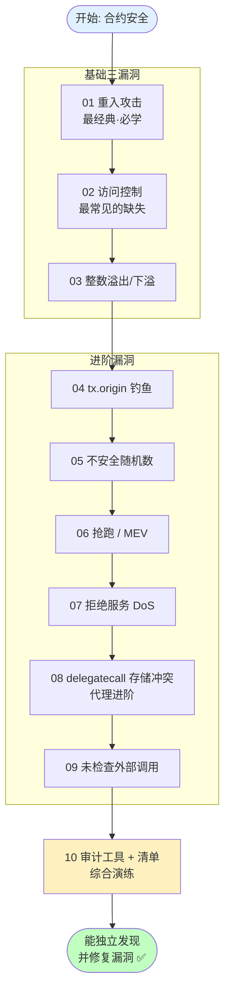

# 04 · 智能合约安全与经典漏洞（Smart Contract Security）

> 本工程系统讲解智能合约的十大经典漏洞：**每个漏洞都给出一对合约**——`Vulnerable.sol`（有漏洞版，注释标出漏洞点）与 `Secure.sol`（修复版），部分配 `Attacker.sol` 攻击合约。每个模块都有攻击流程图、原理讲解、Remix 复现步骤与官方链接。

> ⚠️ **重要声明**：本工程所有"漏洞合约 / 攻击合约"**仅供学习理解与防御，请勿用于攻击任何真实合约**。所有示例**未经审计，仅在 Remix VM 本地沙盒 / 测试网演示，切勿部署到主网或用于真实资产**。

## 🎯 安全总览

智能合约"代码即法律"、部署后难以更改、且直接掌管资金，因此**任何漏洞都可能造成不可逆的巨额损失**。历史上的惨痛教训：

| 事件 | 年份 | 漏洞类型 | 损失 |
| --- | --- | --- | --- |
| The DAO | 2016 | 重入（模块 01） | ~360 万 ETH，直接导致 ETH/ETC 分叉 |
| Parity 多签冻结 | 2017 | 访问控制 + delegatecall（模块 02/08） | ~51 万 ETH 永久冻结 |
| batchOverflow / 代币无限增发 | 2018 | 整数溢出（模块 03） | 多个代币归零，交易所暂停充提 |

安全的核心思想（Consensys "为失败做准备"）：**分层防御** + **最小权限** + **Pull over Push** + **先更新状态再交互** + **工具 + 人工双重审计**。

## 📚 模块索引表

| 模块 | 漏洞 | 核心成因 | 主要防御 | 配套文件 |
| --- | --- | --- | --- | --- |
| [01](./01-reentrancy) | 重入攻击 Reentrancy | 先转账后改状态，回调重入 | CEI 顺序 + ReentrancyGuard | Vulnerable / Secure / **Attacker** |
| [02](./02-access-control) | 访问控制失效 | 缺 `onlyOwner`、可重复初始化 | 权限修饰器 + 两步转移 + 一次性初始化 | Vulnerable / Secure |
| [03](./03-integer-issues) | 整数溢出/下溢 | 0.8 前无检查 / 滥用 `unchecked` | ≥0.8 默认检查 + 慎用 unchecked | Vulnerable / Secure |
| [04](./04-tx-origin-phishing) | tx.origin 钓鱼 | 用 `tx.origin` 鉴权被中间人绕过 | 改用 `msg.sender` | Vulnerable / Secure / **Attacker** |
| [05](./05-unsafe-randomness) | 不安全随机数 | block 变量可被同区块预测 | Chainlink VRF / commit-reveal | Vulnerable / Secure / **Attacker** |
| [06](./06-front-running) | 抢跑 / MEV | mempool 明文被抢先打包 | commit-reveal + 滑点保护 | Vulnerable / Secure |
| [07](./07-denial-of-service) | 拒绝服务 DoS | push 支付被拒 / 无界循环 | Pull Payment + 分页 + 熔断 | Vulnerable / Secure / **Attacker** |
| [08](./08-delegatecall-storage) | delegatecall 存储冲突 | 代理与逻辑存储布局不一致 | 布局对齐 / EIP-1967 + OZ 代理 | Vulnerable / Secure / **Attacker** |
| [09](./09-unchecked-external-call) | 未检查外部调用 | `call`/`send` 失败返 false 被忽略 | `require(success)` + SafeERC20 | Vulnerable / Secure |
| [10](./10-audit-tools) | 审计工具与清单 | 漏洞需系统化排查 | Slither/Mythril + 审计清单 | PracticeContract + 清单 |

## 🗺️ 学习路线图

**建议顺序**：先吃透**基础三漏洞**（01-03，尤其重入），再学**进阶漏洞**（04-09），最后用**模块 10** 的工具与清单做综合实战。每学一个模块，务必亲手在 Remix 里跑通"攻击 → 观察被攻破 → 换成 Secure 版 → 观察防御生效"的完整闭环。

## ▶️ 复现说明（通用）

1. 打开 [Remix IDE](https://remix.ethereum.org)（浏览器免安装）。
2. 按模块新建文件，粘贴对应 `.sol`。**Compiler 选 ≥ 0.8.20**。
3. Deploy 面板 **Environment 选 `Remix VM (Cancun)`**（本地沙盒，不花真钱、可随意演示攻击）。
4. 按各模块 README 的"运行方式"分步操作：先部署 `Vulnerable` + `Attacker` 复现攻击，再部署 `Secure` 验证防御失效。
5. 模块 10 的工具（Slither/Mythril）需本地 Python 环境，见其 README。

## ⚠️ 安全底线（务必遵守）

- **只用测试网（Sepolia 等）+ 水龙头测试币；绝不使用主网真实资产。**
- **绝不在代码/仓库出现真实私钥、助记词、API Key。**
- 所有漏洞/攻击合约**仅供学习理解与防御，请勿用于攻击真实合约**。
- 合约示例**均未经审计，勿直接上主网**；生产环境请用 [OpenZeppelin](https://docs.openzeppelin.com/contracts) 经审计的库并做专业审计。

## 🔗 权威参考

- Solidity 安全考量（中文）：https://docs.soliditylang.org/zh/latest/security-considerations.html
- SWC Registry（智能合约弱点分类）：https://swcregistry.io/
- Consensys Smart Contract Best Practices：https://consensysdiligence.github.io/smart-contract-best-practices/
- OpenZeppelin Contracts 安全库：https://docs.openzeppelin.com/contracts
- ethereum.org 安全专题：https://ethereum.org/zh/developers/docs/smart-contracts/security/
