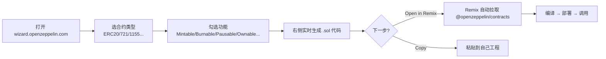

# 01 · OpenZeppelin 简介与 Contracts Wizard（Intro & Wizard）

> OpenZeppelin Contracts 是「久经实战审计」的智能合约标准库；Contracts Wizard 是它的在线可视化生成器，勾几个选项就能生成安全的合约骨架。

## 📖 知识讲解

### OpenZeppelin 是什么

写智能合约就像写房子：ERC20 代币、NFT、权限管理、防重入……这些「地基」全世界都在重复造。OpenZeppelin（简称 OZ）把这些地基做成了**经过大量审计、被无数主网项目使用**的标准库，你直接**继承**它，就能省下 90% 的样板代码，还大幅降低出漏洞的风险。

- **核心思想**：组合（composition）。每个能力（Ownable、ERC20、Pausable…）是一个可继承的合约模块，你把需要的拼在一起。
- **版本**：本合集统一使用 **v5.x**（当前主流版本）。v5 相比 v4 有几处关键破坏性变更（下方安全提示会列出），是新手最容易踩到的坑。
- **在 Remix 里怎么用**：Remix 在线 IDE 原生支持 `import "@openzeppelin/contracts/..."` 这样的 npm 路径，会自动去 npm 拉取源码，**无需任何本地安装**。

### Contracts Wizard 是什么

[Contracts Wizard](https://wizard.openzeppelin.com/) 是官方的网页版「合约生成器」：

1. 选类型：ERC20 / ERC721 / ERC1155 / Governor / Stablecoin 等。
2. 勾功能：Mintable（可增发）、Burnable（可销毁）、Pausable（可暂停）、Access Control（Ownable 还是 Roles）、Upgradeable（是否可升级）等。
3. 右侧**实时生成**完整合约代码，可一键「Open in Remix」直接部署。

本模块的 `WizardToken.sol` 就是 Wizard 勾选「ERC20 + Mintable + Burnable + Ownable」后的典型产物。

## 🔄 流程图 / 原理图



## 💻 代码说明

`WizardToken.sol` 通过多继承把三种能力拼在一起：

```solidity
contract WizardToken is ERC20, ERC20Burnable, Ownable {
    constructor(address initialOwner)
        ERC20("WizardToken", "WZT")
        Ownable(initialOwner)          // ← v5 必须显式传 owner
    { _mint(initialOwner, 1000 * 10 ** decimals()); }

    function mint(address to, uint256 amount) public onlyOwner { _mint(to, amount); }
}
```

- 继承列表 `ERC20, ERC20Burnable, Ownable` 就是「拼装」的体现。
- `import` 全部走 `@openzeppelin/contracts/...` npm 路径。

## ▶️ 运行方式

1. 打开 [Remix](https://remix.ethereum.org)。
2. 新建文件 `WizardToken.sol`，粘贴本模块合约内容。
3. 左侧 **Solidity Compiler** → 选 `0.8.20+` → **Compile**（Remix 会自动下载 OZ 依赖）。
4. **Deploy & Run** → Environment 选 **Remix VM (Cancun)** → 在构造函数输入框填一个 `initialOwner` 地址（可复制账户列表里的第一个地址）→ **Deploy**。
5. 展开已部署合约，调用 `balanceOf(该地址)` 应看到 `1000000000000000000000`（即 1000 枚）。

## ⚠️ 常见坑 / 安全提示

- **v5 三大破坏性变更**（后续模块会反复用到）：
  1. `Ownable` 构造函数必须传 `initialOwner`（v4 无参默认部署者）。
  2. `Pausable` / `ReentrancyGuard` 从 `security/` 移到了 `utils/`。
  3. 转账钩子 `_beforeTokenTransfer` / `_afterTokenTransfer` 被统一成一个 `_update`。
- **务必核对版本**：网上很多教程还是 v4 语法，直接抄会编译不过。
- 合约默认标注「教学用途，未经审计，勿直接上主网」；真正上主网前需专业审计。
- 只在**测试网/Remix VM** 部署，绝不用主网真实资产。

## 🔗 官方文档

- OpenZeppelin Contracts v5.x 文档：https://docs.openzeppelin.com/contracts/5.x/
- Contracts Wizard：https://wizard.openzeppelin.com/
- v4 → v5 迁移指南：https://docs.openzeppelin.com/contracts/5.x/upgrades
