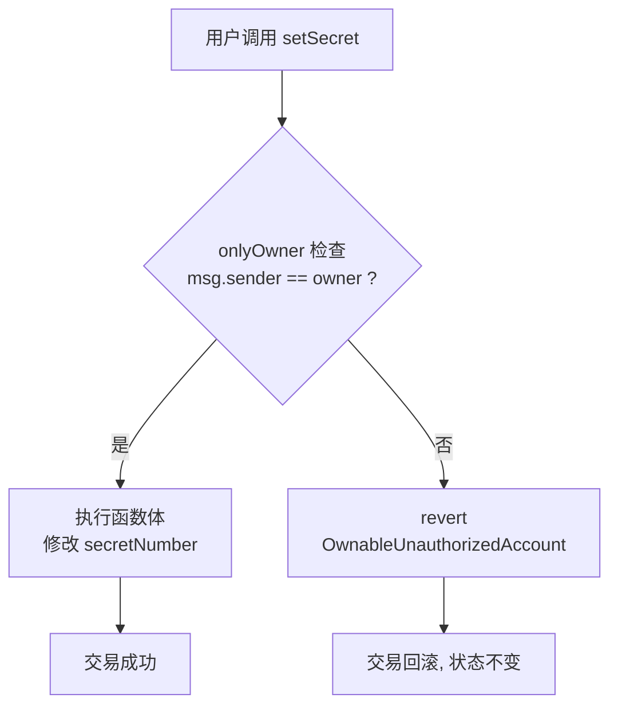

# 02 · 所有权 Ownable（Ownable）

> Ownable 给合约设一个「唯一管理员 owner」，用 `onlyOwner` 修饰器把敏感函数锁给它。

## 📖 知识讲解

很多合约需要「只有管理员能干」的操作：增发代币、暂停合约、提取资金。`Ownable` 是最简单的权限方案——**一个 owner 说了算**。

- `owner()`：查询当前所有者。
- `onlyOwner` 修饰器：非 owner 调用直接 revert（v5 报自定义错误 `OwnableUnauthorizedAccount`）。
- `transferOwnership(newOwner)`：转移所有权。
- `renounceOwnership()`：放弃所有权，owner 变成 `address(0)` —— **权限永久锁死，慎用**。

### v5 关键变化

| | v4 | v5 |
|---|---|---|
| 构造函数 | 无参，owner = 部署者 `msg.sender` | **必须显式传** `Ownable(initialOwner)` |
| 权限出错 | `require` 字符串 | 自定义错误 `OwnableUnauthorizedAccount(account)`（更省 gas） |

为什么 v5 要强制传 owner？因为用工厂合约/脚本部署时，`msg.sender` 可能是工厂而非你本人，显式传参更安全、意图更清晰。

## 🔄 流程图 / 原理图



## 💻 代码说明

`MyOwnable.sol` 要点：

```solidity
contract MyOwnable is Ownable {
    uint256 public secretNumber;
    constructor(address initialOwner) Ownable(initialOwner) {}   // v5 新签名
    function setSecret(uint256 v) public onlyOwner { secretNumber = v; }
}
```

- 继承 `Ownable`，构造函数把 `initialOwner` 透传给 `Ownable(...)`。
- `setSecret` 加 `onlyOwner`，只有 owner 能改 `secretNumber`。

## ▶️ 运行方式

1. Remix 新建 `MyOwnable.sol` 粘贴 → 编译（0.8.20+）。
2. Deploy：Environment 选 **Remix VM**，构造参数 `initialOwner` 填账户列表**第 1 个地址**（记为 A）→ Deploy。
3. 用账户 A 调用 `setSecret(42)` → 成功；`secretNumber()` 返回 42。
4. 在顶部账户下拉切换到**第 2 个地址**（B），再调 `setSecret(99)` → **revert**（B 不是 owner）。
5. 用 A 调 `transferOwnership(B)`，之后 `owner()` 变 B，此时换 B 才能调 `setSecret`。

## ⚠️ 常见坑 / 安全提示

- 忘了给构造函数传 `initialOwner` → v5 编译报错（这是从 v4 迁移最常见的错）。
- **`renounceOwnership()` 不可逆**：调用后没人能再执行 onlyOwner 函数，等于把管理功能永久废掉。演示可用，生产慎用。
- 单点 owner 风险高（私钥丢/被盗即失控），生产中 owner 建议用**多签钱包（如 Gnosis Safe）**。
- 需要「多种角色、多个管理员」时，改用下一模块的 `AccessControl`。

## 🔗 官方文档

- Access 控制概述：https://docs.openzeppelin.com/contracts/5.x/access-control
- Ownable API：https://docs.openzeppelin.com/contracts/5.x/api/access#Ownable
